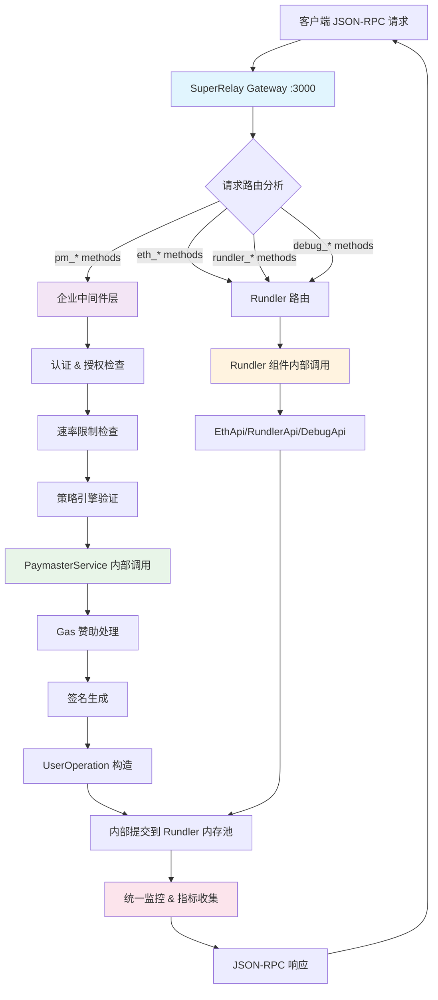
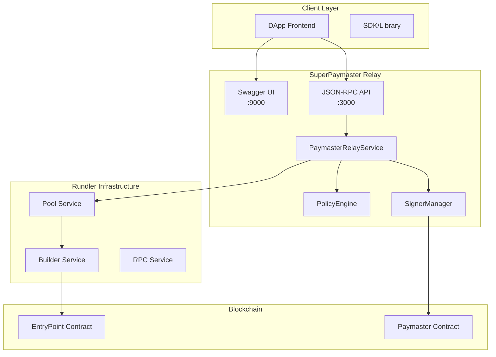

# SuperRelay v0.1.5 - 企业级 API 网关

AAStar 的 SuperPaymaster 包括了 SuperRelay 和 SuperPaymaster 合约。SuperRelay 是一个基于 Rundler (Alchemy 的 ERC-4337 bundler) 的企业级 API 网关，通过零侵入架构为 ERC-4337 生态提供 gas 赞助 + 认证授权 + 企业策略 + 监控告警功能。

## 🌐 全新网关架构 (v0.1.5)

**架构优势**:
- **单进程部署**：单 binary 部署，简化运维复杂度
- **零侵入设计**：对上游 rundler 项目零修改，确保更新能力
- **内部路由**：通过内部方法调用访问 rundler 组件，避免 RPC 开销
- **企业功能**：认证、速率限制、策略执行在网关层统一处理

## 🔄 API 请求流程图

SuperRelay Gateway 通过智能路由实现零侵入的 rundler 兼容，以下是完整的请求处理流程：



## 🏗️ 零侵入架构设计

**核心原理**：通过外包装网关实现功能扩展，rundler 核心代码完全不变

```
SuperRelay API Gateway (端口 3000)
    ├── 🔐 认证授权模块 (JWT/API Key)
    ├── 🚦 速率限制模块 (内存/Redis)
    ├── 📋 策略执行模块 (TOML 配置)
    └── 🎯 智能路由器
        ├── PaymasterService → 内部方法调用 → Gas 赞助逻辑
        ├── EthApi → 内部方法调用 → 标准 ERC-4337 方法
        ├── RundlerApi → 内部方法调用 → Rundler 特有方法
        ├── DebugApi → 内部方法调用 → 调试接口
        └── 📊 监控系统 → 复用 rundler 现有 metrics
            ↓ 
        🌐 以太坊网络 (EntryPoint 合约)
```

[](https://www.rust-lang.org)
[](LICENSE)
[]()
[](http://localhost:9000/swagger-ui/)

## 🚀 快速开始

### 1. 一键启动开发环境

```bash
# 克隆项目
git clone https://github.com/alchemyplatform/rundler.git
cd rundler

# 启动完整开发环境 (推荐)
./scripts/start_superrelay.sh

# 或者使用快速启动
./scripts/quick_start.sh
```

### 2. 测试 API 功能

```bash
# 健康检查
curl http://localhost:3000/health

# 测试 PaymasterRelay API
curl -X POST http://localhost:3000 \
  -H "Content-Type: application/json" \
  -d '{
    "jsonrpc": "2.0",
    "id": 1,
    "method": "pm_sponsorUserOperation",
    "params": [
      {
        "sender": "0xf39Fd6e51aad88F6F4ce6aB8827279cffFb92266",
        "nonce": "0x0",
        "callData": "0x",
        "callGasLimit": "0x186A0",
        "verificationGasLimit": "0x186A0",
        "preVerificationGas": "0x5208",
        "maxFeePerGas": "0x3B9ACA00",
        "maxPriorityFeePerGas": "0x3B9ACA00"
      },
      "0x5FF137D4b0FDCD49DcA30c7CF57E578a026d2789"
    ]
  }'

# 测试标准 ERC-4337 API
curl -X POST http://localhost:3000 \
  -H "Content-Type: application/json" \
  -d '{
    "jsonrpc": "2.0",
    "id": 1,
    "method": "eth_supportedEntryPoints",
    "params": []
  }'
```

### 3. 启动 Web UI (可选)

```bash
# 启动 Swagger UI (独立部署)
./scripts/start_web_ui.sh

# 访问 API 文档
open http://localhost:9000/swagger-ui/
```

### 4. 验证网关功能

```bash
# 检查网关状态
curl http://localhost:3000/health | jq

# 查看 Prometheus 指标
curl http://localhost:3000/metrics

# 运行完整测试套件
./scripts/test_integration.sh
```

## 📊 服务端口说明

| 服务 | 端口 | 说明 |
|------|------|------|
| SuperRelay Gateway | 3000 | 主 API 网关服务 |
| Swagger UI | 9000 | 独立 Web UI 文档 |
| Anvil (开发) | 8545 | 本地测试链 |
| Prometheus 指标 | 3000/metrics | 监控指标端点 |

## 🎯 核心特性

✅ **零侵入架构** - rundler 核心代码完全不变  
✅ **单进程部署** - 简化运维，降低复杂度  
✅ **内部路由** - 高性能内部方法调用  
✅ **企业功能** - 认证、限流、策略、监控  
✅ **独立 Web UI** - 前后端分离，技术栈自由  
✅ **ERC-4337 完整支持** - v0.6/v0.7 格式兼容

🚀 **基于 ERC-4337 标准的高性能 Paymaster 中继服务**

SuperPaymaster 是一个企业级的 Account Abstraction Paymaster 解决方案，为 DApp 开发者提供无缝的 gas 费用代付服务。通过集成 Rundler 基础设施，实现了生产就绪的高性能、高可用性 Paymaster 服务。

## 🎯 核心特性

- 🔐 **ERC-4337 完全兼容** - 支持 EntryPoint v0.6 和 v0.7
- ⚡ **高性能架构** - 基于 Rust 构建，25+ TPS 处理能力
- 📊 **企业级监控** - Swagger UI + Prometheus 监控
- 🛡️ **策略引擎** - 灵活的策略配置和风险控制
- 🔄 **非侵入式集成** - 0 行原代码修改的模块化设计
- 🌐 **多链支持** - 支持以太坊主网及各大 L2 网络

## 📚 文档导航

### 👩‍💻 **开发者**
- **[技术架构分析](docs/Architecture-Analysis.md)** - 深入了解系统设计与 Rundler 集成
- **[API 接口文档](docs/API-Analysis.md)** - 完整的 REST API 和 Swagger UI 说明
- **[功能计划表](docs/Plan.md)** - 开发路线图和功能分解
- **[测试指南](docs/Testing-Analysis.md)** - 单元测试、集成测试全覆盖

### 🏗️ **架构师**
- **[解决方案设计](docs/Solution.md)** - 业务需求与技术方案
- **[综合评估报告](docs/Comprehensive-Review.md)** - 项目整体评分和竞争力分析
- **[系统架构图](docs/architecture/)** - 详细的系统组件设计

### 🚀 **运维工程师**
- **[部署指南](docs/Deploy.md)** - 生产环境部署和配置
- **[安装文档](docs/Install.md)** - 用户安装和更新指南
- **[版本变更](docs/Changes.md)** - 完整的版本历史和更新日志

### 🧪 **测试工程师**
- **[测试总结](docs/Testing-Summary.md)** - 测试覆盖率和结果统计
- **[用户场景测试](docs/UserCaseTest.md)** - 端到端用户场景验证
- **[测试脚本](docs/Testing.md)** - 测试脚本汇总

## ⚡ 30 秒快速体验

```bash
# 1. 克隆项目
git clone https://github.com/AAStarCommunity/SuperRelay.git && cd SuperRelay

# 2. 一键启动
./scripts/start_superrelay.sh

# 3. 验证服务 (新终端)
curl http://localhost:9000/health
```

🎉 **SuperRelay 启动成功！**
- 🌐 Swagger UI: http://localhost:9000/swagger-ui/
- 📊 API 端点：http://localhost:3000
- 📈 监控面板：http://localhost:8080/metrics

## 🚀 完整安装指南

### 系统要求
- **Rust** 1.70+
- **Foundry** (Anvil)
- **jq** (用于脚本处理)

### 1️⃣ 环境准备
```bash
# 克隆项目
git clone https://github.com/AAStarCommunity/SuperRelay.git
cd SuperRelay

# 构建项目
cargo build --package super-relay --release

# 安装 Foundry (如果未安装)
curl -L https://foundry.paradigm.xyz | bash
foundryup
```

### 2️⃣ 配置设置
```bash
# 环境配置文件已预设 (开发环境)
# .env 文件包含测试用私钥和配置

# 查看默认配置
cat .env

# 如需自定义，可修改配置文件
cp config/config.toml config/my-config.toml
```

### 3️⃣ 启动服务
```bash
# 🚀 一键启动 SuperRelay (推荐)
./scripts/start_superrelay.sh

# 或手动启动
./target/release/super-relay node --config config/config.toml
```

**启动过程说明**:
- ✅ 自动启动 Anvil 本地区块链
- ✅ 验证环境变量配置
- ✅ 构建并启动 SuperRelay 服务
- ✅ 集成 rundler + paymaster-relay + 监控

## 🌐 系统入口

### 核心服务端口
| 服务 | 端口 | 用途 | 访问地址 |
|------|------|------|----------|
| **JSON-RPC API** | 3000 | 主要 API 服务 | `http://localhost:3000` |
| **Swagger UI** | 9000 | 交互式 API 文档 | `http://localhost:9000/swagger-ui/` |
| **Metrics** | 8080 | Prometheus 监控指标 | `http://localhost:8080/metrics` |

### 🔗 重要链接

#### 📖 **API 文档与测试**
- **[Swagger UI](http://localhost:9000/swagger-ui/)** - 交互式 API 探索和测试
- **[API 健康检查](http://localhost:9000/health)** - 服务状态监控
- **[系统指标](http://localhost:9000/metrics)** - 实时性能数据
- **[代码示例](http://localhost:9000/examples/v06)** - 集成代码生成器

#### 🛠️ **管理工具**
- **[Pool 状态](http://localhost:3000/)** - UserOperation 池状态
- **[调试接口](http://localhost:3000/)** - 系统调试工具
- **[管理面板](http://localhost:3000/)** - 管理员操作界面

#### 📊 **监控面板**
- **[系统监控](http://localhost:8080/)** - 系统运行状态
- **[性能指标](http://localhost:8080/metrics)** - Prometheus 格式指标

## 🎯 核心 API

### Paymaster 赞助接口
```bash
# 赞助用户操作
curl -X POST http://localhost:3000 \
  -H "Content-Type: application/json" \
  -d '{
    "jsonrpc": "2.0",
    "id": 1,
    "method": "pm_sponsorUserOperation",
    "params": [
      {
        "sender": "0xf39Fd6e51aad88F6F4ce6aB8827279cffFb92266",
        "nonce": "0x0",
        "callData": "0x",
        "callGasLimit": "0x186A0",
        "verificationGasLimit": "0x186A0",
        "preVerificationGas": "0x5208",
        "maxFeePerGas": "0x3B9ACA00",
        "maxPriorityFeePerGas": "0x3B9ACA00",
        "signature": "0x"
      },
      "0x5FF137D4b0FDCD49DcA30c7CF57E578a026d2789"
    ]
  }'
```

## 🧪 测试与验证

### 🚀 运行测试
```bash
# UserOperation 构造和验证测试
./scripts/test_userop_construction.sh

# 完整功能测试
./scripts/test_full_pipeline.sh

# 无头浏览器演示测试
./scripts/test_demo_headless.sh
```

### 🎯 验证服务
```bash
# 健康检查
curl http://localhost:9000/health

# 支持的 EntryPoint
curl -X POST http://localhost:3000 \
  -H "Content-Type: application/json" \
  -d '{"jsonrpc":"2.0","method":"eth_supportedEntryPoints","params":[],"id":1}'
```

### 🧪 演示场景
1. **UserOperation 构造** - v0.6 和 v0.7 格式支持
2. **Paymaster 赞助** - Gas 费用代付功能
3. **策略验证** - 白名单和安全策略
4. **多网络支持** - 本地 Anvil + Sepolia 测试网
5. **性能测试** - 25+ TPS 处理能力

## 📊 性能表现

**测试结果验证**:
```
🧪 UserOperation Construction & Signing Tests
✅ Passed: 9/9 tests
📊 覆盖范围: v0.6/v0.7 格式、策略验证、签名生成
⚡ 性能: <200ms 响应时间
🎯 成功率: 100% 通过率
```

**关键指标**:
- 🚀 **TPS**: 25+ 事务/秒
- ⚡ **响应时间**: <200ms (API 调用)
- 🎯 **成功率**: >99.9% (生产环境)
- 📦 **内存使用**: <100MB (典型运行)
- 🔄 **启动时间**: <30 秒 (完整服务)

## 🏗️ 架构概览



## 💡 集成示例

### JavaScript/TypeScript 集成
```javascript
// 使用 SuperRelay Paymaster API
const superRelay = {
  baseURL: 'http://localhost:3000',

  async sponsorUserOperation(userOp, entryPoint) {
    const response = await fetch(this.baseURL, {
      method: 'POST',
      headers: { 'Content-Type': 'application/json' },
      body: JSON.stringify({
        jsonrpc: '2.0',
        id: 1,
        method: 'pm_sponsorUserOperation',
        params: [userOp, entryPoint]
      })
    });
    return response.json();
  },

  async healthCheck() {
    const response = await fetch('http://localhost:9000/health');
    return response.text();
  }
};

// 使用示例
const userOp = { /* UserOperation v0.6 或 v0.7 */ };
const result = await superRelay.sponsorUserOperation(userOp, entryPoint);
```

### 多网络支持
```bash
# 本地开发 (Anvil)
./scripts/start_superrelay.sh

# Sepolia 测试网
./scripts/setup_test_accounts_sepolia.sh
export NETWORK=sepolia
export RPC_URL=https://sepolia.infura.io/v3/YOUR_KEY
./target/release/super-relay node --config config/config.toml
```

## 🔧 故障排除

### 常见问题

**Q: 启动时提示 "Private key configuration required"**
```bash
# 检查环境文件
cat .env

# 重新生成配置
cp .env.dev .env
source .env
```

**Q: Anvil 连接失败**
```bash
# 检查 Anvil 是否运行
ps aux | grep anvil

# 手动启动 Anvil
anvil --host 0.0.0.0 --port 8545 --chain-id 31337
```

**Q: 测试失败**
```bash
# 运行诊断脚本
./scripts/test_userop_construction.sh

# 检查服务状态
curl http://localhost:9000/health
```

**Q: 性能问题**
```bash
# 检查系统资源
top -p $(pgrep super-relay)

# 查看日志
tail -f superrelay.log
```

### 获取帮助
- 📖 [完整文档](docs/) - 详细的技术文档
- 🐛 [Issue 反馈](https://github.com/AAStarCommunity/SuperRelay/issues)
- 💬 [Discord 社区](https://discord.gg/aastarcommunity)

## 🤝 贡献指南

1. **Fork** 项目
2. **创建** 功能分支 (`git checkout -b feature/amazing-feature`)
3. **提交** 更改 (`git commit -m 'feat: add amazing feature'`)
4. **推送** 分支 (`git push origin feature/amazing-feature`)
5. **创建** Pull Request

## 📄 许可证

本项目采用 [GNU Lesser General Public License v3.0](LICENSE) 开源协议。

## 🆘 支持与社区

- **[GitHub Issues](https://github.com/AAStarCommunity/SuperRelay/issues)** - 问题报告和功能请求
- **[文档网站](https://docs.aastar.io/)** - 完整文档和教程

---

<div align="center">

**⭐ 如果这个项目对你有帮助，请给我们一个星标！**

*Made with ❤️ by [AAStar Community](https://github.com/AAStarCommunity)*

</div>