# SuperRelay

AAStar 的 SuperPaymaster 包括了 SuperRelay 和 SuperPaymaster 合约。SuperRelay 是一个基于 Rundler (Alchemy 的 ERC-4337 bundler) 集成 Paymaster Relay 服务的开源项目，目标是为 ERC-4337 生态提供 gas 赞助 + 安全过滤 + 链上提交功能。
```
sequenceDiagram
    participant Client as 客户端
    participant RPC as PaymasterRelayApi
    participant Service as PaymasterRelayService
    participant Policy as PolicyEngine
    participant Signer as SignerManager
    participant Pool as Rundler内存池

    Client->>RPC: pm_sponsorUserOperation(userOp, entryPoint)
    RPC->>Service: sponsor_user_operation()
    Service->>Policy: check_policy(userOp)
    Policy-->>Service: 验证通过
    Service->>Signer: sign_hash(userOpHash)
    Signer-->>Service: 返回签名
    Service->>Service: 构造sponsored UserOp
    Service->>Pool: add_op(sponsored_op)
    Pool-->>Service: userOpHash
    Service-->>RPC: userOpHash
    RPC-->>Client: userOpHash

```

🚀 **基于 ERC-4337 标准的高性能 Paymaster 中继服务**

SuperPaymaster 是一个企业级的 Account Abstraction Paymaster 解决方案，为 DApp 开发者提供无缝的 gas 费用代付服务。通过集成 Rundler 基础设施，实现了生产就绪的高性能、高可用性 Paymaster 服务。

## 🎯 核心特性

- 🔐 **ERC-4337 完全兼容** - 支持 EntryPoint v0.6 和 v0.7
- ⚡ **高性能架构** - 基于 Rust 构建，25+ TPS 处理能力
- 📊 **企业级监控** - Swagger UI + Prometheus 监控
- 🛡️ **策略引擎** - 灵活的策略配置和风险控制
- 🔄 **非侵入式集成** - 0 行原代码修改的模块化设计
- 🌐 **多链支持** - 支持以太坊主网及各大 L2 网络

## 📚 文档导航

### 👩‍💻 **开发者**
- **[技术架构分析](docs/Architecture-Analysis.md)** - 深入了解系统设计与 Rundler 集成
- **[API 接口文档](docs/API-Analysis.md)** - 完整的 REST API 和 Swagger UI 说明
- **[功能计划表](docs/PLAN.md)** - 开发路线图和功能分解
- **[测试指南](docs/Testing-Analysis.md)** - 单元测试、集成测试全覆盖

### 🏗️ **架构师**
- **[解决方案设计](docs/Solution.md)** - 业务需求与技术方案
- **[综合评估报告](docs/Comprehensive-Review.md)** - 项目整体评分和竞争力分析
- **[系统架构图](docs/architecture/)** - 详细的系统组件设计

### 🚀 **运维工程师**
- **[部署指南](docs/Deploy.md)** - 生产环境部署和配置
- **[安装文档](docs/Install.md)** - 用户安装和更新指南
- **[版本变更](docs/Changes.md)** - 完整的版本历史和更新日志

### 🧪 **测试工程师**
- **[测试总结](docs/Testing-Summary.md)** - 测试覆盖率和结果统计
- **[用户场景测试](docs/UserCaseTest.md)** - 端到端用户场景验证

## 🚀 快速启动

### 系统要求
- **Rust** 1.70+
- **Node.js** 23.0+
- **以太坊节点** (如 Hardhat、Geth)

### 1️⃣ 环境准备
```bash
# 克隆项目
git clone https://github.com/AAStarCommunity/SuperRelay.git
cd SuperRelay

# 安装依赖
cargo build

# 启动本地以太坊节点 (可选)
npx hardhat node
```

### 2️⃣ 配置设置
```bash
# 设置环境变量
export PAYMASTER_PRIVATE_KEY="0x59c6995e998f97a5a0044966f0945389dc9e86dae88c7a8412f4603b6b78690d"
export NODE_HTTP="http://localhost:8545"

# 配置策略文件 (可选)
cp config/paymaster-policies.toml config/my-policies.toml
```

### 3️⃣ 启动服务
```bash
# 启动完整的 SuperPaymaster 服务
cargo run --bin rundler -- node \
  --paymaster.enabled \
  --paymaster.private_key=$PAYMASTER_PRIVATE_KEY \
  --paymaster.policy_file=config/paymaster-policies.toml \
  --node_http=$NODE_HTTP \
  --unsafe \
  --network=dev \
  --rpc.api=eth,debug,admin,rundler,paymaster
```

## 🌐 系统入口

### 核心服务端口
| 服务 | 端口 | 用途 | 访问地址 |
|------|------|------|----------|
| **JSON-RPC API** | 3000 | 主要 API 服务 | `http://localhost:3000` |
| **Swagger UI** | 9000 | 交互式 API 文档 | `http://localhost:9000/swagger-ui/` |
| **Metrics** | 8080 | Prometheus 监控指标 | `http://localhost:8080/metrics` |

### 🔗 重要链接

#### 📖 **API 文档与测试**
- **[Swagger UI](http://localhost:9000/swagger-ui/)** - 交互式 API 探索和测试
- **[API 健康检查](http://localhost:9000/health)** - 服务状态监控
- **[系统指标](http://localhost:9000/metrics)** - 实时性能数据
- **[代码示例](http://localhost:9000/examples/v06)** - 集成代码生成器

#### 🛠️ **管理工具**
- **[Pool 状态](http://localhost:3000/)** - UserOperation 池状态
- **[调试接口](http://localhost:3000/)** - 系统调试工具
- **[管理面板](http://localhost:3000/)** - 管理员操作界面

#### 📊 **监控面板**
- **[系统监控](http://localhost:8080/)** - 系统运行状态
- **[性能指标](http://localhost:8080/metrics)** - Prometheus 格式指标

## 🎯 核心 API

### Paymaster 赞助接口
```bash
# 赞助用户操作
curl -X POST http://localhost:3000 \
  -H "Content-Type: application/json" \
  -d '{
    "jsonrpc": "2.0",
    "id": 1,
    "method": "pm_sponsorUserOperation",
    "params": [
      {
        "sender": "0xf39Fd6e51aad88F6F4ce6aB8827279cffFb92266",
        "nonce": "0x0",
        "callData": "0x",
        "callGasLimit": "0x186A0",
        "verificationGasLimit": "0x186A0",
        "preVerificationGas": "0x5208",
        "maxFeePerGas": "0x3B9ACA00",
        "maxPriorityFeePerGas": "0x3B9ACA00",
        "signature": "0x"
      },
      "0x5FF137D4b0FDCD49DcA30c7CF57E578a026d2789"
    ]
  }'
```

## 🧪 演示应用

### 快速演示
```bash
# 运行完整演示
cd demo
npm install
node superPaymasterDemo.js

# 或使用自动化脚本
./scripts/run_demo.sh
```

### 演示场景
1. **基础赞助** - 标准 UserOperation 代付
2. **策略验证** - 策略引擎白名单检查
3. **错误处理** - 异常情况处理演示
4. **性能测试** - 并发请求处理能力
5. **监控展示** - 实时指标查看

## 🏗️ 架构概览

```mermaid
graph TB
    subgraph "Client Layer"
        A[DApp Frontend]
        B[SDK/Library]
    end
    
    subgraph "SuperPaymaster Relay"
        C[Swagger UI<br/>:9000]
        D[JSON-RPC API<br/>:3000]
        E[PaymasterRelayService]
        F[PolicyEngine]
        G[SignerManager]
    end
    
    subgraph "Rundler Infrastructure"
        H[Pool Service]
        I[Builder Service]
        J[RPC Service]
    end
    
    subgraph "Blockchain"
        K[EntryPoint Contract]
        L[Paymaster Contract]
    end
    
    A --> C
    A --> D
    D --> E
    E --> F
    E --> G
    E --> H
    H --> I
    I --> K
    G --> L
```



## 💡 使用示例

### JavaScript/TypeScript
```javascript
import { ethers } from 'ethers';

const paymasterAPI = {
  sponsorUserOperation: async (userOp, entryPoint) => {
    const response = await fetch('http://localhost:3000', {
      method: 'POST',
      headers: { 'Content-Type': 'application/json' },
      body: JSON.stringify({
        jsonrpc: '2.0',
        id: 1,
        method: 'pm_sponsorUserOperation',
        params: [userOp, entryPoint]
      })
    });
    return response.json();
  }
};
```

### Python
```python
import requests

def sponsor_user_operation(user_op, entry_point):
    payload = {
        "jsonrpc": "2.0",
        "id": 1,
        "method": "pm_sponsorUserOperation",
        "params": [user_op, entry_point]
    }
    response = requests.post('http://localhost:3000', json=payload)
    return response.json()
```

## 🤝 贡献指南

1. **Fork** 项目
2. **创建** 功能分支 (`git checkout -b feature/amazing-feature`)
3. **提交** 更改 (`git commit -m 'feat: add amazing feature'`)
4. **推送** 分支 (`git push origin feature/amazing-feature`)
5. **创建** Pull Request

## 📄 许可证

本项目采用 [GNU Lesser General Public License v3.0](LICENSE) 开源协议。

## 🆘 支持与社区

- **[GitHub Issues](https://github.com/AAStarCommunity/SuperRelay/issues)** - 问题报告和功能请求
- **[Discord](https://discord.gg/aastarcommunity)** - 社区讨论和技术支持
- **[文档网站](https://docs.aa-star.com/)** - 完整文档和教程

---

<div align="center">

**⭐ 如果这个项目对你有帮助，请给我们一个星标！**

*Made with ❤️ by [AAStar Community](https://github.com/AAStarCommunity)*

</div> 