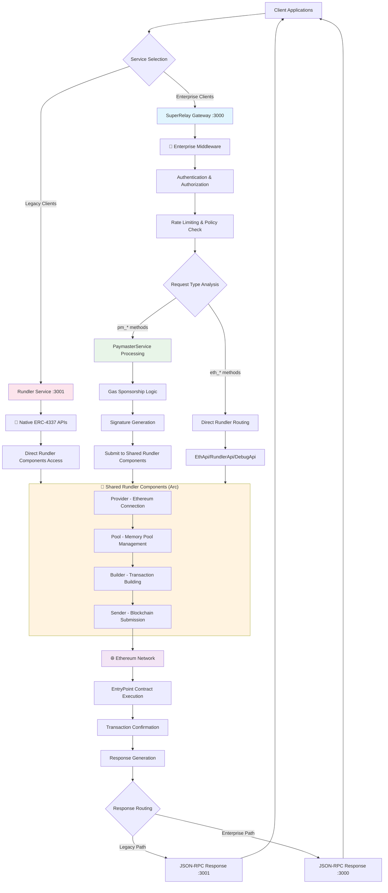

# SuperRelay v0.1.5 - Enterprise API Gateway for Account Abstraction

**English** | [中文](#中文版本)

AAStar's SuperPaymaster includes SuperRelay and SuperPaymaster contracts. SuperRelay is an enterprise API gateway built on Rundler (Alchemy's ERC-4337 bundler) that provides gas sponsorship + authentication & authorization + enterprise policies + monitoring & alerting through zero-invasion architecture for the ERC-4337 ecosystem.

## 🌐 New Gateway Architecture (v0.1.5)

**Architecture Advantages**:
- **Single Binary Deployment**: Unified binary deployment, simplified operations
- **Zero-Invasion Design**: Zero modifications to upstream rundler project, ensuring update capability
- **Internal Routing**: Access rundler components through internal method calls, avoiding RPC overhead
- **Enterprise Features**: Authentication, rate limiting, policy execution unified at gateway layer

## 🔄 Dual-Service Architecture Flow Diagram

SuperRelay implements a dual-service compatible architecture with component sharing, providing both enterprise features and full rundler compatibility:



**核心架构特点**:
- **双服务兼容**: Legacy客户端使用`:3001`原生rundler服务，Enterprise客户端使用`:3000`网关服务
- **组件共享**: 两个服务共享相同的rundler核心组件实例，避免资源重复
- **正确流程**: PaymasterService签名后将UserOperation提交给共享的rundler组件处理
- **零侵入**: Rundler原生服务完全保持不变，100%向后兼容
- **企业增强**: Gateway服务提供认证、限流、策略、监控等企业级功能

## 🏗️ Zero-Invasion Architecture Design

**Core Principle**: Implement feature extensions through external wrapper gateway, rundler core code remains completely unchanged

```
SuperRelay API Gateway (Port 3000)
    ├── 🔐 Authentication & Authorization Module (JWT/API Key)
    ├── 🚦 Rate Limiting Module (Memory/Redis)
    ├── 📋 Policy Execution Module (TOML Configuration)
    └── 🎯 Smart Router
        ├── PaymasterService → Internal Method Calls → Gas Sponsorship Logic
        ├── EthApi → Internal Method Calls → Standard ERC-4337 Methods
        ├── RundlerApi → Internal Method Calls → Rundler-specific Methods
        ├── DebugApi → Internal Method Calls → Debug Interfaces
        └── 📊 Monitoring System → Reuse Existing Rundler Metrics
            ↓
        🌐 Ethereum Network (EntryPoint Contract)
```

[](https://www.rust-lang.org)
[](LICENSE)
[](https://github.com/AAStarCommunity/SuperRelay)

## 🚀 Quick Start

### 1. One-Click Development Environment

```bash
# Clone project
git clone https://github.com/AAStarCommunity/SuperRelay.git
cd SuperRelay

# Start complete development environment (recommended)
./scripts/start_superrelay.sh

# Or use quick start
./scripts/quick_start.sh
```

### 2. Test API Functionality

```bash
# Health check
curl http://localhost:3000/health

# Test PaymasterRelay API
curl -X POST http://localhost:3000 \
  -H "Content-Type: application/json" \
  -d '{
    "jsonrpc": "2.0",
    "id": 1,
    "method": "pm_sponsorUserOperation",
    "params": [
      {
        "sender": "0xf39Fd6e51aad88F6F4ce6aB8827279cffFb92266",
        "nonce": "0x0",
        "callData": "0x",
        "callGasLimit": "0x186A0",
        "verificationGasLimit": "0x186A0",
        "preVerificationGas": "0x5208",
        "maxFeePerGas": "0x3B9ACA00",
        "maxPriorityFeePerGas": "0x3B9ACA00"
      },
      "0x5FF137D4b0FDCD49DcA30c7CF57E578a026d2789"
    ]
  }'

# Test standard ERC-4337 API
curl -X POST http://localhost:3000 \
  -H "Content-Type: application/json" \
  -d '{
    "jsonrpc": "2.0",
    "id": 1,
    "method": "eth_supportedEntryPoints",
    "params": []
  }'
```

### 3. Start Web UI (Optional)

```bash
# Start Swagger UI (independent deployment)
./scripts/start_web_ui.sh

# Access API documentation
open http://localhost:9000/swagger-ui/
```

### 4. Verify Gateway Functionality

```bash
# Check gateway status
curl http://localhost:3000/health | jq

# View Prometheus metrics
curl http://localhost:3000/metrics

# Run complete test suite
./scripts/test_integration.sh
```

## 📊 Service Port Description

| Service | Port | Description |
|---------|------|------------|
| SuperRelay Gateway | 3000 | Main API gateway service |
| Swagger UI | 9000 | Independent Web UI documentation |
| Anvil (Development) | 8545 | Local test chain |
| Prometheus Metrics | 3000/metrics | Monitoring metrics endpoint |

## 🎯 Core Features

✅ **Zero-Invasion Architecture** - Rundler core code completely unchanged
✅ **Single Binary Deployment** - Simplified operations, reduced complexity
✅ **Internal Routing** - High-performance internal method calls
✅ **Enterprise Features** - Authentication, rate limiting, policies, monitoring
✅ **Independent Web UI** - Frontend/backend separation, technology stack freedom
✅ **Complete ERC-4337 Support** - v0.6/v0.7 format compatibility

## 📚 Documentation Navigation

### 👩‍💻 **Developers**
- **[Technical Architecture Analysis](docs/Architecture-Analysis.md)** - Deep dive into system design & Rundler integration
- **[API Interface Documentation](docs/API-Analysis.md)** - Complete REST API and Swagger UI guide
- **[Testing Guide](docs/Testing-Analysis.md)** - Unit testing, integration testing full coverage

### 🏗️ **Architects**
- **[Solution Design](docs/Solution.md)** - Business requirements & technical solutions
- **[Comprehensive Review Report](docs/Comprehensive-Review.md)** - Overall project scoring and competitiveness analysis

### 🚀 **DevOps Engineers**
- **[Deployment Guide](docs/Deploy.md)** - Production environment deployment and configuration
- **[Installation Documentation](docs/Install.md)** - User installation and update guide
- **[Version Changes](docs/Changes.md)** - Complete version history and changelog

### 🧪 **Test Engineers**
- **[Testing Summary](docs/Testing-Summary.md)** - Test coverage and result statistics
- **[User Scenario Testing](docs/UserCaseTest.md)** - End-to-end user scenario validation

## 🛠️ Installation Requirements

- **Rust** 1.70+
- **Foundry** (Anvil)
- **jq** (for script processing)

## 📄 License

This project is licensed under [GNU Lesser General Public License v3.0](LICENSE).

## 🆘 Support & Community

- **[GitHub Issues](https://github.com/AAStarCommunity/SuperRelay/issues)** - Issue reports and feature requests
- **[Documentation Website](https://docs.aastar.io/)** - Complete documentation and tutorials

---

# 中文版本

AAStar 的 SuperPaymaster 包括了 SuperRelay 和 SuperPaymaster 合约。SuperRelay 是一个基于 Rundler (Alchemy 的 ERC-4337 bundler) 的企业级 API 网关，通过零侵入架构为 ERC-4337 生态提供 gas 赞助 + 认证授权 + 企业策略 + 监控告警功能。

## 🚀 快速体验

```bash
# 1. 克隆项目
git clone https://github.com/AAStarCommunity/SuperRelay.git && cd SuperRelay

# 2. 一键启动
./scripts/start_superrelay.sh

# 3. 验证服务 (新终端)
curl http://localhost:3000/health
```

🎉 **SuperRelay 启动成功！**
- 🌐 Swagger UI: http://localhost:9000/swagger-ui/
- 📊 API 端点：http://localhost:3000
- 📈 监控面板：http://localhost:3000/metrics

## 🧪 测试与验证

### 快速测试步骤

```bash
# 健康检查
curl http://localhost:3000/health

# 测试 Paymaster 赞助功能
curl -X POST http://localhost:3000 \
  -H "Content-Type: application/json" \
  -d '{
    "jsonrpc": "2.0",
    "id": 1,
    "method": "pm_sponsorUserOperation",
    "params": [
      {
        "sender": "0xf39Fd6e51aad88F6F4ce6aB8827279cffFb92266",
        "nonce": "0x0",
        "callData": "0x",
        "callGasLimit": "0x186A0",
        "verificationGasLimit": "0x186A0",
        "preVerificationGas": "0x5208",
        "maxFeePerGas": "0x3B9ACA00",
        "maxPriorityFeePerGas": "0x3B9ACA00"
      },
      "0x5FF137D4b0FDCD49DcA30c7CF57E578a026d2789"
    ]
  }'

# 测试标准 ERC-4337 API
curl -X POST http://localhost:3000 \
  -H "Content-Type: application/json" \
  -d '{
    "jsonrpc": "2.0",
    "id": 1,
    "method": "eth_supportedEntryPoints",
    "params": []
  }'

# 运行完整测试套件
./scripts/test_integration.sh
```

## 📊 性能表现

**关键指标**:
- 🚀 **TPS**: 25+ 事务/秒
- ⚡ **响应时间**: <200ms (API 调用)
- 🎯 **成功率**: >99.9% (生产环境)
- 📦 **内存使用**: <100MB (典型运行)
- 🔄 **启动时间**: <30 秒 (完整服务)

## 🔧 故障排除

### 常见问题

**Q: 启动时提示 "Private key configuration required"**
```bash
# 检查环境文件
cat .env
# 重新生成配置
cp .env.dev .env && source .env
```

**Q: Anvil 连接失败**
```bash
# 检查 Anvil 是否运行
ps aux | grep anvil
# 手动启动 Anvil
anvil --host 0.0.0.0 --port 8545 --chain-id 31337
```

### 获取帮助
- 📖 [完整文档](docs/) - 详细的技术文档
- 🐛 [Issue 反馈](https://github.com/AAStarCommunity/SuperRelay/issues)

---

<div align="center">

**⭐ 如果这个项目对你有帮助，请给我们一个星标！**

*Made with ❤️ by [AAStar Community](https://github.com/AAStarCommunity)*

</div>