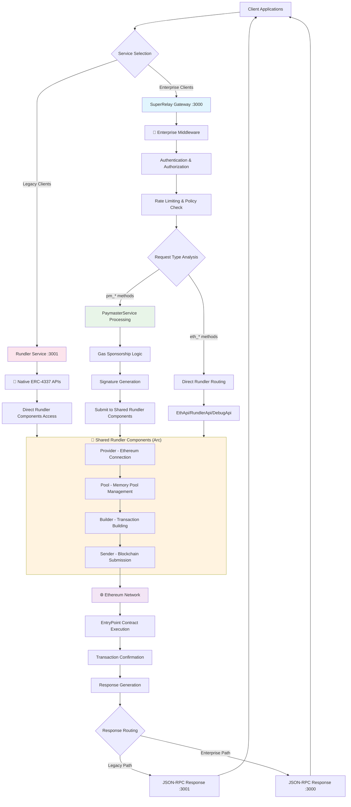
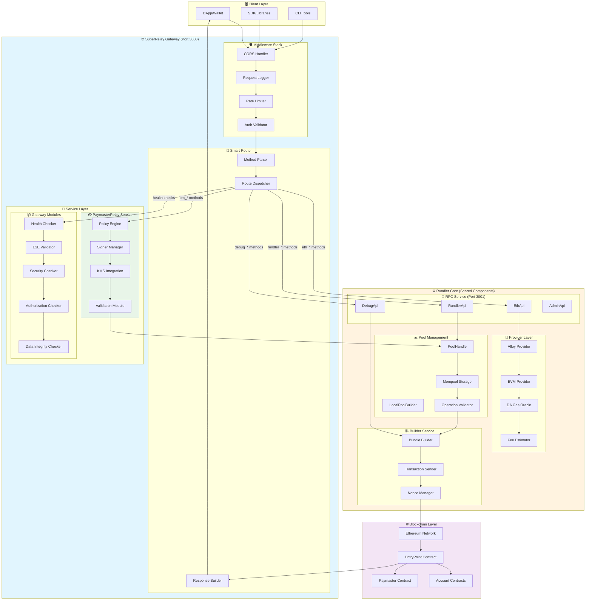
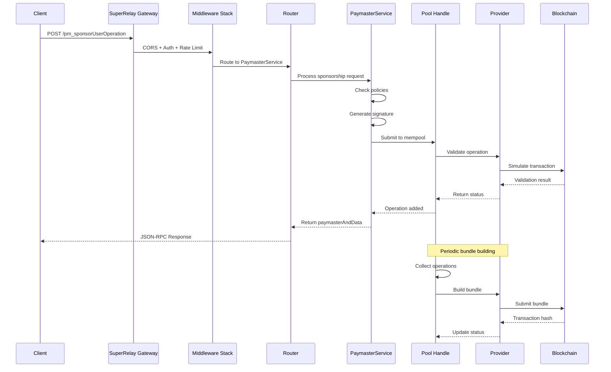
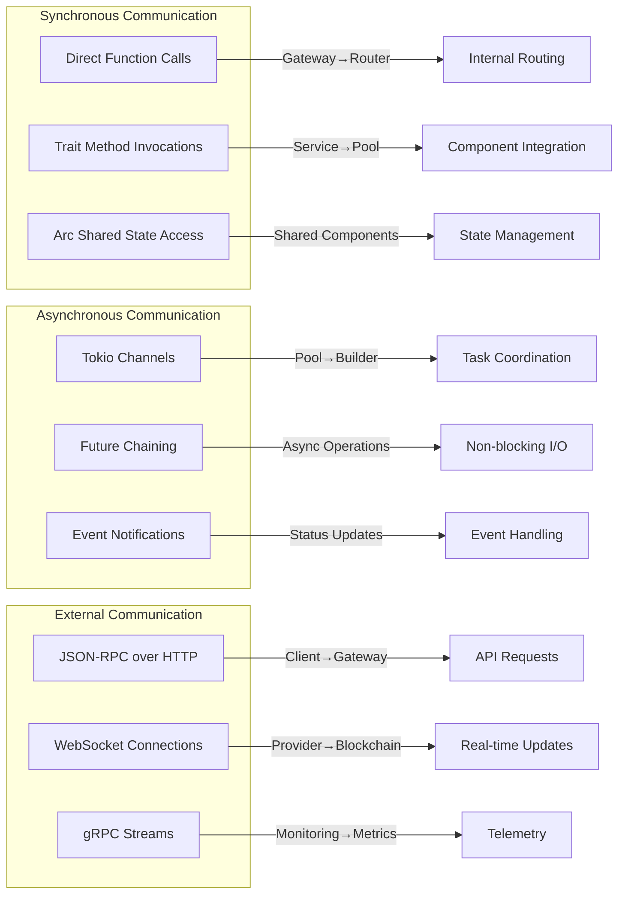

# SuperRelay v0.1.5 - Enterprise API Gateway for Account Abstraction

**English** | [中文](#中文版本)

AAStar's SuperPaymaster includes SuperRelay and SuperPaymaster contracts. SuperRelay is an enterprise API gateway built on Rundler (Alchemy's ERC-4337 bundler) that provides gas sponsorship + authentication & authorization + enterprise policies + monitoring & alerting through zero-invasion architecture for the ERC-4337 ecosystem.

## 🌐 New Gateway Architecture (v0.1.5)

**Architecture Advantages**:
- **Single Binary Deployment**: Unified binary deployment, simplified operations
- **Zero-Invasion Design**: Zero modifications to upstream rundler project, ensuring update capability
- **Internal Routing**: Access rundler components through internal method calls, avoiding RPC overhead
- **Enterprise Features**: Authentication, rate limiting, policy execution unified at gateway layer

## 🔄 Dual-Service Architecture Flow Diagram

SuperRelay implements a dual-service compatible architecture with component sharing, providing both enterprise features and full rundler compatibility:



**核心架构特点**:
- **双服务兼容**: Legacy客户端使用`:3001`原生rundler服务，Enterprise客户端使用`:3000`网关服务
- **组件共享**: 两个服务共享相同的rundler核心组件实例，避免资源重复
- **正确流程**: PaymasterService签名后将UserOperation提交给共享的rundler组件处理
- **零侵入**: Rundler原生服务完全保持不变，100%向后兼容
- **企业增强**: Gateway服务提供认证、限流、策略、监控等企业级功能

## 🏗️ Zero-Invasion Architecture Design

**Core Principle**: Implement feature extensions through external wrapper gateway, rundler core code remains completely unchanged

### High-Level Architecture
```
SuperRelay API Gateway (Port 3000)
    ├── 🔐 Authentication & Authorization Module (JWT/API Key)
    ├── 🚦 Rate Limiting Module (Memory/Redis)
    ├── 📋 Policy Execution Module (TOML Configuration)
    └── 🎯 Smart Router
        ├── PaymasterService → Internal Method Calls → Gas Sponsorship Logic
        ├── EthApi → Internal Method Calls → Standard ERC-4337 Methods
        ├── RundlerApi → Internal Method Calls → Rundler-specific Methods
        ├── DebugApi → Internal Method Calls → Debug Interfaces
        └── 📊 Monitoring System → Reuse Existing Rundler Metrics
            ↓
        🌐 Ethereum Network (EntryPoint Contract)
```

### Detailed Component Architecture



### Component Dependency Matrix

| Component | Dependencies | Communication Protocol | Purpose |
|-----------|-------------|----------------------|----------|
| **Gateway Layer** | | | |
| PaymasterGateway | GatewayRouter, PaymasterRelayService | Internal Method Calls | Main gateway orchestrator |
| GatewayRouter | EthApi, RundlerApi, DebugApi | Direct Function Calls | Request routing and dispatching |
| Middleware Stack | Tower-HTTP, Axum | HTTP/JSON-RPC | Request preprocessing |
| **PaymasterRelay** | | | |
| PaymasterRelayService | SignerManager, PolicyEngine, LocalPoolHandle | Arc<T> Shared State | Gas sponsorship service |
| SignerManager | KMS Module, Alloy Signer | Async Traits | Key management and signing |
| PolicyEngine | TOML Config, Validation Module | File I/O | Policy enforcement |
| **Rundler Core** | | | |
| LocalPoolHandle | Provider, Mempool | Arc<Mutex<T>> | Operation pool management |
| AlloyProvider | Alloy Libraries | HTTP/WebSocket | Blockchain connectivity |
| EVM Provider | AlloyProvider, ChainSpec | Internal Structs | EVM-specific operations |
| Builder Service | Pool, Provider, Signer | Message Passing | Bundle building and submission |
| **Monitoring** | | | |
| Health System | All Components | Status Checks | System health monitoring |
| Metrics Collector | Prometheus | HTTP Metrics Export | Performance monitoring |

### Data Flow and Component Interactions



### Module Hierarchy and Workspace Structure

```
super-relay/
├── bin/                           # Binary crates
│   ├── super-relay/              # Main gateway binary
│   │   └── src/
│   │       └── main.rs          # Entry point with dual-service mode
│   ├── rundler/                 # Original rundler binary
│   ├── dashboard/               # Monitoring dashboard
│   └── integration-tests/       # E2E test suite
│
├── crates/                       # Library crates
│   ├── gateway/                 # Gateway core functionality
│   │   ├── src/
│   │   │   ├── lib.rs          # Public API exports
│   │   │   ├── gateway.rs      # PaymasterGateway implementation
│   │   │   ├── router.rs       # Request routing logic
│   │   │   ├── middleware.rs   # HTTP middleware stack
│   │   │   ├── health.rs       # Health check endpoints
│   │   │   ├── security.rs     # Security validation
│   │   │   ├── authorization.rs # Auth & permissions
│   │   │   ├── validation.rs   # Data integrity checks
│   │   │   └── e2e_validator.rs # End-to-end validation
│   │   └── Cargo.toml
│   │
│   ├── paymaster-relay/         # Paymaster service
│   │   ├── src/
│   │   │   ├── lib.rs
│   │   │   ├── service.rs      # PaymasterRelayService
│   │   │   ├── signer.rs       # SignerManager
│   │   │   ├── policy.rs       # PolicyEngine
│   │   │   ├── kms.rs          # KMS integration
│   │   │   ├── validation.rs   # Operation validation
│   │   │   ├── rpc.rs          # RPC handlers
│   │   │   └── swagger.rs      # API documentation
│   │   └── Cargo.toml
│   │
│   ├── pool/                    # Mempool management
│   ├── builder/                 # Bundle building
│   ├── provider/               # Blockchain providers
│   ├── rpc/                    # RPC service implementations
│   ├── sim/                    # Simulation engine
│   ├── signer/                 # Transaction signing
│   ├── types/                  # Common types
│   └── utils/                  # Utility functions
│
├── config/                      # Configuration files
│   ├── config.toml             # Main configuration
│   └── paymaster-policies.toml # Paymaster policies
│
├── scripts/                     # Automation scripts
│   ├── start_superrelay.sh    # Start all services
│   ├── test_integration.sh    # Run integration tests
│   └── format.sh              # Code formatting
│
└── Cargo.toml                  # Workspace configuration
```

### Component Communication Patterns



[](https://www.rust-lang.org)
[](LICENSE)
[](https://github.com/AAStarCommunity/SuperRelay)

## 🚀 Quick Start

SuperRelay 提供**双协议分离架构**，您可以根据需要独立启动不同的服务：

### 🌐 双协议架构说明
- **JSON-RPC 服务** (端口 3000) - 为区块链工具 (web3.js, ethers.js) 和 DApp 提供标准接口
- **HTTP REST API** (端口 9000) - 为 Web/Mobile 应用提供 REST 接口 + 交互式 Swagger UI

### 启动选项

#### 选项1：启动 JSON-RPC 服务 (推荐用于区块链开发)
```bash
# 克隆项目
git clone https://github.com/AAStarCommunity/SuperRelay.git
cd SuperRelay

# 启动传统的 JSON-RPC 服务，兼容所有 ERC-4337 工具
./scripts/start_superrelay.sh
# 🌐 服务地址: http://localhost:3000
# 🧪 测试: curl -X POST http://localhost:3000 -d '{"jsonrpc":"2.0","method":"pm_sponsorUserOperation","params":[...],"id":1}'
```

#### 选项2：启动 HTTP REST API + Swagger UI (推荐用于 API 测试)
```bash
# 启动 HTTP REST API 服务器和交互式文档
./scripts/start_api_server.sh
# 🌐 Swagger UI: http://localhost:9000/swagger-ui/
# 🏥 健康检查: http://localhost:9000/health
# 🧪 测试: curl -X POST http://localhost:9000/api/v1/sponsor -d '{"user_op":{},"entry_point":"0x..."}'
```

#### 选项3：双服务模式 (完整功能)
```bash
# 同时启动两种协议服务 (JSON-RPC + REST API)
./target/debug/super-relay dual-service --enable-paymaster
# 🔄 JSON-RPC: http://localhost:3000
# 🌐 REST API: http://localhost:9000/swagger-ui/
```

### 1. 快速开发环境设置

### 2. Test API Functionality

```bash
# Health check
curl http://localhost:3000/health

# Test PaymasterRelay API
curl -X POST http://localhost:3000 \
  -H "Content-Type: application/json" \
  -d '{
    "jsonrpc": "2.0",
    "id": 1,
    "method": "pm_sponsorUserOperation",
    "params": [
      {
        "sender": "0xf39Fd6e51aad88F6F4ce6aB8827279cffFb92266",
        "nonce": "0x0",
        "callData": "0x",
        "callGasLimit": "0x186A0",
        "verificationGasLimit": "0x186A0",
        "preVerificationGas": "0x5208",
        "maxFeePerGas": "0x3B9ACA00",
        "maxPriorityFeePerGas": "0x3B9ACA00"
      },
      "0x5FF137D4b0FDCD49DcA30c7CF57E578a026d2789"
    ]
  }'

# Test standard ERC-4337 API
curl -X POST http://localhost:3000 \
  -H "Content-Type: application/json" \
  -d '{
    "jsonrpc": "2.0",
    "id": 1,
    "method": "eth_supportedEntryPoints",
    "params": []
  }'
```

### 3. 访问接口文档 (推荐)

```bash
# 方式1：使用新的 utoipa 自动生成的 Swagger UI (推荐)
./scripts/start_api_server.sh
# 🌐 访问: http://localhost:9000/swagger-ui/
# ✨ 特性: 自动生成、实时更新、可交互测试

# 方式2：使用遗留的独立 Web UI (备选)
./scripts/start_web_ui.sh
# 📱 访问: http://localhost:9000/
# 📋 说明: 静态文档，需要手动维护
```

**推荐使用方式1** - utoipa自动生成的文档始终与代码同步，支持实时API测试。

### 4. Verify Gateway Functionality

```bash
# Check gateway status
curl http://localhost:3000/health | jq

# View Prometheus metrics
curl http://localhost:3000/metrics

# Run complete test suite
./scripts/test_integration.sh
```

## 📊 Service Port Description

| Service | Port | Description |
|---------|------|------------|
| **JSON-RPC API** | 3000 | 主要的 ERC-4337 bundler 服务 (区块链工具使用) |
| **HTTP REST API** | 9000 | REST 接口 + utoipa 自动生成 Swagger UI |
| 遗留 Web UI | 9000 | 独立的静态文档部署 (可选) |
| Anvil (Development) | 8545 | 本地以太坊测试网络 |
| Prometheus Metrics | 3000/metrics | 监控指标端点 |

### 🔗 访问地址
- **Swagger UI (推荐)**: http://localhost:9000/swagger-ui/
- **JSON-RPC 端点**: http://localhost:3000
- **健康检查**: http://localhost:9000/health 或 http://localhost:3000/health
- **OpenAPI 规范**: http://localhost:9000/api-doc/openapi.json

## 🎯 Core Features

✅ **Zero-Invasion Architecture** - Rundler core code completely unchanged
✅ **Single Binary Deployment** - Simplified operations, reduced complexity
✅ **Internal Routing** - High-performance internal method calls
✅ **Enterprise Features** - Authentication, rate limiting, policies, monitoring
✅ **Independent Web UI** - Frontend/backend separation, technology stack freedom
✅ **Complete ERC-4337 Support** - v0.6/v0.7 format compatibility

## 🚀 SDK Integration Guide

SuperRelay provides enterprise-grade Account Abstraction services with simple SDK integration for DApps and wallets.

### Node.js Quick Integration

```bash
# Install dependencies
npm install ethers axios

# Basic setup
git clone https://github.com/AAStarCommunity/SuperRelay.git
cd SuperRelay && ./scripts/start_superrelay.sh
```

```javascript
// Simple UserOperation sponsorship
const { ethers } = require('ethers');
const axios = require('axios');

const client = {
    SUPER_RELAY_URL: 'http://localhost:3000',
    ENTRY_POINT: '0x5FbDB2315678afecb367f032d93F642f64180aa3'
};

// Sponsor a UserOperation
async function sponsorUserOp(userOp) {
    const response = await axios.post(client.SUPER_RELAY_URL, {
        jsonrpc: "2.0",
        id: 1,
        method: "pm_sponsorUserOperation", 
        params: [userOp, client.ENTRY_POINT]
    });
    return response.data.result; // Returns paymasterAndData
}
```

### Key Integration Features

- **🎯 Gas Sponsorship**: `pm_sponsorUserOperation` API for seamless gas abstraction
- **⚡ ERC-4337 Compatible**: Full support for standard UserOperation flow
- **🔧 Multiple Networks**: Works with Anvil, Sepolia, Mainnet
- **📊 Enterprise Ready**: Built-in rate limiting, auth, and monitoring

### Developer Resources

| Resource | Description | Link |
|----------|-------------|------|
| **SDK Integration Guide** | Complete Node.js integration tutorial | [docs/SDK-Integration-Guide.md](docs/SDK-Integration-Guide.md) |
| **Demo Application** | Working demo with examples | [demo/](demo/) |
| **Scripts Collection** | Automated setup and testing tools | [scripts/](scripts/) |
| **Swagger UI** | Interactive API documentation | `http://localhost:9000/swagger-ui/` |

### Quick Start Scripts

```bash
# Complete development environment setup
./scripts/start_anvil.sh           # Start test network
./scripts/deploy_entrypoint.sh     # Deploy EntryPoint contract  
./scripts/setup_test_accounts.sh   # Configure test accounts
./scripts/start_superrelay.sh      # Launch SuperRelay gateway

# Run demo and tests  
cd demo && npm install && npm run demo
./scripts/test_integration.sh      # Comprehensive test suite
```

**⚡ Ready in under 2 minutes** - Complete Account Abstraction infrastructure

## 📚 Documentation Navigation

### 👩‍💻 **Developers**
- **[SDK Integration Guide](docs/SDK-Integration-Guide.md)** - Complete Node.js SDK integration tutorial
- **[Technical Architecture Analysis](docs/Architecture-Analysis.md)** - Deep dive into system design & Rundler integration
- **[API Interface Documentation](docs/API-Analysis.md)** - Complete REST API and Swagger UI guide
- **[Testing Guide](docs/Testing-Analysis.md)** - Unit testing, integration testing full coverage

### 🏗️ **Architects**
- **[Solution Design](docs/Solution.md)** - Business requirements & technical solutions
- **[Comprehensive Review Report](docs/Comprehensive-Review.md)** - Overall project scoring and competitiveness analysis

### 🚀 **DevOps Engineers**
- **[Deployment Guide](docs/Deploy.md)** - Production environment deployment and configuration
- **[Installation Documentation](docs/Install.md)** - User installation and update guide
- **[Version Changes](docs/Changes.md)** - Complete version history and changelog

### 🧪 **Test Engineers**
- **[Testing Summary](docs/Testing-Summary.md)** - Test coverage and result statistics
- **[User Scenario Testing](docs/UserCaseTest.md)** - End-to-end user scenario validation

### 🛠️ **Essential Scripts Reference**

| Script | Purpose | Command |
|--------|---------|---------|
| **Environment Setup** | Complete dev environment | `./scripts/start_anvil.sh && ./scripts/deploy_entrypoint.sh` |
| **Service Launch** | Start SuperRelay services | `./scripts/start_superrelay.sh` |
| **API Testing** | Test Swagger API endpoints | `./scripts/test_swagger_api.sh` |
| **Integration Tests** | Full test suite execution | `./scripts/test_integration.sh` |
| **Production Deploy** | Production environment setup | `./scripts/start_production.sh` |
| **Code Formatting** | Rust code formatting | `./scripts/format.sh` |

### 📦 **Demo Applications**

- **[Node.js Demo](demo/)** - SuperPaymaster SDK usage examples
- **[Package Configuration](demo/package.json)** - NPM dependencies and scripts
- **[Demo Script](demo/superPaymasterDemo.js)** - Complete working example

## 🛠️ Installation Requirements

- **Rust** 1.70+
- **Foundry** (Anvil)
- **jq** (for script processing)

## 📄 License

This project is licensed under [GNU Lesser General Public License v3.0](LICENSE).

## 🆘 Support & Community

- **[GitHub Issues](https://github.com/AAStarCommunity/SuperRelay/issues)** - Issue reports and feature requests
- **[Documentation Website](https://docs.aastar.io/)** - Complete documentation and tutorials

---

# 中文版本

AAStar 的 SuperPaymaster 包括了 SuperRelay 和 SuperPaymaster 合约。SuperRelay 是一个基于 Rundler (Alchemy 的 ERC-4337 bundler) 的企业级 API 网关，通过零侵入架构为 ERC-4337 生态提供 gas 赞助 + 认证授权 + 企业策略 + 监控告警功能。

## 🚀 快速体验

```bash
# 1. 克隆项目
git clone https://github.com/AAStarCommunity/SuperRelay.git && cd SuperRelay

# 2. 一键启动
./scripts/start_superrelay.sh

# 3. 验证服务 (新终端)
curl http://localhost:3000/health
```

🎉 **SuperRelay 启动成功！**
- 🌐 Swagger UI: http://localhost:9000/
- 📊 API 端点：http://localhost:3000
- 📈 监控面板：http://localhost:3000/metrics

## 🧪 测试与验证

### 快速测试步骤

```bash
# 健康检查
curl http://localhost:3000/health

# 测试 Paymaster 赞助功能
curl -X POST http://localhost:3000 \
  -H "Content-Type: application/json" \
  -d '{
    "jsonrpc": "2.0",
    "id": 1,
    "method": "pm_sponsorUserOperation",
    "params": [
      {
        "sender": "0xf39Fd6e51aad88F6F4ce6aB8827279cffFb92266",
        "nonce": "0x0",
        "callData": "0x",
        "callGasLimit": "0x186A0",
        "verificationGasLimit": "0x186A0",
        "preVerificationGas": "0x5208",
        "maxFeePerGas": "0x3B9ACA00",
        "maxPriorityFeePerGas": "0x3B9ACA00"
      },
      "0x5FF137D4b0FDCD49DcA30c7CF57E578a026d2789"
    ]
  }'

# 测试标准 ERC-4337 API
curl -X POST http://localhost:3000 \
  -H "Content-Type: application/json" \
  -d '{
    "jsonrpc": "2.0",
    "id": 1,
    "method": "eth_supportedEntryPoints",
    "params": []
  }'

# 运行完整测试套件
./scripts/test_integration.sh
```

## 📊 性能表现

**关键指标**:
- 🚀 **TPS**: 25+ 事务/秒
- ⚡ **响应时间**: <200ms (API 调用)
- 🎯 **成功率**: >99.9% (生产环境)
- 📦 **内存使用**: <100MB (典型运行)
- 🔄 **启动时间**: <30 秒 (完整服务)

## 🔧 故障排除

### 常见问题

**Q: 启动时提示 "Private key configuration required"**
```bash
# 检查环境文件
cat .env
# 重新生成配置
cp .env.dev .env && source .env
```

**Q: Anvil 连接失败**
```bash
# 检查 Anvil 是否运行
ps aux | grep anvil
# 手动启动 Anvil
anvil --host 0.0.0.0 --port 8545 --chain-id 31337
```

### 获取帮助
- 📖 [完整文档](docs/) - 详细的技术文档
- 🐛 [Issue 反馈](https://github.com/AAStarCommunity/SuperRelay/issues)

---

<div align="center">

**⭐ 如果这个项目对你有帮助，请给我们一个星标！**

*Made with ❤️ by [AAStar Community](https://github.com/AAStarCommunity)*

</div>