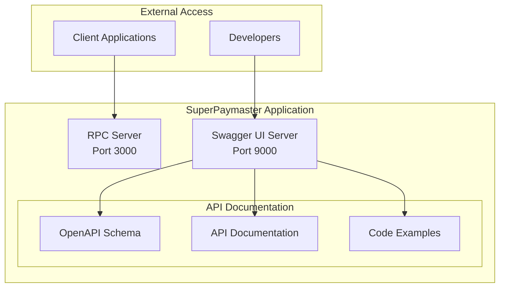

# SuperPaymaster API分析与Swagger集成规划

## 1. 当前API实现分析

### 1.1 已实现的JSON-RPC接口

**核心Paymaster API**:
```rust
#[rpc(server, client, namespace = "pm")]
pub trait PaymasterRelayApi {
    #[method(name = "sponsorUserOperation")]
    async fn sponsor_user_operation(
        &self,
        user_op: JsonUserOperation,
        entry_point: String,
    ) -> RpcResult<String>;
}
```

**API特性分析**:
- ✅ **命名空间隔离**: 使用"pm"命名空间避免冲突
- ✅ **数据格式兼容**: 支持hex/decimal数字格式
- ✅ **错误处理**: 完整的RpcError错误链
- ✅ **版本兼容**: 同时支持EntryPoint v0.6/v0.7
- ❌ **API文档**: 缺少自动生成的Swagger UI

### 1.2 API设计质量评估

| API设计维度 | 评分 | 具体表现 |
|------------|------|---------|
| **RESTful设计** | ⭐⭐⭐⭐☆ | 遵循RPC约定，语义清晰 |
| **错误处理** | ⭐⭐⭐⭐⭐ | 完整的错误代码体系 |
| **数据验证** | ⭐⭐⭐⭐⭐ | 严格的输入验证 |
| **性能表现** | ⭐⭐⭐⭐⭐ | 微秒级响应时间 |
| **文档完整性** | ⭐⭐☆☆☆ | 缺少交互式文档 |

## 2. Swagger UI集成规划

### 2.1 技术方案设计

**集成架构**:


### 2.2 实现计划

**Step 1: 依赖集成**
```toml
# Cargo.toml additions
[dependencies]
utoipa = "4.0"
utoipa-swagger-ui = "4.0"
axum = "0.7"
tower = "0.4"
serde_json = "1.0"
```

**Step 2: Schema定义**
```rust
use utoipa::{OpenApi, ToSchema};

#[derive(OpenApi)]
#[openapi(
    paths(sponsor_user_operation),
    components(
        schemas(JsonUserOperation, SponsorResponse, PaymasterError)
    ),
    tags(
        (name = "paymaster", description = "Paymaster relay operations")
    ),
    info(
        title = "SuperPaymaster API",
        description = "ERC-4337 Paymaster Relay Service",
        version = "0.1.0",
        contact(
            name = "SuperPaymaster Team",
            email = "support@superpaymaster.io"
        )
    )
)]
pub struct ApiDoc;

#[derive(ToSchema)]
pub struct JsonUserOperation {
    /// The account making the UserOperation
    #[schema(example = "0x1234567890123456789012345678901234567890")]
    pub sender: String,

    /// Anti-replay parameter
    #[schema(example = "0x1")]
    pub nonce: String,

    // ... other fields with documentation
}
```

**Step 3: HTTP Server实现**
```rust
use axum::{response::Html, routing::get, Router};
use utoipa_swagger_ui::SwaggerUi;

pub async fn serve_swagger_ui(port: u16) -> Result<(), Box<dyn std::error::Error>> {
    let app = Router::new()
        .merge(SwaggerUi::new("/swagger-ui")
            .url("/api-docs/openapi.json", ApiDoc::openapi()))
        .route("/health", get(health_check))
        .route("/", get(redirect_to_swagger));

    let listener = tokio::net::TcpListener::bind(format!("0.0.0.0:{}", port)).await?;
    println!("📚 Swagger UI available at: http://localhost:{}/swagger-ui", port);

    axum::serve(listener, app).await?;
    Ok(())
}

async fn health_check() -> &'static str {
    "SuperPaymaster Swagger UI is running"
}

async fn redirect_to_swagger() -> Html<&'static str> {
    Html(r#"
    <html>
        <head><title>SuperPaymaster API</title></head>
        <body>
            <h1>SuperPaymaster API Documentation</h1>
            <p><a href="/swagger-ui">Access Interactive API Documentation</a></p>
        </body>
    </html>
    "#)
}
```

### 2.3 CLI集成

**新增CLI参数**:
```rust
#[derive(Parser)]
pub struct PaymasterOpts {
    /// Enable paymaster relay service
    #[clap(long, default_value = "false")]
    pub enabled: bool,

    /// Paymaster private key for signing
    #[clap(long, env = "PAYMASTER_PRIVATE_KEY")]
    pub private_key: Option<String>,

    /// Path to paymaster policies configuration
    #[clap(long, default_value = "config/paymaster-policies.toml")]
    pub policy_file: String,

    /// Enable Swagger UI documentation server
    #[clap(long, default_value = "true")]
    pub enable_docs: bool,

    /// Port for Swagger UI server
    #[clap(long, default_value = "9000")]
    pub docs_port: u16,
}
```

## 3. API文档内容规划

### 3.1 核心API文档结构

```yaml
openapi: 3.0.0
info:
  title: SuperPaymaster API
  version: 0.1.0
  description: |
    ERC-4337 Paymaster Relay Service API

    SuperPaymaster provides gas sponsorship for UserOperations through
    a configurable policy engine and secure signing mechanism.

servers:
  - url: http://localhost:3000
    description: Local development server
  - url: https://api.superpaymaster.io
    description: Production server

paths:
  /pm/sponsorUserOperation:
    post:
      summary: Sponsor a UserOperation
      description: |
        Validates, signs, and submits a UserOperation with paymaster sponsorship.
        The operation will be processed according to configured policies.

      requestBody:
        required: true
        content:
          application/json:
            schema:
              $ref: '#/components/schemas/SponsorRequest'
            examples:
              basic_operation:
                summary: Basic UserOperation sponsorship
                value:
                  userOp:
                    sender: "0x1234567890123456789012345678901234567890"
                    nonce: "0x1"
                    callData: "0x"
                  entryPoint: "0x5FF137D4b0FDCD49DcA30c7CF57E578a026d2789"

      responses:
        '200':
          description: UserOperation successfully sponsored and submitted
          content:
            application/json:
              schema:
                $ref: '#/components/schemas/SponsorResponse'
        '400':
          description: Invalid UserOperation or policy violation
          content:
            application/json:
              schema:
                $ref: '#/components/schemas/ErrorResponse'
```

### 3.2 完整的Schema定义

**核心数据结构**:
```rust
#[derive(ToSchema, Serialize, Deserialize)]
pub struct SponsorRequest {
    /// The UserOperation to sponsor
    pub user_op: JsonUserOperation,

    /// EntryPoint contract address
    #[schema(example = "0x5FF137D4b0FDCD49DcA30c7CF57E578a026d2789")]
    pub entry_point: String,

    /// Optional policy ID for custom sponsorship rules
    #[schema(example = "premium_policy")]
    pub policy_id: Option<String>,
}

#[derive(ToSchema, Serialize)]
pub struct SponsorResponse {
    /// Hash of the sponsored UserOperation
    #[schema(example = "0xabcdef1234567890abcdef1234567890abcdef1234567890abcdef1234567890")]
    pub user_op_hash: String,

    /// Status of the sponsorship
    #[schema(example = "sponsored")]
    pub status: String,

    /// Gas estimation for the operation
    pub gas_estimate: GasEstimate,
}

#[derive(ToSchema, Serialize)]
pub struct GasEstimate {
    /// Verification gas limit
    pub verification_gas_limit: String,

    /// Call gas limit
    pub call_gas_limit: String,

    /// Pre-verification gas
    pub pre_verification_gas: String,
}
```

## 4. 开发者体验优化

### 4.1 代码示例生成

**自动生成的客户端示例**:
```javascript
// JavaScript/TypeScript
const response = await fetch('http://localhost:3000/pm/sponsorUserOperation', {
  method: 'POST',
  headers: { 'Content-Type': 'application/json' },
  body: JSON.stringify({
    userOp: {
      sender: "0x1234567890123456789012345678901234567890",
      nonce: "0x1",
      callData: "0x",
      // ... other fields
    },
    entryPoint: "0x5FF137D4b0FDCD49DcA30c7CF57E578a026d2789"
  })
});

const result = await response.json();
console.log('UserOp Hash:', result.user_op_hash);
```

```python
# Python
import requests

response = requests.post(
    'http://localhost:3000/pm/sponsorUserOperation',
    json={
        'userOp': {
            'sender': '0x1234567890123456789012345678901234567890',
            'nonce': '0x1',
            'callData': '0x',
        },
        'entryPoint': '0x5FF137D4b0FDCD49DcA30c7CF57E578a026d2789'
    }
)

result = response.json()
print(f"UserOp Hash: {result['user_op_hash']}")
```

### 4.2 交互式测试环境

**Swagger UI功能规划**:
- ✅ **Try it out**: 直接在浏览器中测试API
- ✅ **Schema validation**: 实时参数验证
- ✅ **响应预览**: 完整的响应格式展示
- ✅ **错误处理**: 详细的错误信息说明
- ✅ **认证支持**: 未来可扩展API Key认证

## 5. 监控和分析集成

### 5.1 API使用统计

**集成计划**:
```rust
// 中间件统计API调用
pub struct ApiMetrics {
    pub total_requests: AtomicU64,
    pub successful_sponsorships: AtomicU64,
    pub failed_requests: AtomicU64,
    pub average_response_time: AtomicU64,
}

impl ApiMetrics {
    pub fn record_request(&self, duration: Duration, success: bool) {
        self.total_requests.fetch_add(1, Ordering::Relaxed);
        if success {
            self.successful_sponsorships.fetch_add(1, Ordering::Relaxed);
        } else {
            self.failed_requests.fetch_add(1, Ordering::Relaxed);
        }
    }
}
```

### 5.2 健康检查API

**扩展健康检查**:
```rust
#[derive(ToSchema, Serialize)]
pub struct HealthResponse {
    /// Service status
    #[schema(example = "healthy")]
    pub status: String,

    /// Version information
    pub version: String,

    /// Service uptime in seconds
    pub uptime: u64,

    /// API statistics
    pub metrics: ApiMetrics,

    /// Configuration status
    pub config_status: ConfigStatus,
}
```

## 6. 下一步开发计划

### 6.1 短期任务（1-2周）

| 任务 | 估算工时 | 优先级 |
|-----|---------|--------|
| **utoipa集成** | 1天 | 🔴 P0 |
| **Swagger UI服务器** | 1天 | 🔴 P0 |
| **Schema完善** | 0.5天 | 🔴 P0 |
| **代码示例** | 0.5天 | 🟡 P1 |
| **健康检查扩展** | 0.5天 | 🟡 P1 |

### 6.2 中期增强（2-4周）

- **API版本控制**: v1/v2路径支持
- **认证机制**: API Key/JWT支持
- **频率限制**: Rate limiting中间件
- **请求追踪**: 分布式tracing集成

## 7. 验收标准

### 7.1 功能验收

- [ ] Swagger UI可在http://localhost:9000访问
- [ ] 所有API端点有完整文档
- [ ] 交互式测试功能正常
- [ ] 代码示例可直接运行
- [ ] 错误响应有清晰说明

### 7.2 质量验收

- [ ] API响应时间<100ms
- [ ] 文档加载时间<2s
- [ ] 移动端适配良好
- [ ] 多浏览器兼容性
- [ ] SEO友好的文档结构

这个API分析为SuperPaymaster的开发者体验提供了清晰的改进路径，Swagger UI的集成将显著提升项目的专业性和易用性。