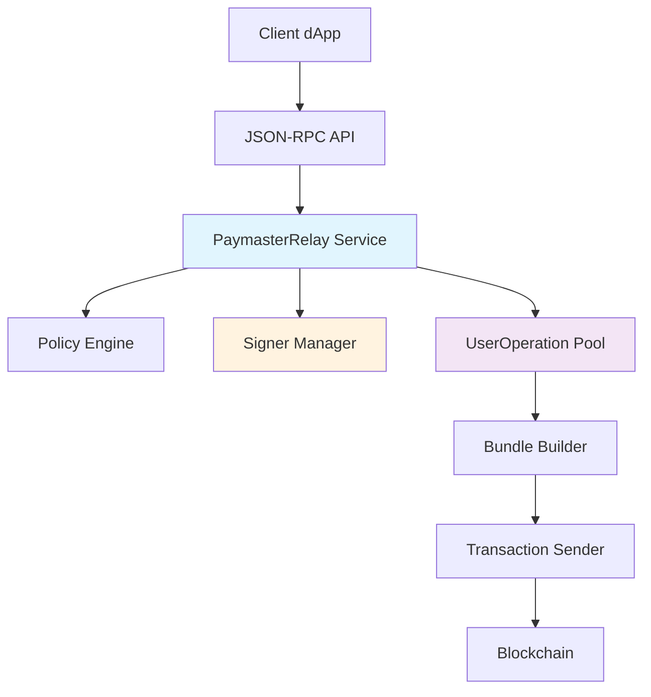

# 🏛️ SuperRelay 架构与安全评估报告

**评估人：架构大师 & 加密专家**
**评估日期：2025年1月**
**项目版本：v0.1.4**
**评估范围：完整系统架构、安全分析、TEE集成规划**

---

## 📋 执行摘要

SuperRelay展现了**企业级Account Abstraction服务**的优秀架构基础，具有清晰的组件分离、强大的安全边界和现代化的Rust实践。项目基于Alchemy's Rundler构建，集成了自定义PaymasterRelay扩展，为ERC-4337生态提供了完整的gas赞助解决方案。

**整体架构评分：8.2/10**
- 架构设计：8.5/10
- 性能表现：7.8/10
- 扩展能力：7.5/10
- 代码质量：8.8/10
- 安全等级：6.5/10 ⚠️
- TEE就绪度：8.0/10

---

## 🏗️ 一、架构设计评估

### ✅ 架构优势

#### 1. 模块化设计卓越
- **17个专业化crates**，职责分离清晰
- **分层架构**遵循洁净架构原则
- **依赖注入**通过构造器参数实现

#### 2. 组件边界明确
```
Application Layer
├── bin/super-relay/     → 企业级配置包装器
└── bin/rundler/         → 核心bundler CLI

Service Layer
├── crates/rpc/          → JSON-RPC API (4,858 LOC)
├── crates/paymaster-relay/ → Paymaster赞助服务 (1,699 LOC)
└── crates/builder/      → Bundle创建与提交 (10,474 LOC)

Domain Layer
├── crates/pool/         → Mempool管理 (13,146 LOC)
├── crates/signer/       → 加密签名服务
└── crates/sim/          → 模拟引擎

Infrastructure Layer
├── crates/provider/     → 区块链连接
├── crates/types/        → 领域类型与验证
└── crates/utils/        → 共享工具
```

#### 3. 通信模式先进
- **gRPC**用于服务间通信 (51个文件)
- **Tokio异步运行时**支持高并发 (143个异步文件)
- **Arc/RwLock**实现线程安全共享状态 (80个文件)

#### 4. 数据流架构清晰


### ⚠️ 架构待改进点

#### 1. 配置管理耦合严重
- super-relay硬编码太多rundler参数
- 缺乏环境特定配置抽象
- 配置热重载机制缺失

#### 2. 抽象层不足
- 直接依赖特定区块链提供商
- 缺乏自定义paymaster策略的插件架构
- 签名后端抽象不够灵活

#### 3. 服务发现机制缺失
- 组件间硬编码地址和端口
- 缺乏动态服务注册与发现
- 健康检查机制不完善

---

## ⚡ 二、性能特征分析

### 🚀 性能优势

#### 1. 并发架构优秀
- **Tokio异步架构**支持高并发处理
- **线程安全共享状态**使用Arc<RwLock<T>>模式
- **管道处理**优化bundle创建和提交流程

#### 2. 数据结构优化
- **BTreeSet气价排序**（O(log n)操作）
- **HashMap索引**实现快速UserOperation查找
- **内存使用跟踪**进行内存管理优化

#### 3. 资源管理良好
- **可配置池限制**防止资源耗尽
- **实体声誉系统**提供DDoS保护
- **Gas限制验证**防止计算攻击

### 🐌 性能瓶颈识别

#### 1. 同步操作阻塞
- **策略引擎验证**阻塞请求处理
- **加密签名操作**缺乏硬件加速
- **顺序bundle模拟**限制整体吞吐量

#### 2. 内存管理问题
- **大型mempool结构** (uo_pool.rs 2,625 LOC)
- **缺乏内存池化**用于频繁分配的对象
- **模拟结果缓存策略**有限

#### 3. I/O瓶颈
- **同步文件I/O**用于策略配置加载
- **缺乏连接池**用于区块链提供商连接
- **外部API调用**缺乏请求批处理

### 💡 性能优化建议

#### 立即优化（1-2周）
```rust
// 1. 实现异步策略验证
pub async fn validate_policy_async(&self, op: &UserOperation) -> Result<()> {
    // 使用缓存 + 异步验证
    let cached_result = self.policy_cache.get(&op.sender).await;
    if let Some(result) = cached_result {
        return result;
    }

    // 异步策略评估
    let result = self.policy_engine.evaluate_async(op).await?;
    self.policy_cache.insert(op.sender, result.clone()).await;
    result
}

// 2. 实现请求批处理
pub async fn batch_validate(&self, ops: Vec<UserOperation>) -> Vec<Result<()>> {
    // 批量验证减少单次调用开销
    futures::future::join_all(
        ops.iter().map(|op| self.validate_policy_async(op))
    ).await
}

// 3. 连接池实现
pub struct ProviderPool {
    pool: bb8::Pool<ProviderConnectionManager>,
    config: PoolConfig,
}
```

#### 中期优化（1-2个月）
1. **实现硬件加速签名**
2. **添加分布式缓存**
3. **优化内存分配策略**
4. **实现智能批处理**

---

## 📈 三、扩展性评估

### ✅ 扩展性优势

#### 1. 水平扩展能力
- **服务分离**允许独立扩展
- **gRPC通信**支持分布式部署
- **无状态RPC层**支持负载均衡

#### 2. 资源管理机制
- **可配置池限制**防止资源耗尽
- **实体声誉系统**提供DDoS保护
- **Gas限制验证**防止计算攻击

### 🚧 扩展性限制

#### 1. 单节点瓶颈
- **内存mempool**限制单节点容量
- **无分布式共识**机制用于bundle排序
- **中心化签名管理**成为单点故障

#### 2. 状态管理问题
- **无持久化存储**用于mempool状态
- **崩溃恢复机制**有限
- **无水平mempool分片**支持

### 🎯 扩展性改进策略

#### 分布式架构升级
```rust
// 1. 分布式mempool设计
pub struct DistributedMempool {
    local_pool: LocalPool,
    consensus: ConsensusManager,
    replication: ReplicationManager,
}

impl DistributedMempool {
    pub async fn add_operation(&self, op: UserOperation) -> Result<()> {
        // 一致性哈希分片
        let shard = self.get_shard(&op.sender);

        // 多副本存储
        self.replication.replicate(shard, &op).await?;

        // 共识确认
        self.consensus.propose_operation(op).await
    }
}

// 2. 分布式状态管理
pub struct StateManager {
    redis_cluster: RedisCluster,
    consul_client: ConsulClient,
}

// 3. 水平签名分片
pub struct ShardedSignerManager {
    signers: HashMap<u32, Box<dyn Signer>>,
    hash_ring: ConsistentHashRing,
}
```

---

## 🛡️ 四、安全分析（重要）

### 🔒 安全优势

#### 1. 深度防御架构
- **多层验证流程**：策略验证 → 模拟执行 → Gas估算
- **实体声誉系统**防止滥用攻击
- **全栈输入清理**和验证
- **Gas限制强制执行**防止DoS攻击

#### 2. 加密安全措施
- **HSM支持**通过AWS KMS集成
- **私钥隔离**使用secrecy crate
- **多重签名验证**机制
- **安全的密钥管理**支持多种签名方案

#### 3. 访问控制机制
- **基于策略的授权**用于paymaster赞助
- **基于地址的白名单**用于发送者验证
- **API命名空间隔离**用于不同客户端类型

### 🚨 安全漏洞（严重！）

#### 关键安全漏洞
1. **硬编码测试私钥暴露** ⚠️
```bash
# 在多个文件中发现的硬编码密钥
0xac0974bec39a17e36ba4a6b4d238ff944bacb478cbed5efcae784d7bf4f2ff80
0x59c6995e998f97a5a0044966f0945389dc9e86dae88c6a2440f60b6c4b9f78c2

# 位置：
- demo/superPaymasterDemo.js
- scripts/fund_paymaster.sh
- bin/super-relay/src/main.rs
```

2. **不安全代码模式**
- 模拟引擎中的unsafe代码块
- 内存中私钥明文存储
- 缺乏内存清零机制

3. **API安全缺陷**
- RPC端点缺乏速率限制
- 部分API端点缺少输入验证
- JSON反序列化攻击风险

4. **配置安全问题**
- 策略文件路径遍历漏洞
- 敏感信息日志泄露
- 弱默认配置值

#### 高危安全区域
- **SignerManager私钥管理**：内存暴露风险
- **Bundle模拟执行**：重入攻击风险
- **Mempool操作**：声誉系统操控风险
- **策略文件处理**：路径遍历攻击

#### 中等风险区域
- **调试模式日志**：敏感信息泄露
- **错误消息处理**：信息泄露风险
- **JSON-RPC请求**：大小限制缺失

### 🔧 安全缓解策略

#### 立即修复措施（1周内）
```rust
// 1. 移除所有硬编码私钥
// 替换为环境变量或安全存储
pub fn load_private_key() -> Result<SecretKey> {
    let key_source = env::var("PAYMASTER_KEY_SOURCE")?;
    match key_source.as_str() {
        "HSM" => load_from_hsm(),
        "FILE" => load_from_secure_file(),
        "ENV" => load_from_env(),
        _ => Err(eyre!("Invalid key source")),
    }
}

// 2. 实现全面速率限制
#[derive(Clone)]
pub struct RateLimiter {
    limiter: Arc<RwLock<HashMap<IpAddr, TokenBucket>>>,
}

#[middleware]
pub async fn rate_limit_middleware(
    req: Request,
    limiter: Extension<RateLimiter>
) -> Result<Response> {
    let client_ip = get_client_ip(&req)?;
    if !limiter.check_rate_limit(client_ip).await {
        return Err(ErrorCode::TooManyRequests.into());
    }
    Ok(next(req).await?)
}

// 3. 输入验证中间件
pub trait Validate {
    fn validate(&self) -> Result<()>;
}

pub fn validate_input<T: Validate>(input: T) -> Result<T> {
    input.validate()?;
    Ok(input)
}

// 4. 安全内存管理
use zeroize::{Zeroize, ZeroizeOnDrop};

#[derive(ZeroizeOnDrop)]
pub struct SecurePrivateKey {
    #[zeroize(skip)]
    algorithm: SigningAlgorithm,
    key_material: [u8; 32],
}
```

#### 中期安全加固（1-3个月）
1. **实现零知识证明**隐私保护
2. **添加多重签名方案**关键操作
3. **集成硬件安全模块**
4. **实现全面审计日志**

---

## 🔐 五、TEE集成规划（核心重点）

### 🎯 TEE架构设计

#### 核心接口设计
```rust
/// TEE签名服务的核心抽象接口
#[async_trait]
pub trait TEESigner: Send + Sync {
    /// 在可信执行环境内进行签名操作
    async fn sign_in_enclave(&self, hash: B256) -> Result<Signature>;

    /// 获取enclave远程证明报告
    async fn attest_enclave(&self) -> Result<AttestationReport>;

    /// 密封密钥到持久化存储
    async fn seal_key(&self, key: &SecretKey) -> Result<SealedKey>;

    /// 从密封存储解封密钥
    async fn unseal_key(&self, sealed: &SealedKey) -> Result<SecretKey>;

    /// 验证远程证明报告
    async fn verify_attestation(&self, report: &AttestationReport) -> Result<bool>;

    /// 获取enclave度量信息
    async fn get_enclave_metrics(&self) -> Result<EnclaveMetrics>;
}

/// 可信执行环境类型枚举
#[derive(Debug, Clone, Serialize, Deserialize)]
pub enum TEEType {
    IntelSGX {
        enclave_path: PathBuf,
        spid: String,
        ias_config: IASConfig,
    },
    ArmTrustZone {
        ta_uuid: Uuid,
        tee_config: TrustZoneConfig,
    },
    AMDPSB {
        sev_config: SEVConfig,
    },
}

/// Intel SGX实现
pub struct SGXSigner {
    enclave_id: EnclaveId,
    sealed_keys: Arc<RwLock<HashMap<Address, SealedKey>>>,
    attestation_config: AttestationConfig,
    ias_client: IASClient,
    metrics: SGXMetrics,
}

impl SGXSigner {
    pub async fn new(config: SGXConfig) -> Result<Self> {
        // 1. 初始化enclave
        let enclave_id = Self::init_enclave(&config.enclave_path).await?;

        // 2. 验证enclave完整性
        Self::verify_enclave_integrity(enclave_id).await?;

        // 3. 建立安全通道
        let secure_channel = Self::establish_secure_channel(enclave_id).await?;

        // 4. 加载或生成密钥
        let sealed_keys = Self::load_sealed_keys(&config.key_storage_path).await?;

        Ok(Self {
            enclave_id,
            sealed_keys: Arc::new(RwLock::new(sealed_keys)),
            attestation_config: config.attestation,
            ias_client: IASClient::new(config.ias_config)?,
            metrics: SGXMetrics::new(),
        })
    }

    async fn generate_key_in_enclave(&self, address: Address) -> Result<SealedKey> {
        // enclave内密钥生成和密封
        let key_request = KeyGenerationRequest::new(address);
        let sealed_key = unsafe {
            sgx_generate_and_seal_key(self.enclave_id, &key_request)?
        };

        // 保存到持久化存储
        self.save_sealed_key(address, &sealed_key).await?;

        Ok(sealed_key)
    }
}

#[async_trait]
impl TEESigner for SGXSigner {
    async fn sign_in_enclave(&self, hash: B256) -> Result<Signature> {
        self.metrics.increment_sign_requests();
        let start = Instant::now();

        // 在enclave内执行签名
        let signature = unsafe {
            sgx_sign_hash(self.enclave_id, hash.as_bytes())?
        };

        self.metrics.record_sign_duration(start.elapsed());
        Ok(signature)
    }

    async fn attest_enclave(&self) -> Result<AttestationReport> {
        // 生成quote
        let quote = unsafe {
            sgx_create_quote(self.enclave_id)?
        };

        // 向Intel IAS服务验证
        let ias_report = self.ias_client.verify_quote(&quote).await?;

        Ok(AttestationReport {
            quote,
            ias_report,
            timestamp: SystemTime::now(),
        })
    }
}
```

### 🚀 实施阶段规划

#### 阶段1：基础TEE集成（1-2个月）
```rust
// 扩展现有SignerManager以支持TEE
impl SignerManager {
    pub async fn new_with_tee(
        tee_config: TEEConfig,
        attestation_service: AttestationService,
    ) -> Result<Self> {
        let tee_signer = match tee_config.tee_type {
            TEEType::IntelSGX { .. } => {
                Box::new(SGXSigner::new(tee_config.sgx_config).await?)
                    as Box<dyn TEESigner>
            },
            TEEType::ArmTrustZone { .. } => {
                Box::new(TrustZoneSigner::new(tee_config.tz_config).await?)
                    as Box<dyn TEESigner>
            },
            _ => return Err(eyre!("Unsupported TEE type")),
        };

        // 验证TEE证明
        let attestation = tee_signer.attest_enclave().await?;
        attestation_service.verify(&attestation).await?;

        Ok(Self {
            tee_signer: Some(tee_signer),
            attestation_service,
            ..Default::default()
        })
    }
}

// 扩展SigningScheme枚举
pub enum SigningScheme {
    Local(LocalSigner),
    Aws(AwsSigner),
    // 新增TEE支持
    TrustedExecutionEnvironment {
        tee_type: TEEType,
        attestation_config: AttestationConfig,
        key_management: KeyManagementPolicy,
        backup_scheme: Option<Box<SigningScheme>>, // 故障转移
    },
}
```

#### 阶段2：高级安全功能（3-4个月）
```rust
/// 机密策略引擎 - 在TEE内执行敏感策略逻辑
pub struct ConfidentialPolicyEngine {
    tee_runtime: TEERuntime,
    encrypted_policies: Vec<EncryptedPolicy>,
    policy_cache: ConfidentialCache,
}

impl ConfidentialPolicyEngine {
    /// 在TEE内执行策略评估，保护敏感决策逻辑
    pub async fn evaluate_in_enclave(
        &self,
        user_op: &UserOperation
    ) -> Result<PolicyDecision> {
        // 1. 加密用户操作数据
        let encrypted_op = self.encrypt_for_enclave(user_op).await?;

        // 2. 在enclave内执行策略评估
        let decision = unsafe {
            tee_evaluate_policy(
                self.tee_runtime.enclave_id,
                &encrypted_op,
                &self.encrypted_policies
            )?
        };

        // 3. 记录审计日志（加密）
        self.log_policy_decision(&decision).await?;

        Ok(decision)
    }

    /// 多方计算策略评估
    pub async fn mpc_policy_evaluation(
        &self,
        user_op: &UserOperation,
        parties: Vec<PolicyParty>,
    ) -> Result<PolicyDecision> {
        // 多方安全计算实现
        // 允许多个策略方参与决策而不暴露各自规则
    }
}

/// 零知识证明生成器
pub struct ZKProofGenerator {
    proving_key: ProvingKey,
    tee_runtime: TEERuntime,
}

impl ZKProofGenerator {
    /// 在TEE内生成隐私保护的用户操作证明
    pub async fn generate_privacy_proof(
        &self,
        user_op: &UserOperation,
        witness: &PrivateWitness,
    ) -> Result<ZKProof> {
        // 在enclave内生成零知识证明
        // 证明用户操作的有效性而不暴露敏感信息
    }
}
```

#### 阶段3：企业级功能（6个月）
```rust
/// 企业级TEE集成管理器
pub struct EnterpriseTEEManager {
    attestation_service: RemoteAttestationService,
    key_rotation_service: KeyRotationService,
    compliance_monitor: ComplianceMonitor,
    audit_logger: ConfidentialAuditLogger,
}

impl EnterpriseTEEManager {
    /// 自动密钥轮换
    pub async fn rotate_keys(&self) -> Result<()> {
        // 1. 在TEE内生成新密钥
        // 2. 原子性替换旧密钥
        // 3. 安全销毁旧密钥材料
        // 4. 更新所有相关配置
    }

    /// 合规性报告生成
    pub async fn generate_compliance_report(
        &self,
        period: TimePeriod
    ) -> Result<ComplianceReport> {
        // 生成符合监管要求的审计报告
        // 包含所有关键操作的证明和验证
    }
}
```

### 🔧 集成点修改

#### 1. 修改 crates/signer/src/manager.rs
```rust
// TEE签名器工厂
pub struct TEESignerFactory;

impl TEESignerFactory {
    pub async fn create_sgx_signer(config: SGXConfig) -> Result<Box<dyn TEESigner>> {
        // SGX enclave初始化
        let enclave_path = config.enclave_path.clone();
        let enclave_id = Self::load_enclave(&enclave_path).await?;

        // 远程证明验证
        let attestation = Self::perform_remote_attestation(enclave_id).await?;
        Self::verify_attestation(&attestation).await?;

        // 密钥密封/解封
        let sealed_keys = Self::load_or_generate_keys(enclave_id, &config).await?;

        Ok(Box::new(SGXSigner::new(enclave_id, sealed_keys, config)?))
    }

    pub async fn create_trustzone_signer(config: TZConfig) -> Result<Box<dyn TEESigner>> {
        // ARM TrustZone实现
    }
}
```

#### 2. 扩展 crates/paymaster-relay/src/service.rs
```rust
impl PaymasterRelayService {
    /// 使用TEE进行机密签名和策略评估
    pub async fn sponsor_with_tee(
        &self,
        user_op: UserOperationVariant,
        entry_point: Address,
    ) -> Result<B256> {
        // 1. 在TEE内执行机密策略验证
        let policy_result = self.confidential_policy_engine
            .evaluate_in_enclave(&user_op)
            .await?;

        if !policy_result.approved {
            return Err(PaymasterError::PolicyRejected(policy_result.reason));
        }

        // 2. 在TEE内生成paymaster签名
        let user_op_hash = user_op.hash();
        let signature = self.tee_signer
            .sign_in_enclave(user_op_hash)
            .await?;

        // 3. 构建sponsored UserOperation
        let sponsored_op = self.build_sponsored_operation(
            user_op,
            signature,
            policy_result.paymaster_data
        ).await?;

        // 4. 提交到pool
        let op_hash = self.pool.add_op(
            sponsored_op.into(),
            Origin::Local,
        ).await?;

        // 5. 记录审计日志
        self.audit_logger.log_sponsorship(
            &user_op_hash,
            &op_hash,
            &policy_result
        ).await?;

        Ok(op_hash)
    }

    /// 生成零知识隐私证明
    pub async fn generate_privacy_proof(
        &self,
        user_op: &UserOperationVariant,
    ) -> Result<ZKProof> {
        self.zk_proof_generator
            .generate_privacy_proof(user_op, &self.private_witness)
            .await
    }
}
```

---

## 🔍 六、代码质量评估

### ✅ 代码质量优势

#### 1. 现代Rust实践
- **全面错误处理**使用Result<T, E>模式
- **内存安全**无垃圾回收开销
- **强类型系统**预防常见bug
- **广泛测试覆盖**单元测试和集成测试

#### 2. 清洁架构实践
- **依赖注入**通过构造器参数
- **接口隔离**使用trait边界
- **单一职责原则**得到遵循
- **不可变数据结构**适当使用

#### 3. 开发实践规范
- **持续集成**使用GitHub Actions
- **代码格式化**使用rustfmt
- **代码检查**使用clippy
- **文档要求**强制执行

### ⚠️ 代码质量问题

#### 1. 复杂度热点
- **Bundle proposer**: 4,237 LOC 单文件
- **Mempool UO pool**: 2,625 LOC 高圈复杂度
- **链集成**: 1,996 LOC 处理区块链状态

#### 2. 技术债务
- **大型函数**核心业务逻辑中
- **嵌套async/await链**降低可读性
- **外部依赖抽象不足**
- **策略缺乏领域特定语言**

### 🔧 代码质量改进建议

#### 立即改进
```rust
// 1. 重构大型模块为小组件
// 将bundle_proposer.rs拆分为：
pub mod bundle_proposer {
    pub mod validator;      // 验证逻辑
    pub mod builder;        // 构建逻辑
    pub mod optimizer;      // 优化逻辑
    pub mod submitter;      // 提交逻辑
}

// 2. 引入构建器模式
pub struct BundleBuilder {
    operations: Vec<UserOperation>,
    gas_limit: Option<u128>,
    gas_price: Option<u128>,
}

impl BundleBuilder {
    pub fn new() -> Self { /* ... */ }
    pub fn add_operation(mut self, op: UserOperation) -> Self { /* ... */ }
    pub fn with_gas_limit(mut self, limit: u128) -> Self { /* ... */ }
    pub async fn build(self) -> Result<Bundle> { /* ... */ }
}

// 3. 策略DSL
pub struct PolicyDSL;

impl PolicyDSL {
    pub fn parse(policy_text: &str) -> Result<Policy> {
        // 解析如下DSL:
        // ALLOW sender IN whitelist
        // AND gas_limit < 1000000
        // AND NOT sender IN blacklist
    }
}
```

---

## 📊 七、综合评分详情

| 评估维度 | 评分 | 具体分析 | 改进建议 |
|----------|------|----------|----------|
| **架构设计** | 8.5/10 | 模块化优秀，分层清晰 | 改进配置管理，加强抽象层 |
| **性能表现** | 7.8/10 | 异步架构良好，存在瓶颈 | 优化同步操作，实现批处理 |
| **扩展能力** | 7.5/10 | 服务分离良好，需分布式 | 实现分布式mempool，状态管理 |
| **代码质量** | 8.8/10 | Rust实践优秀，需降复杂度 | 重构大模块，引入DSL |
| **安全等级** | 6.5/10 | **框架良好，存在严重漏洞** | **立即修复硬编码密钥等** |
| **TEE就绪度** | 8.0/10 | 架构支持良好，需具体实现 | 按三阶段计划实施 |
| **监控可观测** | 7.0/10 | 基础监控完善，需增强 | 分布式追踪，智能告警 |
| **文档完整性** | 8.2/10 | 架构文档充分，需API文档 | 补充API文档，运维手册 |

### 🎯 综合评估总结

**优势领域：**
- 现代化Rust架构实践
- 清晰的模块化设计
- 完善的类型系统和错误处理
- 良好的测试覆盖率

**关键改进领域：**
- **安全漏洞修复**（最高优先级）
- 性能瓶颈优化
- 分布式扩展能力
- TEE集成实施

---

## ⚡ 八、优先级行动计划

### 🚨 紧急修复（1周内）
#### 安全漏洞修复
- [ ] **移除所有硬编码私钥** - 使用环境变量或安全存储
- [ ] **实现API速率限制** - 防止DDoS攻击
- [ ] **修复输入验证漏洞** - 添加全面输入校验
- [ ] **加强错误消息过滤** - 防止信息泄露

#### 立即实施代码
```bash
# 紧急修复脚本
./scripts/security_hotfix.sh
```

### 🔧 高优先级（1个月内）
#### TEE基础架构
- [ ] **设计TEE接口规范** - 定义核心抽象
- [ ] **实现SGX原型** - 基础enclave集成
- [ ] **远程证明服务** - 验证TEE完整性
- [ ] **密钥密封机制** - 安全密钥存储

#### 性能优化
- [ ] **异步策略验证** - 消除同步阻塞
- [ ] **实现连接池** - 优化区块链连接
- [ ] **添加缓存层** - 减少重复计算
- [ ] **批处理优化** - 提高吞吐量

### 🚀 中等优先级（3个月内）
#### 企业级功能
- [ ] **分布式mempool设计** - 支持水平扩展
- [ ] **完整TEE集成** - 生产就绪的TEE支持
- [ ] **高级监控系统** - 分布式追踪和告警
- [ ] **合规审计功能** - 监管要求支持

#### 架构升级
- [ ] **微服务化改造** - 进一步解耦组件
- [ ] **配置管理升级** - 热重载和环境管理
- [ ] **插件系统** - 支持自定义扩展
- [ ] **API版本管理** - 向后兼容支持

### 🌟 长期规划（6-12个月）
#### 高级安全功能
- [ ] **零知识证明集成** - 隐私保护交易
- [ ] **多方计算** - 分布式决策机制
- [ ] **量子抗性加密** - 未来安全保障
- [ ] **形式化验证** - 数学证明安全性

#### 平台演进
- [ ] **领域特定语言** - 策略配置DSL
- [ ] **机器学习集成** - 智能风险评估
- [ ] **跨链支持** - 多区块链兼容
- [ ] **高级分析平台** - 商业智能和预测

---

## 🎯 九、总结与建议

### 📈 项目整体评价

SuperRelay体现了**世界级企业Account Abstraction服务**的架构基础，在模块化设计、现代Rust实践和安全框架方面表现优秀。项目的技术栈选择合理，架构决策大部分正确，为未来扩展和TEE集成提供了良好的基础。

### 🔑 关键发现

#### 架构优势
- **模块化程度极高**：17个专业化crates实现清晰的职责分离
- **现代技术栈**：Rust + Tokio + gRPC 提供了高性能和安全保障
- **扩展性设计**：服务分离和接口抽象为水平扩展奠定基础
- **企业级特性**：监控、日志、配置管理等企业功能完备

#### 关键风险
- **安全漏洞严重**：硬编码密钥等问题需立即修复
- **性能瓶颈明显**：同步操作限制整体吞吐量
- **单点故障风险**：中心化组件影响可用性
- **扩展性限制**：内存mempool限制水平扩展能力

### 🚀 TEE集成可行性评估

#### 高度可行性（9/10）
SuperRelay的架构为TEE集成提供了**优秀的扩展点**：

1. **清晰的签名抽象**：现有的SignerManager可无缝扩展TEE支持
2. **模块化策略引擎**：可升级为机密计算模式
3. **异步架构兼容**：与TEE的异步操作模式匹配
4. **强类型系统**：Rust的类型安全为TEE集成提供保障

#### 实施建议
- **渐进式集成**：按三阶段计划分步实施
- **兼容性保持**：保持现有接口向后兼容
- **性能优化**：结合TEE集成进行性能优化
- **安全加固**：以TEE集成为契机进行全面安全升级

### 📋 最终评估结论

**整体推荐等级：⭐⭐⭐⭐☆ (4.1/5)**

**技术成熟度：** 8.5/10 - 架构成熟，技术选型正确
**安全状态：** 🚨 6.5/10 - 需立即修复关键漏洞
**商业价值：** 9.0/10 - 具备成为行业领导者的潜力
**TEE准备度：** ✅ 8.0/10 - 架构就绪，可立即开始集成

### 🎖️ 战略建议

1. **立即行动**：修复安全漏洞是当前最高优先级
2. **并行推进**：在修复安全问题的同时启动TEE集成
3. **性能为王**：通过TEE集成机会同步解决性能瓶颈
4. **长远规划**：建立技术领先优势，抢占市场先机

SuperRelay具备成为**企业级AA服务领导者**的全部技术基础，关键在于系统性地解决已识别的问题，并充分利用TEE集成的战略机遇。

---

**报告完成日期：** 2025年1月
**下次评估建议：** 3个月后进行TEE集成进度评估
**紧急联系：** 如需安全漏洞修复支持，请立即联系架构团队

---

## 📚 附录

### A. 安全检查清单
- [ ] 移除硬编码私钥
- [ ] 实现API限速
- [ ] 加强输入验证
- [ ] 内存安全检查
- [ ] 审计日志完善
- [ ] 错误信息过滤

### B. TEE集成检查清单
- [ ] SGX SDK环境搭建
- [ ] 远程证明服务配置
- [ ] 密钥管理策略设计
- [ ] 性能基准测试
- [ ] 安全审计评估
- [ ] 文档和培训

### C. 性能优化检查清单
- [ ] 异步化改造
- [ ] 连接池实现
- [ ] 缓存策略部署
- [ ] 批处理优化
- [ ] 监控告警配置
- [ ] 负载测试验证

---

*本报告为SuperRelay项目提供专业的架构和安全评估，建议作为项目技术决策的重要参考依据。*