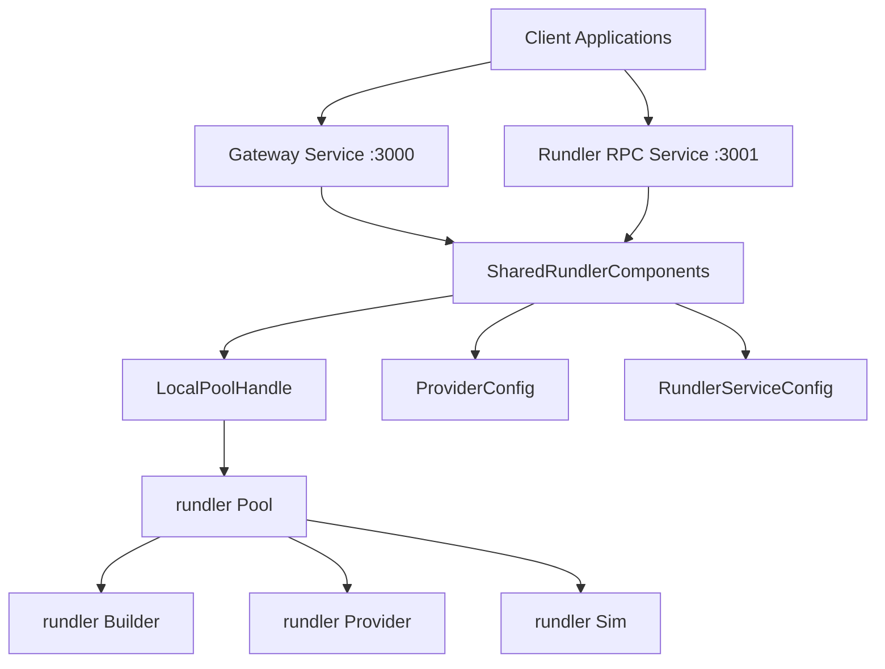
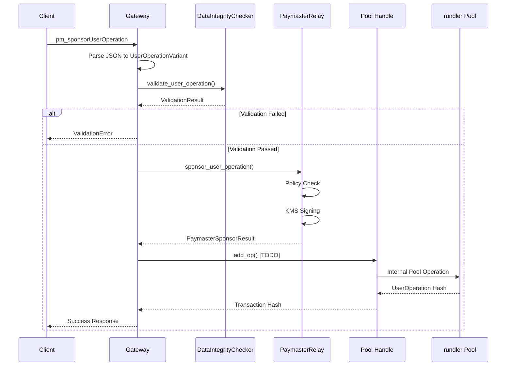

# SuperRelay 模块通信架构文档

## 概述

本文档详细描述SuperRelay项目中新增模块与rundler核心组件之间的通信机制，包括组件协调、数据流转和接口设计。

## 1. 架构总览

### 1.1 双服务共享组件设计



### 1.2 核心通信原则

- **零拷贝共享**: 使用`Arc<T>`实现线程安全的组件共享
- **异步优先**: 所有I/O操作采用async/await模式
- **类型兼容**: 直接使用rundler的`UserOperationVariant`等类型
- **进程内调用**: 避免网络开销，直接方法调用

## 2. SharedRundlerComponents 详解

### 2.1 组件定义

```rust
#[derive(Clone)]
pub struct SharedRundlerComponents {
    /// 核心Pool组件句柄 - 主要通信桥梁
    pub pool: Arc<LocalPoolHandle>,
    /// Provider配置 - 网络和节点配置
    pub provider_config: Arc<ProviderConfig>,  
    /// Rundler服务配置 - 服务级配置
    pub rundler_config: Arc<RundlerServiceConfig>,
}
```

### 2.2 初始化流程

```rust
async fn initialize_shared_rundler_components(
    config: &SuperRelayConfig,
) -> Result<SharedRundlerComponents> {
    // 1. 创建Provider - 连接以太坊节点
    let provider = Arc::new(rundler_provider::new_alloy_provider(
        &config.node_http, 30
    )?);
    
    // 2. 创建EVM Provider和DA Gas Oracle
    let evm_provider = rundler_provider::AlloyEvmProvider::new(provider.clone());
    let (da_gas_oracle, _) = rundler_provider::new_alloy_da_gas_oracle(
        &chain_spec, provider.clone()
    );
    
    // 3. 创建Entry Point providers (支持v0.6和v0.7)
    let ep_v0_6 = Some(rundler_provider::AlloyEntryPointV0_6::new(
        chain_spec.clone(),
        max_verification_gas,
        max_bundle_execution_gas,
        max_bundle_execution_gas, 
        max_bundle_execution_gas,
        provider.clone(),
        da_gas_oracle.clone(),
    ));
    
    let ep_v0_7 = Some(rundler_provider::AlloyEntryPointV0_7::new(
        chain_spec.clone(),
        max_verification_gas,
        max_bundle_execution_gas,
        max_bundle_execution_gas,
        max_bundle_execution_gas,
        provider.clone(),
        da_gas_oracle.clone(),
    ));
    
    // 4. 创建Pool组件 - 核心共享组件
    let pool_builder = LocalPoolBuilder::new(100);
    let pool_handle = Arc::new(pool_builder.get_handle());
    
    Ok(SharedRundlerComponents {
        pool: pool_handle,
        provider_config: Arc::new(provider_config),
        rundler_config: Arc::new(rundler_config),
    })
}
```

## 3. Gateway通信机制

### 3.1 JSON-RPC请求路由

#### 路由决策矩阵

| 方法前缀 | 目标组件 | 处理方式 |
|---------|---------|---------|
| `pm_*` | PaymasterRelay | 直接服务调用 |
| `eth_*` | rundler Pool | SharedComponents.pool |
| `rundler_*` | rundler Admin | SharedComponents.pool |

#### 核心路由实现

```rust
pub async fn route_to_rundler(&self, request: &JsonRpcRequest) -> GatewayResult<Value> {
    match request.method.as_str() {
        "eth_sendUserOperation" => {
            if let Some(pool) = &self.pool_handle {
                // 直接调用共享Pool组件 - 零网络开销
                self.send_user_operation_with_pool(pool, request).await
            } else {
                Err(GatewayError::InvalidRequest("Pool not available".to_string()))
            }
        }
        "eth_estimateUserOperationGas" => {
            if let Some(pool) = &self.pool_handle {
                // 使用Pool组件进行Gas估算
                self.estimate_user_operation_gas_with_pool(pool, request).await
            } else {
                // 降级到备用估算
                self.estimate_user_operation_gas_fallback(request).await
            }
        }
        // ... 其他方法路由
    }
}
```

### 3.2 UserOperation处理流程



## 4. Paymaster-Relay集成

### 4.1 类型系统集成

#### UserOperation兼容性
```rust
// 直接使用rundler类型，确保完全兼容
pub async fn sponsor_user_operation(
    &self,
    user_op: UserOperationVariant,  // rundler原生类型
    entry_point: Address,          // alloy_primitives::Address
) -> Result<PaymasterSponsorResult, PaymasterError>
```

#### 版本适配处理
```rust
match user_op {
    UserOperationVariant::V0_6(op) => {
        // v0.6: paymaster+data一体化格式
        let paymaster_and_data = [
            paymaster_address.as_bytes(),
            &signature.to_vec()
        ].concat();
        
        PaymasterSponsorResult {
            paymaster_and_data,
            verification_gas_limit: None, // v0.6不分离
            post_op_gas_limit: None,
            ..
        }
    }
    UserOperationVariant::V0_7(op) => {
        // v0.7: 分离的paymaster字段
        PaymasterSponsorResult {
            paymaster_and_data: signature.to_vec(),
            verification_gas_limit: Some(100_000),
            post_op_gas_limit: Some(50_000),
            ..
        }
    }
}
```

### 4.2 签名流程集成

```rust
// 与rundler UserOperation的hash方法集成
let user_op_hash = user_op.hash(&entry_point, &chain_id);

// KMS签名 - 支持多种签名方案
let signature = match &self.signer_manager.scheme {
    SigningScheme::PrivateKeys => {
        // 本地私钥签名
        self.signer_manager.sign_hash(user_op_hash.into()).await?
    }
    SigningScheme::AwsKms => {
        // AWS KMS签名
        self.aws_kms_client.sign(user_op_hash).await?
    }
    SigningScheme::TeeKms => {
        // TEE KMS签名 (待集成)
        self.tee_kms_client.secure_sign(user_op_hash).await?
    }
};
```

## 5. 双服务模式实现

### 5.1 服务启动协调

```rust
pub async fn run_dual_service(&self) -> Result<()> {
    // 1. 初始化共享组件 - 只初始化一次
    let shared_components = self
        .initialize_shared_rundler_components(&super_config)
        .await?;
    
    // 2. 并行启动两个服务，使用相同的组件实例
    let (gateway_result, rundler_result) = tokio::join!(
        self.start_gateway_service(
            gateway_host,
            gateway_port,
            shared_components.clone(), // 克隆Arc指针，不复制数据
            paymaster_service.clone(),
        ),
        self.start_rundler_rpc_service(
            shared_components.clone(), // 同一组件实例
            rundler_port,
        )
    );
    
    // 3. 处理服务结果
    match (gateway_result, rundler_result) {
        (Ok(_), Ok(_)) => {
            info!("✅ Both services started successfully");
            // 等待服务信号
            self.wait_for_shutdown_signal().await;
        }
        (Err(e), _) | (_, Err(e)) => {
            error!("❌ Service startup failed: {}", e);
            return Err(e);
        }
    }
    
    Ok(())
}
```

### 5.2 资源共享管理

#### 内存共享
```rust
// Pool组件通过Arc共享，避免数据复制
pub struct GatewayState {
    pub pool_handle: Option<Arc<LocalPoolHandle>>, // 共享Pool句柄
    pub paymaster_service: Option<Arc<PaymasterRelayService>>,
    pub router: GatewayRouter,
}
```

#### 并发访问控制
```rust
// LocalPoolHandle内部实现线程安全
impl LocalPoolHandle {
    pub async fn add_op(&self, op: UserOperationVariant) -> Result<Hash> {
        // 内部使用Mutex/RwLock确保线程安全
        let mut pool = self.inner.write().await;
        pool.add_operation(op).await
    }
}
```

## 6. 错误处理和状态管理

### 6.1 统一错误处理

```rust
// 错误类型映射 - 保持兼容性
impl From<rundler::PoolError> for GatewayError {
    fn from(err: rundler::PoolError) -> Self {
        match err {
            rundler::PoolError::InvalidUserOperation(msg) => {
                GatewayError::ValidationError(msg)
            }
            rundler::PoolError::InsufficientFunds => {
                GatewayError::PaymasterError("Insufficient funds".to_string())
            }
            _ => GatewayError::InternalError(err.to_string())
        }
    }
}
```

### 6.2 健康状态监控

```rust
pub async fn check_component_health(
    &self,
    shared_components: &SharedRundlerComponents,
) -> ComponentHealthStatus {
    // 检查Pool组件健康状态
    let pool_status = match shared_components.pool.health_check().await {
        Ok(_) => ComponentStatus::Healthy,
        Err(e) => {
            warn!("Pool health check failed: {}", e);
            ComponentStatus::Unhealthy
        }
    };
    
    // 检查Provider连接状态
    let provider_status = match shared_components
        .provider_config
        .test_connection()
        .await 
    {
        Ok(_) => ComponentStatus::Healthy,
        Err(_) => ComponentStatus::Degraded,
    };
    
    ComponentHealthStatus {
        pool: pool_status,
        provider: provider_status,
        overall: self.calculate_overall_status(&[pool_status, provider_status]),
    }
}
```

## 7. 性能优化机制

### 7.1 零拷贝数据传递

```rust
// 使用Arc避免UserOperation复制
async fn process_user_operation(
    user_op: Arc<UserOperationVariant>, // 零拷贝传递
    components: &SharedRundlerComponents,
) -> Result<Hash> {
    // 各组件通过引用访问UserOperation数据
    let validation_result = validate_operation(&*user_op).await?;
    let pool_result = components.pool.add_op((*user_op).clone()).await?;
    Ok(pool_result)
}
```

### 7.2 异步并发优化

```rust
// 并行处理多个UserOperation
pub async fn batch_process_operations(
    &self,
    operations: Vec<UserOperationVariant>,
) -> Vec<Result<Hash, GatewayError>> {
    // 使用futures::join_all实现并发处理
    let tasks: Vec<_> = operations
        .into_iter()
        .map(|op| self.process_single_operation(op))
        .collect();
    
    futures::future::join_all(tasks).await
}
```

## 8. 关键通信接口API

### 8.1 Gateway -> rundler Pool

```rust
// 主要接口方法
impl GatewayRouter {
    // UserOperation提交
    async fn submit_user_operation(
        &self,
        pool: &Arc<LocalPoolHandle>,
        user_op: UserOperationVariant,
    ) -> Result<Hash>;
    
    // Gas估算
    async fn estimate_gas(
        &self,
        pool: &Arc<LocalPoolHandle>, 
        user_op: UserOperationVariant,
    ) -> Result<GasEstimate>;
    
    // 操作查询
    async fn get_user_operation(
        &self,
        pool: &Arc<LocalPoolHandle>,
        hash: Hash,
    ) -> Result<Option<UserOperationWithReceipt>>;
}
```

### 8.2 PaymasterRelay -> KMS

```rust
// KMS集成接口设计
#[async_trait]
pub trait KmsProvider: Send + Sync {
    async fn sign_hash(&self, hash: [u8; 32]) -> Result<Signature, KmsError>;
    async fn get_address(&self) -> Result<Address, KmsError>;
    async fn health_check(&self) -> Result<(), KmsError>;
}

// TEE KMS具体实现 (待集成)
pub struct TeeKmsProvider {
    endpoint: String,
    api_key: String,
    attestation_verifier: TeeAttestationVerifier,
}

impl KmsProvider for TeeKmsProvider {
    async fn sign_hash(&self, hash: [u8; 32]) -> Result<Signature, KmsError> {
        // 1. 验证TEE环境
        self.attestation_verifier.verify_environment().await?;
        
        // 2. 调用TEE KMS API
        let request = TeeSignRequest {
            hash: hex::encode(hash),
            key_id: self.get_key_id(),
        };
        
        let response: TeeSignResponse = self
            .http_client
            .post(&self.endpoint)
            .json(&request)
            .send()
            .await?
            .json()
            .await?;
            
        // 3. 验证签名
        let signature = Signature::from_hex(&response.signature)?;
        Ok(signature)
    }
}
```

## 9. 监控和可观测性

### 9.1 Metrics集成

```rust
// 通信性能指标
pub struct CommunicationMetrics {
    // Pool调用指标
    pool_calls_total: Counter,
    pool_call_duration: Histogram,
    pool_errors_total: Counter,
    
    // Paymaster调用指标  
    paymaster_sponsorships_total: Counter,
    paymaster_response_time: Histogram,
    
    // 组件健康指标
    component_health_status: Gauge,
}
```

### 9.2 分布式追踪

```rust
// 使用tracing实现请求追踪
#[tracing::instrument(skip(self, user_op))]
async fn handle_sponsor_request(
    &self,
    user_op: UserOperationVariant,
    entry_point: Address,
) -> Result<PaymasterSponsorResult> {
    let span = tracing::info_span!(
        "paymaster_sponsor",
        user_op.hash = %user_op.hash(&entry_point, &chain_id),
        entry_point = %entry_point,
    );
    
    async move {
        // 业务逻辑处理...
    }.instrument(span).await
}
```

## 总结

SuperRelay的通信架构通过以下关键机制实现了高性能、低延迟的模块间通信：

1. **SharedRundlerComponents**: 实现组件零拷贝共享
2. **直接方法调用**: 避免网络开销，提升响应速度  
3. **异步并发**: 最大化系统吞吐量
4. **类型兼容**: 保持与rundler的完全兼容性
5. **统一错误处理**: 简化错误传播和处理
6. **健康监控**: 实时掌握组件状态

这种设计既保持了对rundler的零侵入原则，又实现了企业级功能的无缝集成，为生产环境的高可用性提供了技术保障。

---

*文档版本: v1.0*  
*更新时间: 2025-01-21*