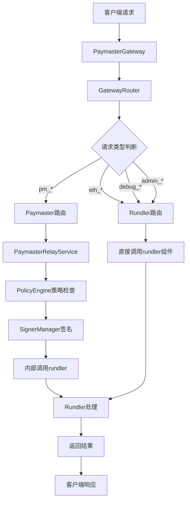
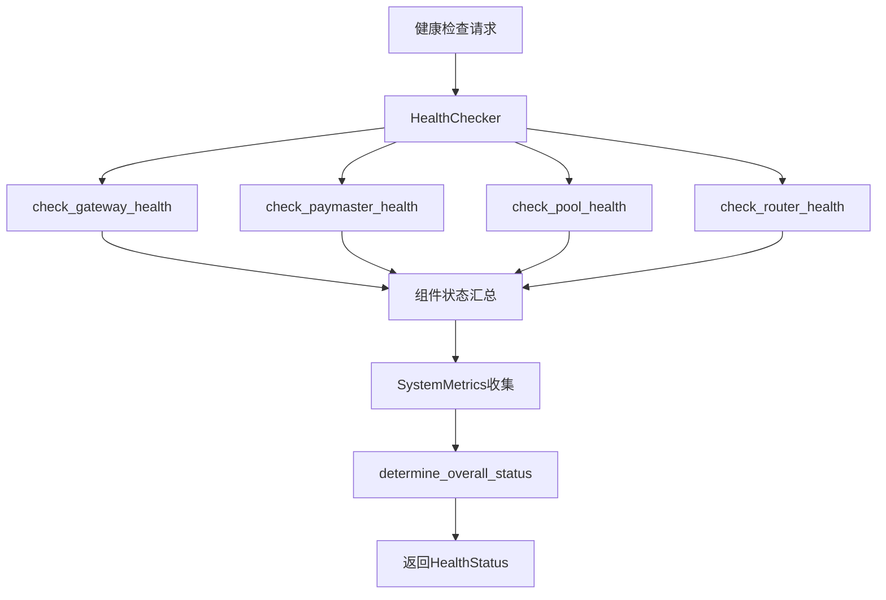
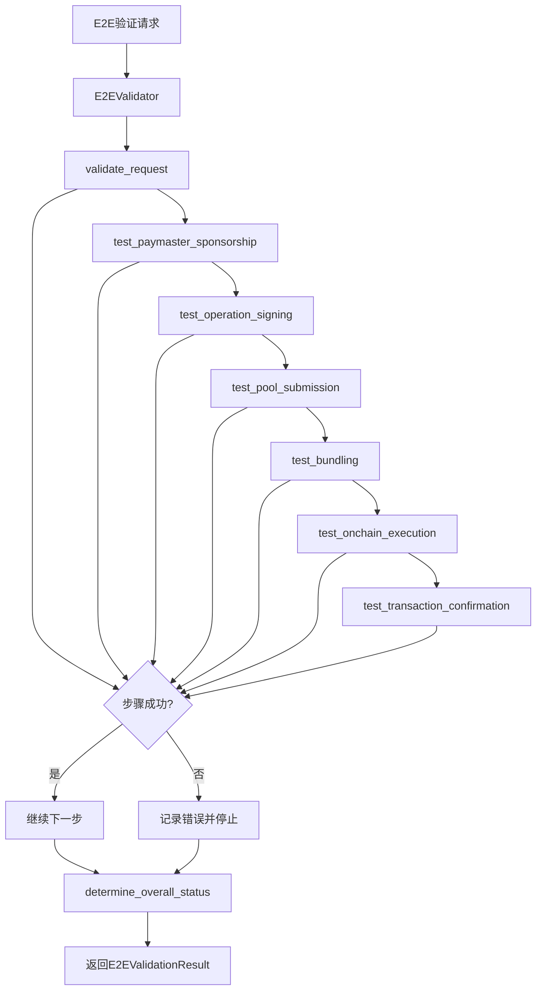
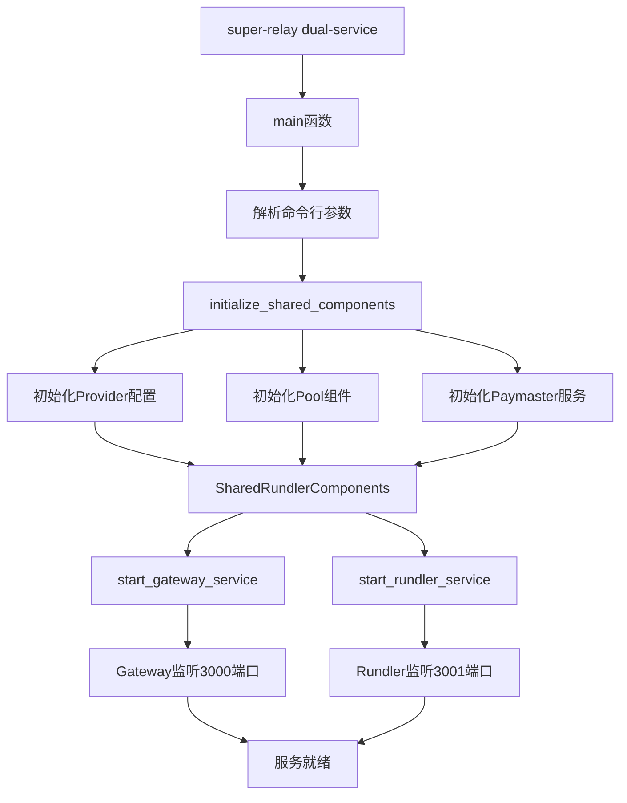

# SuperRelay 组件架构文档

本文档详细描述SuperRelay项目中我们在原有rundler基础上添加的主要组件及其内部函数关系。

## 项目概览

### 二进制文件大小对比
- **rundler**: 56M (原始完整功能)
- **super-relay**: 12M (企业API网关版本，包含全部功能)

### 核心架构原则
- **零侵入设计**: 对rundler原始代码无任何修改
- **单binary部署**: 一个可执行文件包含所有功能
- **双服务架构**: Gateway(3000端口) + Rundler服务共存
- **企业功能扩展**: 在网关层实现认证、监控、安全检查等

## 主要添加组件

### 1. super-relay-gateway (API网关组件)

#### 1.1 核心模块

##### PaymasterGateway (`src/gateway.rs`)
主要API网关服务，负责请求路由和企业功能集成。

**核心函数**:
```rust
// 网关服务管理
pub fn new(config: GatewayConfig, paymaster_service: Option<Arc<PaymasterRelayService>>) -> Self
pub fn with_rundler_components(config, paymaster_service, pool_handle, eth_config) -> Self
pub async fn start(self) -> GatewayResult<()>

// 请求处理
async fn handle_jsonrpc(State(state): State<GatewayState>, Json(payload): Json<Value>) -> Result<Json<Value>, StatusCode>
async fn handle_e2e_validation(State(state): State<GatewayState>) -> Result<Json<E2EValidationResult>, StatusCode>
async fn handle_metrics(State(state): State<GatewayState>) -> String

// 内部辅助
fn create_router(&self, state: GatewayState) -> Router
fn parse_jsonrpc_request(payload: &Value) -> GatewayResult<JsonRpcRequest>
```

##### GatewayRouter (`src/router.rs`)
智能请求路由器，处理不同类型API请求的分发和转换。

**核心函数**:
```rust
// 路由器初始化
pub fn new() -> Self
pub fn with_rundler_components(pool_handle: Arc<LocalPoolHandle>, eth_config: EthApiConfig) -> Self

// 请求路由
pub async fn route_paymaster_request(&self, request: &JsonRpcRequest) -> Result<Value, GatewayError>
pub async fn route_rundler_request(&self, request: &JsonRpcRequest) -> Result<Value, GatewayError>

// Paymaster API实现
async fn pm_sponsor_user_operation(&self, params: Vec<Value>) -> Result<Value, GatewayError>

// Rundler API代理
async fn eth_supported_entry_points(&self) -> Result<Value, GatewayError>
async fn eth_estimate_user_operation_gas(&self, params: Vec<Value>) -> Result<Value, GatewayError>
async fn eth_send_user_operation(&self, params: Vec<Value>) -> Result<Value, GatewayError>
async fn eth_get_user_operation_by_hash(&self, params: Vec<Value>) -> Result<Value, GatewayError>
async fn eth_get_user_operation_receipt(&self, params: Vec<Value>) -> Result<Value, GatewayError>
```

##### HealthChecker (`src/health.rs`)
多级健康检查系统，提供组件级状态监控。

**核心函数**:
```rust
// 健康检查器管理
pub fn new() -> Self
pub fn record_request(&self)
pub fn record_error(&self)

// 健康检查逻辑
pub async fn check_health(&self, state: &GatewayState) -> HealthStatus
async fn check_gateway_health(&self) -> ComponentHealth
async fn check_paymaster_health(&self, paymaster_service: &Option<Arc<PaymasterRelayService>>) -> ComponentHealth
async fn check_pool_health(&self) -> ComponentHealth
async fn check_router_health(&self, router: &GatewayRouter) -> ComponentHealth

// 系统指标收集
async fn collect_system_metrics(&self) -> SystemMetrics
async fn get_memory_usage_mb(&self) -> f64
fn determine_overall_status(&self, components: &[&ComponentHealth]) -> SystemStatus

// API端点处理
pub async fn health_check(State(state): State<GatewayState>) -> Result<Json<HealthStatus>, StatusCode>
pub async fn readiness_check(State(state): State<GatewayState>) -> Result<StatusCode, StatusCode>
pub async fn liveness_check() -> StatusCode
```

##### E2EValidator (`src/e2e_validator.rs`)
端到端交易验证系统，提供完整UserOperation生命周期验证。

**核心函数**:
```rust
// 验证器管理
pub fn new(state: GatewayState) -> Self

// 端到端验证
pub async fn validate_user_operation_flow(&self, user_op: UserOperationVariant, entry_point: String) -> E2EValidationResult

// 验证步骤实现
async fn validate_request(&self, user_op: &UserOperationVariant, entry_point: &str) -> E2EStepResult
async fn test_paymaster_sponsorship(&self, user_op: &UserOperationVariant, entry_point: &str) -> E2EStepResult
async fn test_operation_signing(&self, user_op: &UserOperationVariant) -> E2EStepResult
async fn test_pool_submission(&self, user_op: &UserOperationVariant) -> E2EStepResult
async fn test_remaining_steps(&self, steps_completed: &mut Vec<E2EStep>, step_results: &mut Vec<E2EStepResult>)

// 辅助方法
fn determine_overall_status(&self, step_results: &[E2EStepResult]) -> E2EStatus
fn extract_error_summary(&self, step_results: &[E2EStepResult]) -> Option<String>
fn extract_sender(&self, user_op: &UserOperationVariant) -> String
fn extract_call_data(&self, user_op: &UserOperationVariant) -> Vec<u8>
fn extract_signature(&self, user_op: &UserOperationVariant) -> Vec<u8>

// 快速健康检查
pub async fn quick_e2e_health_check(state: &GatewayState) -> E2EValidationResult
```

##### Middleware (`src/middleware.rs`)
企业中间件框架，提供认证、策略检查等功能基础。

**核心函数**:
```rust
// 认证中间件
pub struct AuthenticationMiddleware
impl AuthenticationMiddleware {
    pub fn new() -> Self
    pub async fn authenticate(&self, request: &JsonRpcRequest) -> Result<(), GatewayError>
}

// 策略检查中间件  
pub struct PolicyCheckMiddleware
impl PolicyCheckMiddleware {
    pub fn new() -> Self
    pub async fn check_policy(&self, request: &JsonRpcRequest) -> Result<(), GatewayError>
}
```

#### 1.2 数据结构

**配置结构**:
- `GatewayConfig`: 网关基础配置
- `GatewayState`: 请求间共享状态
- `EthApiConfig`: Ethereum API配置
- `JsonRpcRequest`: JSON-RPC请求结构

**健康检查结构**:
- `HealthStatus`: 综合健康状态
- `SystemStatus`: 系统整体状态枚举
- `ComponentsStatus`: 各组件状态汇总
- `ComponentHealth`: 单个组件健康状态
- `SystemMetrics`: 系统指标数据

**端到端验证结构**:
- `E2EValidationResult`: 验证结果汇总
- `E2EStatus`: 验证状态枚举
- `E2EStep`: 验证步骤枚举
- `E2EStepResult`: 单步验证结果
- `StepStatus`: 步骤执行状态

### 2. rundler-paymaster-relay (Paymaster服务组件)

#### 2.1 核心模块

##### PaymasterRelayService (`src/service.rs`)
Paymaster核心业务逻辑，负责UserOperation赞助和签名。

**核心函数**:
```rust
// 服务管理
pub fn new(signer: SignerManager, policy: PolicyEngine) -> Self

// 核心业务API
pub async fn sponsor_user_operation(&self, user_op: UserOperationVariant, entry_point: H160) -> Result<UserOperationVariant, PaymasterError>

// 内部处理逻辑
async fn validate_user_operation(&self, user_op: &UserOperationVariant) -> Result<(), PaymasterError>
async fn apply_sponsorship_policy(&self, user_op: &UserOperationVariant) -> Result<(), PaymasterError>
async fn sign_user_operation(&self, user_op: UserOperationVariant) -> Result<UserOperationVariant, PaymasterError>
```

##### SignerManager (`src/signer.rs`)
签名管理器，处理私钥管理和UserOperation签名。

**核心函数**:
```rust
// 签名器管理
pub fn new(private_key: SecretString) -> Result<Self, PaymasterError>

// 签名操作
pub async fn sign_user_operation(&self, user_op: &UserOperationVariant, entry_point: &H160) -> Result<Signature, PaymasterError>

// 内部实现
fn calculate_user_operation_hash(&self, user_op: &UserOperationVariant, entry_point: &H160) -> Result<H256, PaymasterError>
fn sign_hash(&self, hash: H256) -> Result<Signature, PaymasterError>
```

##### PolicyEngine (`src/policy.rs`)
策略引擎，基于配置文件实现赞助策略检查。

**核心函数**:
```rust
// 策略引擎管理
pub fn new(policy_config: PolicyConfig) -> Self
pub fn from_file(file_path: &Path) -> Result<Self, PaymasterError>

// 策略检查
pub async fn should_sponsor(&self, user_op: &UserOperationVariant) -> Result<bool, PaymasterError>

// 内部检查逻辑
fn check_sender_allowlist(&self, sender: &H160) -> bool
fn check_gas_limits(&self, user_op: &UserOperationVariant) -> bool
fn check_contract_interaction(&self, user_op: &UserOperationVariant) -> bool
```

#### 2.2 API层

##### PaymasterRelayApiServer (`src/rpc.rs`)
JSON-RPC API服务器实现，提供标准化的RPC接口。

**核心函数**:
```rust
// RPC API实现 (由jsonrpsee宏生成)
#[rpc(server)]
pub trait PaymasterRelayApi {
    async fn pm_sponsor_user_operation(&self, user_op: UserOperationVariant, entry_point: Address) -> RpcResult<UserOperationVariant>;
}

// 服务器实现
pub struct PaymasterRelayApiServerImpl
impl PaymasterRelayApiServer for PaymasterRelayApiServerImpl {
    async fn pm_sponsor_user_operation(&self, user_op: UserOperationVariant, entry_point: Address) -> RpcResult<UserOperationVariant>
}
```

### 3. bin/super-relay (主二进制程序)

#### 3.1 主程序结构 (`src/main.rs`)

##### 双服务架构实现

**核心函数**:
```rust
// 主入口
#[tokio::main]
async fn main() -> Result<()>

// 命令处理
async fn run_dual_service(args: DualServiceArgs) -> Result<()>
async fn run_gateway(args: GatewayArgs) -> Result<()>
async fn run_node(args: NodeArgs) -> Result<()>

// 双服务架构核心
async fn start_dual_service(config: DualServiceConfig) -> Result<()>
fn initialize_shared_components(config: &DualServiceConfig) -> Result<SharedRundlerComponents>
async fn start_gateway_service(shared_components: &SharedRundlerComponents, config: &DualServiceConfig) -> Result<JoinHandle<()>>
async fn start_rundler_service(shared_components: &SharedRundlerComponents, config: &DualServiceConfig) -> Result<JoinHandle<()>>

// 组件初始化
async fn create_paymaster_service(config: &DualServiceConfig) -> Result<Option<Arc<PaymasterRelayService>>>
async fn initialize_pool(provider_config: &ProviderConfig, rundler_config: &RundlerServiceConfig) -> Result<Arc<LocalPoolHandle>>
async fn initialize_provider_config(network: &str, node_http: &str) -> Result<ProviderConfig>
```

##### 共享组件架构

**数据结构**:
```rust
// 双服务共享组件
#[derive(Clone)]
pub struct SharedRundlerComponents {
    pub pool: Arc<LocalPoolHandle>,
    pub provider_config: Arc<ProviderConfig>,
    pub rundler_config: Arc<RundlerServiceConfig>,
}

// 配置结构
pub struct DualServiceConfig {
    pub gateway_port: u16,
    pub rundler_port: u16,
    pub enable_paymaster: bool,
    pub network: String,
    pub node_http: String,
    pub paymaster_private_key: Option<SecretString>,
}

pub struct ProviderConfig {
    pub network: String,
    pub node_http: String,
    pub chain_id: u64,
}

pub struct RundlerServiceConfig {
    pub rpc_enabled: bool,
    pub rpc_port: u16,
    pub chain_id: u64,
}
```

## 组件间交互流程

### 主流程 (UserOperation处理)



### 健康检查流程



### 端到端验证流程



### 双服务架构启动流程



## TODO和占位符状态

### 现有TODO项分析

#### Gateway组件 (需要完善的功能)
1. **E2E验证器** (`e2e_validator.rs`):
   - `TODO: Extract transaction hash from successful execution`
   - `TODO: Actually call paymaster service`
   - `TODO: Actually test pool submission`

2. **健康检查** (`health.rs`):
   - `TODO: Add actual paymaster health check logic`
   - `TODO: Add actual pool health check logic`
   - `TODO: Track actual connections`

3. **网关核心** (`gateway.rs`):
   - `TODO: Proxy rundler metrics endpoint (/metrics) for unified access`

4. **中间件** (`middleware.rs`):
   - `TODO: Implement authentication logic`
   - `TODO: Implement policy checking logic`

5. **路由器** (`router.rs`):
   - `TODO: Use actual pool methods for gas estimation, operation submission, etc.`

#### Paymaster组件 (功能相对完整)
1. **Swagger UI** (`swagger.rs`):
   - `TODO: Fix Prometheus integration`
   - `TODO: Implement actual balance checking`
   - `TODO: Implement actual policy reading`
   - `TODO: Implement actual transaction history`

### 优先级评估
- **P0 (高优先级)**: Router中的实际pool方法调用
- **P1 (中优先级)**: 健康检查的实际组件检测
- **P2 (低优先级)**: Swagger UI的辅助功能完善

## 小结

SuperRelay在rundler基础上构建了完整的企业级API网关架构，主要特点：

1. **零侵入扩展**: 未修改rundler原始代码
2. **模块化设计**: Gateway、Paymaster、E2E验证等独立模块
3. **企业功能**: 健康检查、监控、认证、策略管理
4. **双服务架构**: 支持网关模式和原生模式并存
5. **单binary部署**: 12M vs 56M，体积优化显著

当前还有一些TODO项需要完善，但核心架构和主要功能已经完成。