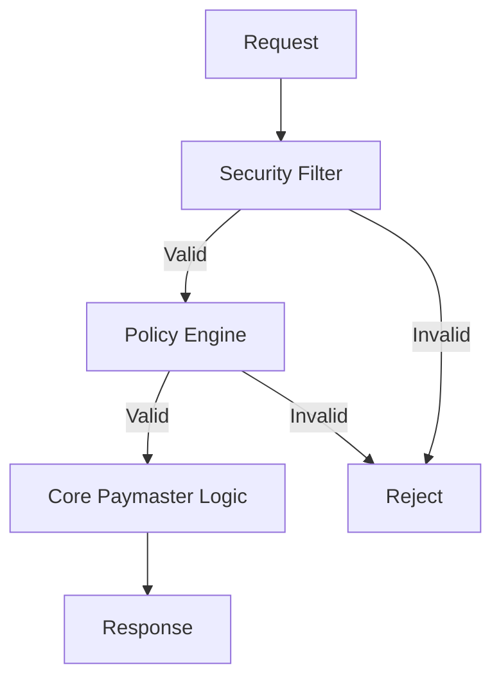

# Comprehensive Review (V2) - SuperRelay

**Date**: 2025-01-04
**Version Reviewed**: 0.1.6
**Reviewer**: Gemini (AI Architect)

## 1. Executive Summary

This review assesses the SuperRelay project at version 0.1.6. The project's goal is to create an enterprise-grade ERC-4337 Paymaster Relay.

Overall, the project has a solid architectural foundation. The modular design within `paymaster-relay` is commendable, separating concerns like services, policies, and metrics. The recent efforts to stabilize the development environment and CI/CD pipeline (fixing git hooks, compilation issues) were crucial and have successfully unblocked development.

However, the review identifies several areas for improvement to elevate the project from a functional tool to an enterprise-grade service. Key recommendations include:
- **Strengthening Security**: Implementing a dedicated, extensible security filtering module.
- **Enhancing Test Coverage**: Adding comprehensive user-centric E2E tests and stress tests.
- **Improving Developer Experience**: Creating a unified, powerful interactive demo and a simple `curl`-based health check.
- **Formalizing Health Monitoring**: Designing a more comprehensive and user-facing health dashboard.

These findings will be translated into a new, prioritized development plan.

---

## 2. Component Abstraction Review

### 2.1. Business Component & User Case
- **Core Value**: The project successfully abstracts the core business value: providing a reliable, configurable, and observable "Gas Sponsoring" service for dApp developers.
- **User Case**: The primary user case is clear: a developer wants to submit a `UserOperation` to SuperRelay, which validates it against a set of rules (policies) and, if valid, pays for the gas and submits it to the blockchain via a Bundler.

### 2.2. System Component Structure
The component structure is logical and follows best practices for Rust projects.

```mermaid
graph TD
    subgraph SuperRelay System
        subgraph "bin/super-relay"
            A[main.rs] --> B{PaymasterRelay Service};
        end

        subgraph "crates/paymaster-relay"
            B --> C[RPC Handler];
            C --> D{Policy Engine};
            C --> E{Signer Logic};
            C --> F{Simulation Engine};
            C --> G{Metrics & Monitoring};
        end

        subgraph "crates/types"
            H[Data Structures]
        end
    end

    subgraph External Dependencies
        I[Bundler (rundler)];
        J[EVM Node (Anvil/Geth)];
        K[Signature Provider (AWS KMS, etc.)];
    end

    B -.-> H;
    F --> I;
    E --> K;
    B --> J;

    style D fill:#f9f,stroke:#333,stroke-width:2px
    style E fill:#f9f,stroke:#333,stroke-width:2px
    style G fill:#f9f,stroke:#333,stroke-width:2px
```

- **Business vs. Technical Components**:
  - The business component `PaymasterRelay Service` is well-supported by technical components like `Policy Engine`, `Signer Logic`, and `Metrics`. The mapping is clear.
- **Strengths**: The separation of `paymaster-relay` as a library crate from the `super-relay` binary is excellent, promoting reusability.
- **Weaknesses**: The security logic is currently implicitly part of the `Policy Engine`. It's not explicitly defined as a first-class component, which could be a limitation.

---

## 3. Technical Implementation Review

### 3.1. Component Communication
- Communication is primarily handled via direct Rust function calls within the `paymaster-relay` service, which is efficient.
- External communication (to Bundler, EVM Node) uses standard JSON-RPC, which is appropriate.

### 3.2. Key Data Structures
- The project correctly uses and extends data structures from the `ethers-rs` and `alloy` ecosystems.
- The `UserOperationVariant` enum to handle both v0.6 and v0.7 of the ERC-4337 spec is a good implementation detail.

### 3.3. Extensibility
- **Strengths**: The policy engine is file-based (`paymaster-policies.toml`), which makes it highly extensible without recompiling. Adding a new policy is a matter of configuration. The `Signer` trait allows for different signing backends (local, AWS KMS) to be added easily.
- **Area for Improvement**: The current architecture lacks a formal "middleware" or "pipeline" pattern for processing requests. Adding a cross-cutting concern, like a global security filter, would require modifying the main RPC handling logic.

#### **Proposed Extensibility Improvement: Security Filter Pipeline**
A more extensible approach would be to process incoming requests through a pipeline of handlers.


This would allow new stages (e.g., caching, advanced logging) to be added with minimal changes to the core code.

---

## 4. Key Aspects Review & Reflection

### 4.1. Reflection on Product Design Assumptions
- **Assumption**: "Developers need a highly configurable Paymaster." - **Still Valid**. The TOML-based policy configuration validates this.
- **Assumption**: "Observability is a key enterprise feature." - **Still Valid**. The work on `/metrics` and Prometheus endpoints confirms this.
- **Potential Gap**: The project assumes developers are technically proficient with Rust/CLI tools. The developer experience for non-Rust developers could be improved. The existing demos are a good start but could be more interactive and unified.
- **Recommendation**: Create a single, powerful "one-stop-shop" interactive demo (web-based) that combines configuration, sending operations, and viewing logs/metrics in one place.

### 4.2. API Docs and Demo Review
- **API Docs**: The Swagger UI integration is a significant achievement and provides excellent, interactive documentation. This meets enterprise standards.
- **Demo**:
  - `curl-test.sh`: Good for a quick health check but doesn't demonstrate the full power.
  - `interactive-demo.html`: A great concept but feels disconnected from the main project flow.
  - **Gap**: There is no simple, one-command `curl` test to verify if the paymaster is "alive and ready to sponsor". The current `curl` test is too complex for a simple health check.
- **Recommendation**:
  1. Create a very simple `curl` command for the `/health` endpoint as the primary "is it alive?" check.
  2. Enhance the web demo to be the primary tool for new developers to explore SuperRelay's capabilities.

### 4.3. Test Coverage Review
- **Unit/Integration Tests**: The existing tests within crates (`paymaster-relay/tests`) are good for verifying individual components.
- **Gap**: There is a lack of end-to-end (E2E) tests that simulate a user's entire journey from `UserOperation` submission to it being seen on-chain.
- **Gap**: There is no formal `UserCaseTest.md` document as suggested in the rules.
- **Gap**: No stress testing or security testing has been performed to understand the system's limits and vulnerabilities.
- **Recommendation**:
  1. Create a `UserCaseTest.md` document.
  2. Implement an E2E test suite (e.g., using `integration-tests` bin) that covers the main user success paths.
  3. Develop a basic stress test plan and script.

### 4.4. Health Monitoring Review
- **Current State**: The `/metrics` and `/prometheus` endpoints provide excellent data for monitoring tools. The `/health` endpoint is basic.
- **Gap**: There is no human-readable, real-time health dashboard. For operators, a simple web page showing key metrics (e.g., sponsoring rate, balance, errors) would be invaluable for quick diagnostics without setting up a full Grafana stack.
- **Recommendation**: Design and implement a simple, real-time status dashboard served on a separate port, using the existing Axum web server capabilities.

---

## 5. Conclusion & Next Steps

The SuperRelay project is in a good state. The foundational work is solid. The next phase of development should focus on maturing the project into a truly enterprise-grade, secure, and developer-friendly service.

The findings from this review will be used to create a new set of tasks in `PLAN.md`.