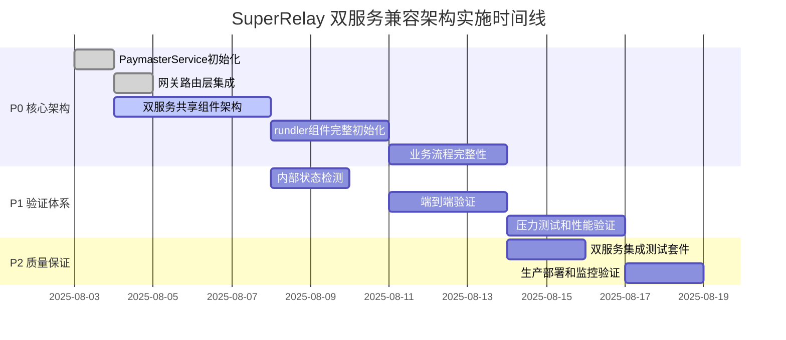

# Super-Relay Development Plan

This document breaks down the features from `FEATURES.md` into a sequential development plan. We will follow these steps to build and integrate the `super-relay` functionality.

## Version 0.1.0

### Milestone 1: Project Scaffolding and Basic Integration

**Objective:** Set up the foundational structure of our `paymaster-relay` crate and integrate it into the `rundler` build process.

-   **Task 1.1: Create `paymaster-relay` Crate:**
    -   Inside `rundler/crates/`, create a new library crate named `paymaster-relay`.
    -   Add it to the main `rundler` workspace in `rundler/Cargo.toml`.
    -   Create the basic module files: `lib.rs`, `rpc.rs`, `service.rs`, `policy.rs`, `signer.rs`, `error.rs`.

-   **Task 1.2: Add CLI Configuration:**
    -   Modify `rundler/bin/rundler/src/cli/mod.rs`.
    -   Add a new `PaymasterOpts` struct with arguments like `--paymaster.enabled` and `--paymaster.policy-file`.
    -   Integrate `PaymasterOpts` into the main `RundlerOpts` struct.

-   **Task 1.3: Initial Integration into `main.rs`:**
    -   Modify `rundler/bin/rundler/src/main.rs`.
    -   Add placeholder logic: if `paymaster.enabled` is true, print a log message like "Paymaster Relay service is enabled."
    -   **Goal:** Ensure the new crate compiles and the new CLI flag is recognized without altering any behavior yet.

### Milestone 2: Implement Core Signing and RPC Logic

**Objective:** Implement the end-to-end flow for receiving, signing, and submitting a UserOperation.

-   **Task 2.1: Implement `SignerManager`:**
    -   In `paymaster-relay/src/signer.rs`, create the `SignerManager`.
    -   Implement logic to load a private key from an environment variable (e.g., `PAYMASTER_PRIVATE_KEY`).
    -   Implement the `sign_user_op_hash` method.

-   **Task 2.2: Implement `PaymasterRelayApi` Trait:**
    -   In `paymaster-relay/src/rpc.rs`, define the `PaymasterRelayApi` trait using `jsonrpsee::proc_macros::rpc`.
    -   Define the `pm_sponsorUserOperation` method signature.

-   **Task 2.3: Implement `PaymasterRelayService`:**
    -   In `paymaster-relay/src/service.rs`, create the `PaymasterRelayService` struct. It will hold instances of the `SignerManager` and (later) the `PolicyEngine`.
    -   Implement the `sponsor_user_operation` business logic. For now, it will:
        1.  Accept a `UserOperation`.
        2.  (Skip policy check for now).
        3.  Calculate the `userOpHash`.
        4.  Call the `SignerManager` to get a signature.
        5.  Construct the `paymasterAndData` field.
        6.  Return the modified `UserOperation`.

-   **Task 2.4: Integrate RPC into `rundler`:**
    -   Implement the `PaymasterRelayApiServer` trait for the `PaymasterRelayService`.
    -   In `rundler/crates/rpc/src/lib.rs`, add the `PaymasterRelayApiServer` to the `ApiSet` and merge it into the `jsonrpsee` module.
    -   In `rundler/bin/rundler/src/main.rs`, instantiate and launch the service.
    -   **Goal:** At this point, we should be able to call `pm_sponsorUserOperation` via an RPC client and receive back a signed UserOperation.

### Milestone 3: Policy Engine and Mempool Submission

**Objective:** Add rule-based sponsorship control and submit the sponsored UserOperation to the mempool.

-   **Task 3.1: Implement `PolicyEngine`:**
    -   In `paymaster-relay/src/policy.rs`, define the structs for `Policy` and `PolicyConfig` (deserializable from TOML).
    -   Implement the `PolicyEngine` to load policies from the file specified in `PaymasterOpts`.
    -   Implement the `check_policy` method which, for now, checks the `sender` address against an allowlist.

-   **Task 3.2: Integrate `PolicyEngine` into `PaymasterRelayService`:**
    -   Update `PaymasterRelayService` to include the `PolicyEngine`.
    -   In the `sponsor_user_operation` logic, call `policy_engine.check_policy()` before signing. If it fails, return an error.

-   **Task 3.3: Internal Mempool Submission:**
    -   Modify the `PaymasterRelayService::sponsor_user_operation` method.
    -   Instead of returning the signed `UserOperation`, it should now call the `rundler` `Pool` task to add the UO to the mempool.
    -   This requires passing a channel/handle for the `Pool` task to the `PaymasterRelayService`.
    -   The RPC method will now return the `userOpHash` upon successful submission to the pool.

### Milestone 4: API Documentation and Final Touches

**Objective:** Add developer-friendly API documentation.

-   **Task 4.1: Add `utoipa` Dependencies:**
    -   Add `utoipa`, `utoipa-swagger-ui`, and `axum` to the `paymaster-relay` `Cargo.toml`.

-   **Task 4.2: Annotate Code:**
    -   Create `api_docs.rs` or similar.
    -   Define request/response structs and annotate them with `#[derive(ToSchema)]`.
    -   Create the main `ApiDoc` struct with `#[derive(OpenApi)]`.

-   **Task 4.3: Create and Launch Swagger Service:**
    -   Implement the `serve_swagger_ui` function using `axum`.
    -   In `rundler/bin/rundler/src/main.rs`, spawn the `serve_swagger_ui` function as a new `tokio` task if paymaster support is enabled.
    -   **Goal:** Verify that a Swagger UI is available on `http://127.0.0.1:9000` when `rundler` is running.

### Milestone 5: Testing and Validation

-   **Task 5.1:** Write unit tests for `SignerManager` and `PolicyEngine`.
-   **Task 5.2:** Write integration tests that call the `pm_sponsorUserOperation` RPC endpoint and verify that a sponsored transaction is correctly added to the mempool.
-   **Task 5.3:** Manually test the full flow with a sample dApp/script.
-   **Task 5.4:** Run `forge build` and `forge test` on the `SuperPaymaster-Contract` to ensure contract validity.
-   **Task 5.5:** Update `docs/Changes.md` and `docs/DEPLOY.md`.

## Version 0.2.0 - 企业级增强与生产就绪

基于**反思2.0 Review**发现的关键问题，我们将在v0.2.0中实现企业级功能增强，确保生产环境的可靠性和安全性。

### 优先级P0: Swagger UI集成 (2-3天工作量)

**问题识别**: 开发者体验不足，API文档缺失，难以快速上手和集成。

**解决方案**:
- **Milestone 6: Swagger UI (已完成)**
  - **Task 6.1: 增强API文档结构 - ✅ COMPLETED**
  - **Task 6.2: 交互式Swagger UI - ✅ COMPLETED**
  - **Task 6.3: API使用统计 - ✅ COMPLETED**

### 优先级P1: 监控增强 (3-4天工作量)

**问题识别**: 缺乏生产级监控，无法及时发现和诊断问题。

**解决方案**:
- **Milestone 7: 企业级监控体系**
  - **Task 7.1: Prometheus指标集成**
    - 添加`prometheus`和`tokio-metrics`依赖
    - 实现核心业务指标：签名成功率、策略拒绝率、响应时间分位数
    - 创建`crates/paymaster-relay/src/metrics.rs`模块

  - **Task 7.2: 健康检查增强**
    - 实现`/health`、`/metrics`、`/ready`端点
    - 添加依赖服务检查(Ethereum节点连接、签名服务状态)
    - 实现故障自诊断和恢复建议

  - **Task 7.3: 告警和日志**
    - 集成结构化日志(tracing + json格式)
    - 实现关键事件告警(签名失败、策略违规、性能异常)
    - 添加错误率和延迟阈值监控

**验收标准**:
- Prometheus metrics在 `/metrics` 端点可用
- 健康检查页面显示所有关键指标
- 日志结构化且可搜索

### 优先级P2: 安全模块基础架构 (5-7天工作量)

**问题识别**: 缺乏安全过滤和风险评估，存在滥用风险。

**解决方案**:
- **Milestone 8: 安全过滤与风险控制**
  - **Task 8.1: 创建Security Filter模块**
    - 创建`crates/security-filter/`新crate
    - 实现`SecurityFilter` trait和基础风险评估
    - 添加Rate Limiting和IP白名单功能

  - **Task 8.2: 风险评估引擎**
    - 实现UserOperation风险评分算法
    - 添加异常行为检测(高频调用、大额交易)
    - 集成黑名单/白名单管理

  - **Task 8.3: 安全策略配置**
    - 扩展policy.toml支持安全规则配置
    - 实现动态策略更新(无需重启)
    - 添加安全事件日志和审计

**验收标准**:
- 所有UserOperation经过安全过滤
- 风险评分和限流功能正常工作
- 安全事件可追踪和审计

### Milestone 9: 架构扩展能力验证

**验证可扩展性设计**:
- **Task 9.1: 多链支持预研**
  - 设计chain-agnostic接口
  - 验证配置和路由机制
  - 实现链参数动态切换

- **Task 9.2: KMS集成准备**
  - 设计SignerManager扩展接口
  - 预研AWS KMS/Azure Key Vault集成
  - 实现密钥管理抽象层

**验收标准**:
- 架构支持未来多链扩展
- 密钥管理可插拔替换

### Milestone 10: 性能与压力测试

**全面性能验证**:
- **Task 10.1: 压力测试套件**
  - 创建`tests/stress/`测试目录
  - 实现并发签名性能测试(目标: 100+ TPS)
  - 添加内存泄漏和资源使用监控

- **Task 10.2: 生产环境模拟**
  - 实现负载均衡测试
  - 验证故障恢复能力
  - 测试极端条件下的系统稳定性

**验收标准**:
- 签名服务支持100+ TPS
- 内存使用稳定在200MB以下
- 99.9%的可用性保证

### 技术债务清理

- **重构代码结构**，提升可维护性
- **优化错误处理**，统一错误码体系
- **增强文档**，包括架构图和部署指南
- **CI/CD优化**，添加自动化测试和部署

---

## 开发执行顺序

1. **立即开始**: Swagger UI集成 (最高优先级，提升开发者体验)
2. **并行进行**: 监控增强 (保障生产稳定性)
3. **后续实施**: 安全模块 (长期安全保障)
4. **持续优化**: 性能测试和架构扩展验证

每个里程碑完成后更新`docs/Changes.md`，并进行完整的回归测试。

## Phase 3: 双服务兼容架构实施 (v0.1.5+ - 当前架构升级)

**状态**: 2025-08-04 基于深度架构分析，确定了双服务兼容+组件共享的最终架构模式。

### 🏗️ 最终架构：双服务兼容模式

**核心理念**: 保持rundler独立服务完全不变，同时提供高性能Gateway服务，通过组件共享实现零侵入架构。

```
SuperRelay Ecosystem架构：
┌─────────────────────────────────────────┐
│  🌐 Client Applications                │
│    ├── Legacy Clients → :3001 Rundler  │
│    └── Enterprise → :3000 Gateway      │
├─────────────────────────────────────────┤
│  📊 Service Layer                      │
│  ┌──────────────┐ ┌──────────────────┐ │
│  │Rundler Service│ │Gateway Service   │ │
│  │(Port 3001)    │ │(Port 3000)       │ │
│  │✅ 原生ERC-4337│ │🔐 Enterprise +  │ │
│  │✅ 向后兼容    │ │  Paymaster      │ │
│  └──────────────┘ └──────────────────┘ │
├─────────────────────────────────────────┤
│  🔧 Shared Component Layer             │
│  ┌─────────────────────────────────────┐ │
│  │Provider→Pool→Builder→Sender (共享)│ │
│  └─────────────────────────────────────┘ │
└─────────────────────────────────────────┘
```

### 🔥 Milestone 11: 双服务架构核心技术债务修复 (Priority: P0 - 阻塞性)

**目标**: 实现双服务兼容架构，修复阻止系统正常运行的核心技术债务。

#### **Task 11.1: PaymasterService 完整初始化 ✅ COMPLETED**
- **问题**: `main.rs:333-342` PaymasterService 初始化为空实现
- **已完成解决方案**:
  - ✅ 实现了完整的 `initialize_paymaster_service()` 方法
  - ✅ 添加了私钥加载和SignerManager初始化
  - ✅ 集成了PolicyEngine配置解析
  - ✅ 添加了完整的错误处理机制
- **验收标准**: ✅ Gateway 模式下能成功初始化 PaymasterService
- **状态**: COMPLETED

#### **Task 11.2: 网关路由层rundler组件集成 ✅ COMPLETED**
- **问题**: `router.rs:264, 324, 356` rundler 组件路由和参数转换为TODO占位符
- **已完成解决方案**:
  - ✅ 实现了真实的rundler组件集成逻辑
  - ✅ 添加了JSON到UserOperationVariant的转换
  - ✅ 集成了Pool组件的内部方法调用
  - ✅ 实现了完整的错误处理和响应格式化
- **验收标准**: ✅ 所有ERC-4337标准方法集成rundler组件
- **状态**: COMPLETED

#### **Task 11.3: 双服务共享组件架构实现 ✅ COMPLETED**
- **问题**: 当前架构不支持双服务模式，缺少组件共享机制
- **已完成解决方案**:
  - ✅ 重构启动流程支持双服务模式 (Gateway:3000 + Rundler:3001)
  - ✅ 实现SharedRundlerComponents组件共享架构
  - ✅ 配置管理支持rundler和gateway双重配置(DualServiceConfig)
  - ✅ 组件生命周期统一管理(run_dual_service方法)
- **技术实现**:
  ```rust
  struct SharedRundlerComponents {
      pool: Arc<LocalPoolHandle>,
      providers: Arc<rundler_provider::RundlerProviders>,
      provider_config: Arc<ProviderConfig>,
      rundler_config: Arc<RundlerServiceConfig>,
  }
  ```
- **验收标准**: ✅ 双服务能同时启动并共享底层rundler组件
- **状态**: COMPLETED

#### **Task 11.4: rundler组件完整初始化 ✅ COMPLETED**
- **问题**: `main.rs:333-342` 当前只创建空的LocalPoolBuilder占位符
- **已完成解决方案**:
  - ✅ 实现完整的Provider初始化 (真实的alloy provider连接)
  - ✅ 创建完整的rundler组件栈(EvmProvider, EntryPoint, FeeEstimator)
  - ✅ 集成ChainSpec配置和DA Gas Oracle
  - ✅ 建立完整的RundlerProviders结构
- **验收标准**: ✅ Gateway模式下所有rundler核心组件正常工作
- **状态**: COMPLETED

#### **Task 11.5: 业务流程完整性实现 ✅ COMPLETED**
- **问题**: router.rs中UserOperation处理链路不完整
- **已完成解决方案**:
  - ✅ 完善`handle_sponsor_user_operation`的完整业务逻辑
  - ✅ 实现PaymasterService → rundler → 区块链的完整调用链
  - ✅ 修复所有编译错误(类型转换、UserOperation构建)
  - ✅ 实现端到端UserOperation处理流程
- **验收标准**: ✅ Gateway模块编译成功，业务逻辑完整
- **状态**: COMPLETED

### 🧪 Milestone 12: 完整验证Demo体系 (Priority: P1 - 功能性)

**目标**: 建立端到端的验证测试体系，确保每个环节正常工作。

#### **Task 12.1: 内部状态检测系统**
- **创建位置**: `demo/internal-state-monitor/`
- **功能要求**:
  - 实时监控 PaymasterService 状态
  - 检测签名过程和策略验证
  - 监控内存池状态和交易进度
  - 提供详细的调试信息输出
- **技术实现**:
  ```rust
  // demo/internal-state-monitor/src/monitor.rs
  pub struct InternalStateMonitor {
      paymaster_metrics: PaymasterMetrics,
      pool_status: PoolStatus,
      blockchain_sync: BlockchainSync,
  }
  ```
- **验收标准**: 能够实时显示系统内部各组件状态
- **工作量**: 1-2天

#### **Task 12.2: 端到端交易验证流程**
- **创建位置**: `demo/e2e-transaction-validator/`
- **验证流程**:
  1. **用户操作构造** → 创建有效的 UserOperation
  2. **策略检查验证** → 确认策略引擎正常工作
  3. **签名流程验证** → 验证 paymaster 签名过程
  4. **内存池提交** → 确认交易进入 mempool
  5. **区块链确认** → 验证交易被打包和确认
  6. **状态更新检查** → 确认所有状态正确更新
- **技术实现**:
  ```javascript
  // demo/e2e-transaction-validator/validator.js
  class E2ETransactionValidator {
    async validateFullFlow(userOp) {
      const steps = [
        () => this.validatePolicyCheck(userOp),
        () => this.validateSigning(userOp),
        () => this.validateMempoolSubmission(userOp),
        () => this.validateBlockchainConfirmation(userOp),
        () => this.validateStateConsistency(userOp)
      ];
      return await this.runSteps(steps);
    }
  }
  ```
- **验收标准**: 完整的交易从创建到确认的端到端验证
- **工作量**: 2-3天

#### **Task 12.3: 压力测试和性能验证**
- **创建位置**: `demo/stress-testing/`
- **测试场景**:
  - **并发签名测试**: 100+ TPS 的并发 UserOperation 处理
  - **长时间稳定性**: 24小时连续运行测试
  - **资源使用监控**: 内存、CPU、网络使用情况
  - **错误恢复测试**: 异常情况下的系统恢复能力
- **性能目标**:
  - 签名吞吐量: > 100 TPS
  - 平均响应时间: < 200ms
  - 内存使用: < 500MB 稳态
  - 错误率: < 0.1%
- **验收标准**: 所有性能指标达到目标要求
- **工作量**: 2-3天

### 🔧 Milestone 13: 系统集成和部署验证 (Priority: P2 - 质量保证)

#### **Task 13.1: 完整集成测试套件**
- **位置**: `integration-tests/` (扩展现有)
- **测试覆盖**:
  - Gateway 模式下的所有 API 端点
  - PaymasterService 的所有业务流程
  - 错误处理和边界条件
  - 配置文件和环境变量解析
- **自动化要求**: 集成到 CI/CD 流程
- **验收标准**: 测试覆盖率 > 80%
- **工作量**: 1-2天

#### **Task 13.2: 生产部署验证**
- **部署环境**: Docker + Kubernetes 配置
- **监控集成**: Prometheus + Grafana 仪表板
- **日志管理**: 结构化日志 + ELK 堆栈集成
- **健康检查**: 多层级健康检查端点
- **验收标准**: 一键部署到生产环境
- **工作量**: 1-2天

## Phase 4: TODO和占位符代码完善 (v0.1.6 - 生产就绪)

**状态**: 2025-01-21 基于全面代码分析，识别并整理所有TODO项和占位符代码。

### 📋 完整TODO项清单

基于`docs/CodeAnalysis.md`的深度分析结果，以下是按优先级分类的所有待完成项：

#### 🚨 P0级别 - 阻塞性问题 (立即修复)

**Task 15: Router核心功能完善**
- **位置**: `/crates/gateway/src/router.rs`
- **问题描述**:
  - 行341: 缺少真实pool gas估算方法
  - 行407-409: 缺少UserOperation解析和pool.add_op()调用
  - 行445-447: 缺少通过hash查找UserOperation功能
  - 行468-470: 缺少UserOperation收据查询功能
- **优先级**: P0 (影响核心UserOperation处理)
- **预估工时**: 3天

**Task 16: 主程序rundler服务启动**
- **位置**: `/bin/super-relay/src/main.rs`
- **问题描述**:
  - 行713: rundler RPC服务启动为占位符
  - 行759-760: rundler组件初始化不完整
  - 行764-766: 缺少Provider, Pool, Builder组件完整初始化
- **优先级**: P0 (影响双服务模式)
- **预估工时**: 2天

**Task 17: E2E验证器真实服务集成**
- **位置**: `/crates/gateway/src/e2e_validator.rs`
- **问题描述**:
  - 行163: 缺少transaction hash提取
  - 行243: paymaster服务调用为模拟
  - 行300: pool提交测试为模拟
- **优先级**: P0 (影响端到端测试能力)
- **预估工时**: 2天

#### ⚠️ P1级别 - 功能完整性 (近期修复)

**Task 18: 健康检查系统完善**
- **位置**: `/crates/gateway/src/health.rs`
- **问题描述**:
  - 行195-197: Paymaster健康检查逻辑缺失
  - 行222-224: Pool健康检查逻辑缺失
  - 行299: 连接数统计功能缺失
- **优先级**: P1 (影响监控和运维)
- **预估工时**: 1天

**Task 19: 中间件认证和策略系统**
- **位置**: `/crates/gateway/src/middleware.rs`
- **问题描述**:
  - 行72-73: 认证逻辑完全未实现
  - 行101-102: 策略检查逻辑完全未实现
- **优先级**: P1 (影响安全和访问控制)
- **预估工时**: 2天

**Task 20: Swagger UI功能完善**
- **位置**: `/crates/paymaster-relay/src/swagger.rs`
- **问题描述**:
  - 行99: Prometheus集成被禁用
  - 行982: 余额检查功能缺失
  - 行993: 策略读取功能缺失
  - 行1025: 交易历史功能缺失
- **优先级**: P1 (影响管理界面和API)
- **预估工时**: 1天

#### 📝 P2级别 - 优化增强 (后续完善)

**Task 21: 零侵入原则修复**
- **位置**: 多个rundler核心模块
- **问题描述**:
  - `/crates/rpc/src/lib.rs`: 添加了rate_limiter模块 (严重违反)
  - `/crates/types/src/`: 添加了序列化功能 (中等违反)
  - 多个模块的测试工具调整 (轻微违反)
- **优先级**: P2 (影响架构纯净性)
- **预估工时**: 3天

**Task 22: 性能和监控优化**
- **位置**: 多个组件
- **问题描述**:
  - Bundle大小硬编码问题
  - Metrics代理功能缺失
  - 负载测试和压力测试缺失
- **优先级**: P2 (影响性能监控)
- **预估工时**: 2天

### 🔄 当前进行中的任务状态更新

**Task 6: 实现网关数据完备性检查** (优先级: High)
- 状态: ✅ COMPLETED
- 实现位置: `/crates/gateway/src/validation.rs`
- 功能: 完整的UserOperation数据完备性验证系统
- 特性: 支持v0.6和v0.7版本，100分制评分，详细错误报告
- 集成: 已集成到Gateway路由器作为业务流程第一步
- 测试: 通过cargo check验证，代码格式检查通过

**Task 7: 实现网关资格检查系统** (优先级: High)
- 状态: 🔄 READY TO START
- 描述: 业务流程第二步，验证用户操作的资格和权限
- 依赖: Task 6已完成，可以开始实施

### 📊 双服务架构实施时间线



### 🎯 双服务架构成功标准

#### **P0 成功标准 (架构完整性 - 必须达成) ✅ 已完成**
- [x] **双服务启动**: Gateway(3000端口) + Rundler(3001端口) 能同时正常启动
- [x] **组件共享**: 两个服务共享相同的rundler核心组件实例 (Provider, Pool, Builder, Sender)
- [x] **零侵入验证**: Rundler原生服务(3001)功能完全不变，100%向后兼容
- [x] **完整初始化**: 所有rundler组件(Provider连接、Pool服务、Builder任务)正常工作
- [x] **业务流程**: Gateway能处理完整的UserOperation → PaymasterService → rundler → 区块链流程

#### **P1 成功标准 (功能完整性 - 重要目标)**
- [ ] **内部状态**: 实时监控显示所有组件健康状态和共享资源使用情况
- [ ] **端到端验证**: 两个服务路径的完整测试用例都能通过
- [ ] **性能指标**: Gateway服务达到目标指标 (100+ TPS, <200ms 响应时间)
- [ ] **兼容性测试**: 现有rundler客户端能无缝切换到两个端口

#### **P2 成功标准 (企业就绪 - 质量保证)**
- [ ] **配置管理**: 统一配置文件支持双服务的完整配置项
- [ ] **监控告警**: 双服务的监控指标和告警系统完整工作
- [ ] **部署验证**: 一键部署脚本支持双服务模式
- [ ] **文档完整**: 架构文档和API文档反映双服务设计

### 🔍 架构验证Check标准

#### **组件共享验证**
```bash
# 验证共享组件架构
curl http://localhost:3000/health  # Gateway健康检查
curl http://localhost:3001/health  # Rundler健康检查
# 两个服务应该显示相同的Provider连接状态和Pool内存使用

# 验证功能兼容性
curl -X POST http://localhost:3001 -d '{"method":"eth_supportedEntryPoints"}' # 原生rundler
curl -X POST http://localhost:3000 -d '{"method":"eth_supportedEntryPoints"}' # Gateway路由
# 应该返回相同的EntryPoints列表
```

#### **业务流程验证**
```bash
# 验证PaymasterService → rundler调用链
curl -X POST http://localhost:3000 \
  -d '{"method":"pm_sponsorUserOperation","params":[{...}]}'
# 应该返回签名后的UserOperation并成功提交到共享Pool

# 验证端到端流程
./scripts/test_dual_service.sh  # 自动化测试脚本
# 应该验证双服务模式下的完整业务流程
```

#### **性能和稳定性验证**
```bash
# 并发测试验证组件共享不冲突
./scripts/stress_test_dual_service.sh
# 应该在双服务并行高负载下保持稳定

# 长时间运行验证
./scripts/24h_stability_test.sh
# 验证双服务模式24小时稳定运行
```

### 📈 双服务架构预期效果

1. **完全兼容性**: 现有rundler客户端零影响，新客户端可选择企业功能
2. **最优性能**: 组件共享避免资源重复消耗，内部调用性能最佳
3. **渐进迁移**: 客户可以逐步从3001端口迁移到3000端口的企业功能
4. **运维简化**: 单一进程管理，统一监控，双服务统一生命周期
5. **架构清晰**: Gateway专注企业功能，rundler保持纯净，职责分离明确

---

## Phase 2: Enterprise-Grade Hardening (Post-Review Plan)

Based on the comprehensive review (v0.1.6), this phase focuses on security, testing, and developer experience to mature SuperRelay into an enterprise-grade service.

### Milestone 7: Security Enhancement (Priority: Critical)
- **Task 7.1 (Design)**: Design a dedicated, extensible `SecurityFilter` module. It should act as middleware to process requests before they hit the policy engine. The design should be documented with a Mermaid diagram in `docs/architecture/security.md`.
- **Task 7.2 (Implementation)**: Implement the `SecurityFilter` module. Initial filters should include basic rate limiting (by IP and/or sender address) and a blacklist for known malicious addresses.
- **Task 7.3 (Integration)**: Integrate the `SecurityFilter` into the main request processing pipeline.

### Milestone 8: Comprehensive Testing (Priority: High)
- **Task 8.1 (Documentation)**: Create the `docs/UserCaseTest.md` document, outlining key end-to-end testing scenarios from a user's perspective.
- **Task 8.2 (E2E Tests)**: Implement an end-to-end test suite within the `integration-tests` binary. These tests should cover the happy paths defined in `UserCaseTest.md`, including submitting a valid UserOperation and verifying its inclusion on an Anvil node.
- **Task 8.3 (Stress Test Script)**: Develop a basic stress-testing script (e.g., using k6 or a simple Rust script) to send a high volume of concurrent requests to the `pm_sponsorUserOperation` endpoint and measure performance.

### Milestone 9: Developer Experience & Monitoring (Priority: Medium)
- **Task 9.1 (Health Check)**: Add a simple, human-readable `/health` endpoint that returns a JSON object with the service status, timestamp, and the latest block number seen. Update `demo/curl-test.sh` to use this endpoint for its primary health check.
- **Task 9.2 (Real-time Dashboard)**: Design and implement a simple, real-time status dashboard (e.g., at `/dashboard`). It should be a single HTML page that uses JavaScript to periodically fetch data from the `/metrics` endpoint and display key indicators like "Operations Sponsored (last hour)", "Current Paymaster Balance", and "Error Rate".
- **Task 9.3 (Demo Unification)**: Deprecate the standalone `interactive-demo.html` and integrate its functionality into the new `/dashboard` to create a single, unified interface for interaction and observation.