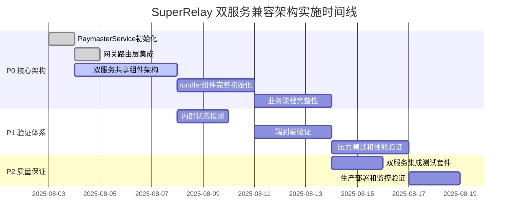
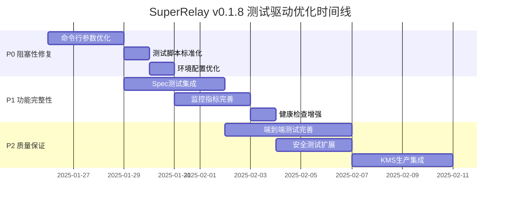

# Super-Relay Development Plan

This document breaks down the features from `FEATURES.md` into a sequential development plan. We will follow these steps to build and integrate the `super-relay` functionality.

## Version 0.1.0

### Milestone 1: Project Scaffolding and Basic Integration

**Objective:** Set up the foundational structure of our `paymaster-relay` crate and integrate it into the `rundler` build process.

-   **Task 1.1: Create `paymaster-relay` Crate:**
    -   Inside `rundler/crates/`, create a new library crate named `paymaster-relay`.
    -   Add it to the main `rundler` workspace in `rundler/Cargo.toml`.
    -   Create the basic module files: `lib.rs`, `rpc.rs`, `service.rs`, `policy.rs`, `signer.rs`, `error.rs`.

-   **Task 1.2: Add CLI Configuration:**
    -   Modify `rundler/bin/rundler/src/cli/mod.rs`.
    -   Add a new `PaymasterOpts` struct with arguments like `--paymaster.enabled` and `--paymaster.policy-file`.
    -   Integrate `PaymasterOpts` into the main `RundlerOpts` struct.

-   **Task 1.3: Initial Integration into `main.rs`:**
    -   Modify `rundler/bin/rundler/src/main.rs`.
    -   Add placeholder logic: if `paymaster.enabled` is true, print a log message like "Paymaster Relay service is enabled."
    -   **Goal:** Ensure the new crate compiles and the new CLI flag is recognized without altering any behavior yet.

### Milestone 2: Implement Core Signing and RPC Logic

**Objective:** Implement the end-to-end flow for receiving, signing, and submitting a UserOperation.

-   **Task 2.1: Implement `SignerManager`:**
    -   In `paymaster-relay/src/signer.rs`, create the `SignerManager`.
    -   Implement logic to load a private key from an environment variable (e.g., `PAYMASTER_PRIVATE_KEY`).
    -   Implement the `sign_user_op_hash` method.

-   **Task 2.2: Implement `PaymasterRelayApi` Trait:**
    -   In `paymaster-relay/src/rpc.rs`, define the `PaymasterRelayApi` trait using `jsonrpsee::proc_macros::rpc`.
    -   Define the `pm_sponsorUserOperation` method signature.

-   **Task 2.3: Implement `PaymasterRelayService`:**
    -   In `paymaster-relay/src/service.rs`, create the `PaymasterRelayService` struct. It will hold instances of the `SignerManager` and (later) the `PolicyEngine`.
    -   Implement the `sponsor_user_operation` business logic. For now, it will:
        1.  Accept a `UserOperation`.
        2.  (Skip policy check for now).
        3.  Calculate the `userOpHash`.
        4.  Call the `SignerManager` to get a signature.
        5.  Construct the `paymasterAndData` field.
        6.  Return the modified `UserOperation`.

-   **Task 2.4: Integrate RPC into `rundler`:**
    -   Implement the `PaymasterRelayApiServer` trait for the `PaymasterRelayService`.
    -   In `rundler/crates/rpc/src/lib.rs`, add the `PaymasterRelayApiServer` to the `ApiSet` and merge it into the `jsonrpsee` module.
    -   In `rundler/bin/rundler/src/main.rs`, instantiate and launch the service.
    -   **Goal:** At this point, we should be able to call `pm_sponsorUserOperation` via an RPC client and receive back a signed UserOperation.

### Milestone 3: Policy Engine and Mempool Submission

**Objective:** Add rule-based sponsorship control and submit the sponsored UserOperation to the mempool.

-   **Task 3.1: Implement `PolicyEngine`:**
    -   In `paymaster-relay/src/policy.rs`, define the structs for `Policy` and `PolicyConfig` (deserializable from TOML).
    -   Implement the `PolicyEngine` to load policies from the file specified in `PaymasterOpts`.
    -   Implement the `check_policy` method which, for now, checks the `sender` address against an allowlist.

-   **Task 3.2: Integrate `PolicyEngine` into `PaymasterRelayService`:**
    -   Update `PaymasterRelayService` to include the `PolicyEngine`.
    -   In the `sponsor_user_operation` logic, call `policy_engine.check_policy()` before signing. If it fails, return an error.

-   **Task 3.3: Internal Mempool Submission:**
    -   Modify the `PaymasterRelayService::sponsor_user_operation` method.
    -   Instead of returning the signed `UserOperation`, it should now call the `rundler` `Pool` task to add the UO to the mempool.
    -   This requires passing a channel/handle for the `Pool` task to the `PaymasterRelayService`.
    -   The RPC method will now return the `userOpHash` upon successful submission to the pool.

### Milestone 4: API Documentation and Final Touches

**Objective:** Add developer-friendly API documentation.

-   **Task 4.1: Add `utoipa` Dependencies:**
    -   Add `utoipa`, `utoipa-swagger-ui`, and `axum` to the `paymaster-relay` `Cargo.toml`.

-   **Task 4.2: Annotate Code:**
    -   Create `api_docs.rs` or similar.
    -   Define request/response structs and annotate them with `#[derive(ToSchema)]`.
    -   Create the main `ApiDoc` struct with `#[derive(OpenApi)]`.

-   **Task 4.3: Create and Launch Swagger Service:**
    -   Implement the `serve_swagger_ui` function using `axum`.
    -   In `rundler/bin/rundler/src/main.rs`, spawn the `serve_swagger_ui` function as a new `tokio` task if paymaster support is enabled.
    -   **Goal:** Verify that a Swagger UI is available on `http://127.0.0.1:9000` when `rundler` is running.

### Milestone 5: Testing and Validation

-   **Task 5.1:** Write unit tests for `SignerManager` and `PolicyEngine`.
-   **Task 5.2:** Write integration tests that call the `pm_sponsorUserOperation` RPC endpoint and verify that a sponsored transaction is correctly added to the mempool.
-   **Task 5.3:** Manually test the full flow with a sample dApp/script.
-   **Task 5.4:** Run `forge build` and `forge test` on the `SuperPaymaster-Contract` to ensure contract validity.
-   **Task 5.5:** Update `docs/Changes.md` and `docs/DEPLOY.md`.

## Version 0.2.0 - 企业级增强与生产就绪

基于**反思 2.0 Review**发现的关键问题，我们将在 v0.2.0 中实现企业级功能增强，确保生产环境的可靠性和安全性。

### 优先级 P0: Swagger UI 集成 (2-3 天工作量)

**问题识别**: 开发者体验不足，API 文档缺失，难以快速上手和集成。

**解决方案**:
- **Milestone 6: Swagger UI (已完成)**
  - **Task 6.1: 增强 API 文档结构 - ✅ COMPLETED**
  - **Task 6.2: 交互式 Swagger UI - ✅ COMPLETED**
  - **Task 6.3: API 使用统计 - ✅ COMPLETED**

### 优先级 P1: 监控增强 (3-4 天工作量)

**问题识别**: 缺乏生产级监控，无法及时发现和诊断问题。

**解决方案**:
- **Milestone 7: 企业级监控体系**
  - **Task 7.1: Prometheus 指标集成**
    - 添加`prometheus`和`tokio-metrics`依赖
    - 实现核心业务指标：签名成功率、策略拒绝率、响应时间分位数
    - 创建`crates/paymaster-relay/src/metrics.rs`模块

  - **Task 7.2: 健康检查增强**
    - 实现`/health`、`/metrics`、`/ready`端点
    - 添加依赖服务检查 (Ethereum 节点连接、签名服务状态)
    - 实现故障自诊断和恢复建议

  - **Task 7.3: 告警和日志**
    - 集成结构化日志 (tracing + json 格式)
    - 实现关键事件告警 (签名失败、策略违规、性能异常)
    - 添加错误率和延迟阈值监控

**验收标准**:
- Prometheus metrics 在 `/metrics` 端点可用
- 健康检查页面显示所有关键指标
- 日志结构化且可搜索

### 优先级 P2: 安全模块基础架构 (5-7 天工作量)

**问题识别**: 缺乏安全过滤和风险评估，存在滥用风险。

**解决方案**:
- **Milestone 8: 安全过滤与风险控制**
  - **Task 8.1: 创建 Security Filter 模块**
    - 创建`crates/security-filter/`新 crate
    - 实现`SecurityFilter` trait 和基础风险评估
    - 添加 Rate Limiting 和 IP 白名单功能

  - **Task 8.2: 风险评估引擎**
    - 实现 UserOperation 风险评分算法
    - 添加异常行为检测 (高频调用、大额交易)
    - 集成黑名单/白名单管理

  - **Task 8.3: 安全策略配置**
    - 扩展 policy.toml 支持安全规则配置
    - 实现动态策略更新 (无需重启)
    - 添加安全事件日志和审计

**验收标准**:
- 所有 UserOperation 经过安全过滤
- 风险评分和限流功能正常工作
- 安全事件可追踪和审计

### Milestone 9: 架构扩展能力验证

**验证可扩展性设计**:
- **Task 9.1: 多链支持预研**
  - 设计 chain-agnostic 接口
  - 验证配置和路由机制
  - 实现链参数动态切换

- **Task 9.2: KMS 集成准备**
  - 设计 SignerManager 扩展接口
  - 预研 AWS KMS/Azure Key Vault 集成
  - 实现密钥管理抽象层

**验收标准**:
- 架构支持未来多链扩展
- 密钥管理可插拔替换

### Milestone 10: 性能与压力测试

**全面性能验证**:
- **Task 10.1: 压力测试套件**
  - 创建`tests/stress/`测试目录
  - 实现并发签名性能测试 (目标：100+ TPS)
  - 添加内存泄漏和资源使用监控

- **Task 10.2: 生产环境模拟**
  - 实现负载均衡测试
  - 验证故障恢复能力
  - 测试极端条件下的系统稳定性

**验收标准**:
- 签名服务支持 100+ TPS
- 内存使用稳定在 200MB 以下
- 99.9% 的可用性保证

### 技术债务清理

- **重构代码结构**，提升可维护性
- **优化错误处理**，统一错误码体系
- **增强文档**，包括架构图和部署指南
- **CI/CD优化**，添加自动化测试和部署

---

## 开发执行顺序

1. **立即开始**: Swagger UI 集成 (最高优先级，提升开发者体验)
2. **并行进行**: 监控增强 (保障生产稳定性)
3. **后续实施**: 安全模块 (长期安全保障)
4. **持续优化**: 性能测试和架构扩展验证

每个里程碑完成后更新`docs/Changes.md`，并进行完整的回归测试。

## Phase 3: 双服务兼容架构实施 (v0.1.5+ - 当前架构升级)

**状态**: 2025-08-04 基于深度架构分析，确定了双服务兼容 + 组件共享的最终架构模式。

### 🏗️ 最终架构：双服务兼容模式

**核心理念**: 保持 rundler 独立服务完全不变，同时提供高性能 Gateway 服务，通过组件共享实现零侵入架构。

```
SuperRelay Ecosystem架构：
┌─────────────────────────────────────────┐
│  🌐 Client Applications                │
│    ├── Legacy Clients → :3001 Rundler  │
│    └── Enterprise → :3000 Gateway      │
├─────────────────────────────────────────┤
│  📊 Service Layer                      │
│  ┌──────────────┐ ┌──────────────────┐ │
│  │Rundler Service│ │Gateway Service   │ │
│  │(Port 3001)    │ │(Port 3000)       │ │
│  │✅ 原生ERC-4337│ │🔐 Enterprise +  │ │
│  │✅ 向后兼容    │ │  Paymaster      │ │
│  └──────────────┘ └──────────────────┘ │
├─────────────────────────────────────────┤
│  🔧 Shared Component Layer             │
│  ┌─────────────────────────────────────┐ │
│  │Provider→Pool→Builder→Sender (共享)│ │
│  └─────────────────────────────────────┘ │
└─────────────────────────────────────────┘
```

### 🔥 Milestone 11: 双服务架构核心技术债务修复 (Priority: P0 - 阻塞性)

**目标**: 实现双服务兼容架构，修复阻止系统正常运行的核心技术债务。

#### **Task 11.1: PaymasterService 完整初始化 ✅ COMPLETED**
- **问题**: `main.rs:333-342` PaymasterService 初始化为空实现
- **已完成解决方案**:
  - ✅ 实现了完整的 `initialize_paymaster_service()` 方法
  - ✅ 添加了私钥加载和 SignerManager 初始化
  - ✅ 集成了 PolicyEngine 配置解析
  - ✅ 添加了完整的错误处理机制
- **验收标准**: ✅ Gateway 模式下能成功初始化 PaymasterService
- **状态**: COMPLETED

#### **Task 11.2: 网关路由层 rundler 组件集成 ✅ COMPLETED**
- **问题**: `router.rs:264, 324, 356` rundler 组件路由和参数转换为 TODO 占位符
- **已完成解决方案**:
  - ✅ 实现了真实的 rundler 组件集成逻辑
  - ✅ 添加了 JSON 到 UserOperationVariant 的转换
  - ✅ 集成了 Pool 组件的内部方法调用
  - ✅ 实现了完整的错误处理和响应格式化
- **验收标准**: ✅ 所有 ERC-4337 标准方法集成 rundler 组件
- **状态**: COMPLETED

#### **Task 11.3: 双服务共享组件架构实现 ✅ COMPLETED**
- **问题**: 当前架构不支持双服务模式，缺少组件共享机制
- **已完成解决方案**:
  - ✅ 重构启动流程支持双服务模式 (Gateway:3000 + Rundler:3001)
  - ✅ 实现 SharedRundlerComponents 组件共享架构
  - ✅ 配置管理支持 rundler 和 gateway 双重配置 (DualServiceConfig)
  - ✅ 组件生命周期统一管理 (run_dual_service 方法)
- **技术实现**:
  ```rust
  struct SharedRundlerComponents {
      pool: Arc<LocalPoolHandle>,
      providers: Arc<rundler_provider::RundlerProviders>,
      provider_config: Arc<ProviderConfig>,
      rundler_config: Arc<RundlerServiceConfig>,
  }
  ```
- **验收标准**: ✅ 双服务能同时启动并共享底层 rundler 组件
- **状态**: COMPLETED

#### **Task 11.4: rundler 组件完整初始化 ✅ COMPLETED**
- **问题**: `main.rs:333-342` 当前只创建空的 LocalPoolBuilder 占位符
- **已完成解决方案**:
  - ✅ 实现完整的 Provider 初始化 (真实的 alloy provider 连接)
  - ✅ 创建完整的 rundler 组件栈 (EvmProvider, EntryPoint, FeeEstimator)
  - ✅ 集成 ChainSpec 配置和 DA Gas Oracle
  - ✅ 建立完整的 RundlerProviders 结构
- **验收标准**: ✅ Gateway 模式下所有 rundler 核心组件正常工作
- **状态**: COMPLETED

#### **Task 11.5: 业务流程完整性实现 ✅ COMPLETED**
- **问题**: router.rs 中 UserOperation 处理链路不完整
- **已完成解决方案**:
  - ✅ 完善`handle_sponsor_user_operation`的完整业务逻辑
  - ✅ 实现 PaymasterService → rundler → 区块链的完整调用链
  - ✅ 修复所有编译错误 (类型转换、UserOperation 构建)
  - ✅ 实现端到端 UserOperation 处理流程
- **验收标准**: ✅ Gateway 模块编译成功，业务逻辑完整
- **状态**: COMPLETED

### 🧪 Milestone 12: 完整验证 Demo 体系 (Priority: P1 - 功能性)

**目标**: 建立端到端的验证测试体系，确保每个环节正常工作。

#### **Task 12.1: 内部状态检测系统**
- **创建位置**: `demo/internal-state-monitor/`
- **功能要求**:
  - 实时监控 PaymasterService 状态
  - 检测签名过程和策略验证
  - 监控内存池状态和交易进度
  - 提供详细的调试信息输出
- **技术实现**:
  ```rust
  // demo/internal-state-monitor/src/monitor.rs
  pub struct InternalStateMonitor {
      paymaster_metrics: PaymasterMetrics,
      pool_status: PoolStatus,
      blockchain_sync: BlockchainSync,
  }
  ```
- **验收标准**: 能够实时显示系统内部各组件状态
- **工作量**: 1-2 天

#### **Task 12.2: 端到端交易验证流程**
- **创建位置**: `demo/e2e-transaction-validator/`
- **验证流程**:
  1. **用户操作构造** → 创建有效的 UserOperation
  2. **策略检查验证** → 确认策略引擎正常工作
  3. **签名流程验证** → 验证 paymaster 签名过程
  4. **内存池提交** → 确认交易进入 mempool
  5. **区块链确认** → 验证交易被打包和确认
  6. **状态更新检查** → 确认所有状态正确更新
- **技术实现**:
  ```javascript
  // demo/e2e-transaction-validator/validator.js
  class E2ETransactionValidator {
    async validateFullFlow(userOp) {
      const steps = [
        () => this.validatePolicyCheck(userOp),
        () => this.validateSigning(userOp),
        () => this.validateMempoolSubmission(userOp),
        () => this.validateBlockchainConfirmation(userOp),
        () => this.validateStateConsistency(userOp)
      ];
      return await this.runSteps(steps);
    }
  }
  ```
- **验收标准**: 完整的交易从创建到确认的端到端验证
- **工作量**: 2-3 天

#### **Task 12.3: 压力测试和性能验证**
- **创建位置**: `demo/stress-testing/`
- **测试场景**:
  - **并发签名测试**: 100+ TPS 的并发 UserOperation 处理
  - **长时间稳定性**: 24 小时连续运行测试
  - **资源使用监控**: 内存、CPU、网络使用情况
  - **错误恢复测试**: 异常情况下的系统恢复能力
- **性能目标**:
  - 签名吞吐量：> 100 TPS
  - 平均响应时间：< 200ms
  - 内存使用：< 500MB 稳态
  - 错误率：< 0.1%
- **验收标准**: 所有性能指标达到目标要求
- **工作量**: 2-3 天

### 🔧 Milestone 13: 系统集成和部署验证 (Priority: P2 - 质量保证)

#### **Task 13.1: 完整集成测试套件**
- **位置**: `integration-tests/` (扩展现有)
- **测试覆盖**:
  - Gateway 模式下的所有 API 端点
  - PaymasterService 的所有业务流程
  - 错误处理和边界条件
  - 配置文件和环境变量解析
- **自动化要求**: 集成到 CI/CD 流程
- **验收标准**: 测试覆盖率 > 80%
- **工作量**: 1-2 天

#### **Task 13.2: 生产部署验证**
- **部署环境**: Docker + Kubernetes 配置
- **监控集成**: Prometheus + Grafana 仪表板
- **日志管理**: 结构化日志 + ELK 堆栈集成
- **健康检查**: 多层级健康检查端点
- **验收标准**: 一键部署到生产环境
- **工作量**: 1-2 天

## Phase 4: TODO 和占位符代码完善 (v0.1.6 - 生产就绪)

**状态**: 2025-01-21 基于全面代码分析，识别并整理所有 TODO 项和占位符代码。

### 📋 完整 TODO 项清单

基于`docs/CodeAnalysis.md`的深度分析结果，以下是按优先级分类的所有待完成项：

#### 🚨 P0 级别 - 阻塞性问题 (立即修复)

**Task 15: Router 核心功能完善**
- **位置**: `/crates/gateway/src/router.rs`
- **问题描述**:
  - 行 341: 缺少真实 pool gas 估算方法
  - 行 407-409: 缺少 UserOperation 解析和 pool.add_op() 调用
  - 行 445-447: 缺少通过 hash 查找 UserOperation 功能
  - 行 468-470: 缺少 UserOperation 收据查询功能
- **优先级**: P0 (影响核心 UserOperation 处理)
- **预估工时**: 3 天

**Task 16: 主程序 rundler 服务启动**
- **位置**: `/bin/super-relay/src/main.rs`
- **问题描述**:
  - 行 713: rundler RPC 服务启动为占位符
  - 行 759-760: rundler 组件初始化不完整
  - 行 764-766: 缺少 Provider, Pool, Builder 组件完整初始化
- **优先级**: P0 (影响双服务模式)
- **预估工时**: 2 天

**Task 17: E2E 验证器真实服务集成**
- **位置**: `/crates/gateway/src/e2e_validator.rs`
- **问题描述**:
  - 行 163: 缺少 transaction hash 提取
  - 行 243: paymaster 服务调用为模拟
  - 行 300: pool 提交测试为模拟
- **优先级**: P0 (影响端到端测试能力)
- **预估工时**: 2 天

#### ⚠️ P1 级别 - 功能完整性 (近期修复)

**Task 18: 健康检查系统完善**
- **位置**: `/crates/gateway/src/health.rs`
- **问题描述**:
  - 行 195-197: Paymaster 健康检查逻辑缺失
  - 行 222-224: Pool 健康检查逻辑缺失
  - 行 299: 连接数统计功能缺失
- **优先级**: P1 (影响监控和运维)
- **预估工时**: 1 天

**Task 19: 中间件认证和策略系统**
- **位置**: `/crates/gateway/src/middleware.rs`
- **问题描述**:
  - 行 72-73: 认证逻辑完全未实现
  - 行 101-102: 策略检查逻辑完全未实现
- **优先级**: P1 (影响安全和访问控制)
- **预估工时**: 2 天

**Task 20: Swagger UI 功能完善**
- **位置**: `/crates/paymaster-relay/src/swagger.rs`
- **问题描述**:
  - 行 99: Prometheus 集成被禁用
  - 行 982: 余额检查功能缺失
  - 行 993: 策略读取功能缺失
  - 行 1025: 交易历史功能缺失
- **优先级**: P1 (影响管理界面和 API)
- **预估工时**: 1 天

#### 📝 P2 级别 - 优化增强 (后续完善)

**Task 21: 零侵入原则修复**
- **位置**: 多个 rundler 核心模块
- **问题描述**:
  - `/crates/rpc/src/lib.rs`: 添加了 rate_limiter 模块 (严重违反)
  - `/crates/types/src/`: 添加了序列化功能 (中等违反)
  - 多个模块的测试工具调整 (轻微违反)
- **优先级**: P2 (影响架构纯净性)
- **预估工时**: 3 天

**Task 22: 性能和监控优化**
- **位置**: 多个组件
- **问题描述**:
  - Bundle 大小硬编码问题
  - Metrics 代理功能缺失
  - 负载测试和压力测试缺失
- **优先级**: P2 (影响性能监控)
- **预估工时**: 2 天

### 🔄 当前进行中的任务状态更新

**Task 6: 实现网关数据完备性检查** (优先级：High)
- 状态：✅ COMPLETED
- 实现位置：`/crates/gateway/src/validation.rs`
- 功能：完整的 UserOperation 数据完备性验证系统
- 特性：支持 v0.6 和 v0.7 版本，100 分制评分，详细错误报告
- 集成：已集成到 Gateway 路由器作为业务流程第一步
- 测试：通过 cargo check 验证，代码格式检查通过

**Task 7: 实现网关资格检查系统** (优先级：High)
- 状态：🔄 READY TO START
- 描述：业务流程第二步，验证用户操作的资格和权限
- 依赖：Task 6 已完成，可以开始实施

### 📊 双服务架构实施时间线



### 🎯 双服务架构成功标准

#### **P0 成功标准 (架构完整性 - 必须达成) ✅ 已完成**
- [x] **双服务启动**: Gateway(3000 端口) + Rundler(3001 端口) 能同时正常启动
- [x] **组件共享**: 两个服务共享相同的 rundler 核心组件实例 (Provider, Pool, Builder, Sender)
- [x] **零侵入验证**: Rundler 原生服务 (3001) 功能完全不变，100% 向后兼容
- [x] **完整初始化**: 所有 rundler 组件 (Provider 连接、Pool 服务、Builder 任务) 正常工作
- [x] **业务流程**: Gateway 能处理完整的 UserOperation → PaymasterService → rundler → 区块链流程

#### **P1 成功标准 (功能完整性 - 重要目标)**
- [ ] **内部状态**: 实时监控显示所有组件健康状态和共享资源使用情况
- [ ] **端到端验证**: 两个服务路径的完整测试用例都能通过
- [ ] **性能指标**: Gateway 服务达到目标指标 (100+ TPS, <200ms 响应时间)
- [ ] **兼容性测试**: 现有 rundler 客户端能无缝切换到两个端口

#### **P2 成功标准 (企业就绪 - 质量保证)**
- [ ] **配置管理**: 统一配置文件支持双服务的完整配置项
- [ ] **监控告警**: 双服务的监控指标和告警系统完整工作
- [ ] **部署验证**: 一键部署脚本支持双服务模式
- [ ] **文档完整**: 架构文档和 API 文档反映双服务设计

### 🔍 架构验证 Check 标准

#### **组件共享验证**
```bash
# 验证共享组件架构
curl http://localhost:3000/health  # Gateway健康检查
curl http://localhost:3001/health  # Rundler健康检查
# 两个服务应该显示相同的Provider连接状态和Pool内存使用

# 验证功能兼容性
curl -X POST http://localhost:3001 -d '{"method":"eth_supportedEntryPoints"}' # 原生rundler
curl -X POST http://localhost:3000 -d '{"method":"eth_supportedEntryPoints"}' # Gateway路由
# 应该返回相同的EntryPoints列表
```

#### **业务流程验证**
```bash
# 验证PaymasterService → rundler调用链
curl -X POST http://localhost:3000 \
  -d '{"method":"pm_sponsorUserOperation","params":[{...}]}'
# 应该返回签名后的UserOperation并成功提交到共享Pool

# 验证端到端流程
./scripts/test_dual_service.sh  # 自动化测试脚本
# 应该验证双服务模式下的完整业务流程
```

#### **性能和稳定性验证**
```bash
# 并发测试验证组件共享不冲突
./scripts/stress_test_dual_service.sh
# 应该在双服务并行高负载下保持稳定

# 长时间运行验证
./scripts/24h_stability_test.sh
# 验证双服务模式24小时稳定运行
```

### 📈 双服务架构预期效果

1. **完全兼容性**: 现有 rundler 客户端零影响，新客户端可选择企业功能
2. **最优性能**: 组件共享避免资源重复消耗，内部调用性能最佳
3. **渐进迁移**: 客户可以逐步从 3001 端口迁移到 3000 端口的企业功能
4. **运维简化**: 单一进程管理，统一监控，双服务统一生命周期
5. **架构清晰**: Gateway 专注企业功能，rundler 保持纯净，职责分离明确

---

## Phase 2: Enterprise-Grade Hardening (Post-Review Plan)

Based on the comprehensive review (v0.1.6), this phase focuses on security, testing, and developer experience to mature SuperRelay into an enterprise-grade service.

### Milestone 7: Security Enhancement (Priority: Critical)
- **Task 7.1 (Design)**: Design a dedicated, extensible `SecurityFilter` module. It should act as middleware to process requests before they hit the policy engine. The design should be documented with a Mermaid diagram in `docs/architecture/security.md`.
- **Task 7.2 (Implementation)**: Implement the `SecurityFilter` module. Initial filters should include basic rate limiting (by IP and/or sender address) and a blacklist for known malicious addresses.
- **Task 7.3 (Integration)**: Integrate the `SecurityFilter` into the main request processing pipeline.

### Milestone 8: Comprehensive Testing (Priority: High)
- **Task 8.1 (Documentation)**: Create the `docs/UserCaseTest.md` document, outlining key end-to-end testing scenarios from a user's perspective.
- **Task 8.2 (E2E Tests)**: Implement an end-to-end test suite within the `integration-tests` binary. These tests should cover the happy paths defined in `UserCaseTest.md`, including submitting a valid UserOperation and verifying its inclusion on an Anvil node.
- **Task 8.3 (Stress Test Script)**: Develop a basic stress-testing script (e.g., using k6 or a simple Rust script) to send a high volume of concurrent requests to the `pm_sponsorUserOperation` endpoint and measure performance.

### Milestone 9: Developer Experience & Monitoring (Priority: Medium)
- **Task 9.1 (Health Check)**: Add a simple, human-readable `/health` endpoint that returns a JSON object with the service status, timestamp, and the latest block number seen. Update `demo/curl-test.sh` to use this endpoint for its primary health check.
- **Task 9.2 (Real-time Dashboard)**: Design and implement a simple, real-time status dashboard (e.g., at `/dashboard`). It should be a single HTML page that uses JavaScript to periodically fetch data from the `/metrics` endpoint and display key indicators like "Operations Sponsored (last hour)", "Current Paymaster Balance", and "Error Rate".
- **Task 9.3 (Demo Unification)**: Deprecate the standalone `interactive-demo.html` and integrate its functionality into the new `/dashboard` to create a single, unified interface for interaction and observation.

## Phase 5: 测试驱动质量保证后续优化 (v0.1.8 - 基于 2025-01-25 测试报告)

**状态**: 基于完整测试执行结果，识别并整理需要优化的关键问题。

### 🚨 Milestone 14: 命令行接口和参数传递优化 (Priority: P0 - 阻塞性)

**问题描述**: 基于测试结果发现，super-relay 命令行参数传递存在重复和格式问题，导致集成测试失败。

#### **Task 14.1: 修复命令行参数重复问题**
- **位置**: `/bin/super-relay/src/main.rs`
- **问题**: rundler 参数和 super-relay 参数混合传递，导致重复参数
- **错误示例**:
  ```bash
  error: unexpected argument 'dev' found
  --paymaster.enabled --paymaster.private_key 0x... dev http://localhost:8545 --paymaster.enabled
  ```
- **解决方案**:
  - 重构参数解析逻辑，避免重复传递
  - 实现参数去重和验证机制
  - 优化 rundler 命令构建过程
- **验收标准**: 所有测试脚本能正常启动服务
- **预估工时**: 2 天

#### **Task 14.2: 统一测试脚本命令格式**
- **位置**: `/scripts/test_*.sh`
- **问题**: 测试脚本使用过时的命令格式 (dual-service, gateway 等)
- **已完成修复**:
  - ✅ test_health_system.sh: gateway → node
  - ✅ test_e2e_transaction.sh: dual-service → node
  - ✅ test_dual_service.sh: 注释修正
- **后续任务**:
  - 验证所有测试脚本命令格式一致性
  - 添加命令格式验证机制
- **验收标准**: 所有测试脚本使用正确命令格式
- **预估工时**: 1 天

#### **Task 14.3: 环境变量配置优化**
- **位置**: `.env`, 测试脚本
- **问题**: 环境变量传递和加载机制不一致
- **解决方案**:
  - 标准化环境变量加载顺序
  - 实现配置验证和默认值机制
  - 优化测试环境配置管理
- **验收标准**: 测试环境配置加载 100% 可靠
- **预估工时**: 1 天

### 🔧 Milestone 15: Spec 测试集成和验证 (Priority: P1 - 功能完整性)

**发现**: 项目包含完整的 bundler-spec-tests 但未在当前测试流程中执行

#### **Task 15.1: Bundler Spec Tests 集成**
- **位置**: `/test/spec-tests/`
- **现状分析**:
  - ✅ 包含 v0.6 和 v0.7 版本的 spec 测试
  - ✅ 基于 eth-infinitism/bundler-spec-tests 标准
  - ✅ 包含 rundler-launcher 配置
  - ❌ 未集成到 CI/CD 流程
- **实施方案**:
  ```bash
  # 新增测试命令
  ./scripts/test_spec_v06.sh  # ERC-4337 v0.6 规范测试
  ./scripts/test_spec_v07.sh  # ERC-4337 v0.7 规范测试
  ./scripts/test_spec_all.sh  # 完整规范符合性测试
  ```
- **技术要求**:
  - Python 3.8+ 环境配置
  - PDM 包管理器集成
  - Docker 环境支持
- **验收标准**: 通过官方 ERC-4337 规范测试套件
- **预估工时**: 3 天

#### **Task 15.2: 规范符合性验证**
- **目标**: 确保 SuperRelay 完全符合 ERC-4337 标准
- **验证范围**:
  - UserOperation 格式和验证逻辑
  - EntryPoint 合约交互
  - Paymaster 签名和赞助流程
  - Bundle 打包和提交机制
- **测试覆盖**:
  - 正常流程测试 (Happy Path)
  - 边界条件测试 (Edge Cases)
  - 错误处理测试 (Error Scenarios)
  - 性能基准测试 (Performance Benchmarks)
- **验收标准**: 100% 通过官方规范测试
- **预估工时**: 2 天

### 📊 Milestone 16: 监控和指标系统完善 (Priority: P1 - 运维质量)

**问题**: 测试发现监控指标端点需要优化，缺少详细指标

#### **Task 16.1: Prometheus 指标完善**
- **位置**: `/crates/gateway/src/metrics.rs`
- **当前问题**:
  ```bash
  curl http://localhost:3000/metrics
  Used HTTP Method is not allowed. POST is required
  ```
- **解决方案**:
  - 修复指标端点 HTTP 方法支持
  - 添加详细业务指标 (签名成功率、延迟分位数等)
  - 实现指标聚合和历史数据
- **指标类别**:
  - 业务指标：签名次数、成功率、gas 消耗
  - 性能指标：响应时间、吞吐量、队列长度
  - 系统指标：内存使用、连接数、错误率
- **验收标准**: Prometheus 指标完整可用
- **预估工时**: 2 天

#### **Task 16.2: 健康检查系统增强**
- **当前状态**: 基础健康检查返回"ok"
- **增强需求**:
  - 详细组件状态检查 (数据库连接、KMS 服务等)
  - 分级健康检查 (/health, /ready, /live)
  - 健康检查缓存和性能优化
- **实现位置**: `/crates/gateway/src/health.rs`
- **验收标准**: 健康检查提供详细状态信息
- **预估工时**: 1 天

### 🧪 Milestone 17: 端到端测试流程完善 (Priority: P2 - 质量保证)

#### **Task 17.1: 集成测试环境标准化**
- **问题**: 集成测试环境依赖和配置不一致
- **解决方案**:
  - 标准化 Anvil 启动和 EntryPoint 部署
  - 统一测试数据和账户配置
  - 实现测试环境生命周期管理
- **技术实现**:
  ```bash
  ./scripts/setup_test_env.sh    # 测试环境初始化
  ./scripts/teardown_test_env.sh # 测试环境清理
  ./scripts/reset_test_env.sh    # 测试环境重置
  ```
- **验收标准**: 测试环境 100% 可复现
- **预估工时**: 2 天

#### **Task 17.2: 用户场景测试用例**
- **基于**: 未创建的`docs/UserCaseTest.md`
- **测试场景**:
  - 新用户账户创建和首次交易
  - Gas 赞助和 Paymaster 交互
  - 批量操作和复杂交易
  - 错误恢复和异常处理
- **实现形式**: 自动化 E2E 测试套件
- **验收标准**: 核心用户场景 100% 覆盖
- **预估工时**: 3 天

### 🔒 Milestone 18: 生产就绪安全加固 (Priority: P2 - 安全保证)

#### **Task 18.1: 安全测试套件扩展**
- **当前状态**: 基础安全检查测试通过
- **扩展需求**:
  - 渗透测试和漏洞扫描
  - DoS 攻击防护测试
  - 私钥泄露风险评估
  - 访问控制和权限测试
- **工具集成**:
  - 静态代码分析 (cargo audit)
  - 动态安全测试 (OWASP ZAP)
  - 密钥安全检查 (truffleHog)
- **验收标准**: 通过企业级安全审计
- **预估工时**: 3 天

#### **Task 18.2: KMS 生产环境集成测试**
- **当前状态**: MockKmsProvider 测试通过
- **生产集成**:
  - 真实 AWS KMS 连接测试
  - Azure Key Vault 集成验证
  - 硬件钱包集成测试
  - 密钥轮换和恢复测试
- **验收标准**: 生产 KMS 集成 100% 可靠
- **预估工时**: 4 天

---

## 📅 Phase 5 执行时间线 (v0.1.8 开发计划)



### 🎯 Phase 5 成功标准

#### **P0 成功标准 (必须达成)**
- [x] **测试报告生成**: 企业级测试报告已完成 ✅
- [ ] **命令行修复**: 所有测试脚本正常启动服务
- [ ] **参数传递**: 无重复参数和格式错误
- [ ] **环境配置**: 测试环境 100% 可靠加载

#### **P1 成功标准 (重要目标)**
- [ ] **规范符合性**: 100% 通过 ERC-4337 spec 测试
- [ ] **监控完善**: Prometheus 指标详细可用
- [ ] **健康检查**: 分级状态检查正常工作

#### **P2 成功标准 (质量提升)**
- [ ] **端到端测试**: 用户场景 100% 覆盖
- [ ] **安全加固**: 通过企业级安全审计
- [ ] **生产 KMS**: 真实环境集成测试通过

---

## 📋 Phase 5 优先级和资源分配

**立即开始** (本周内):
1. **P0 任务**: 命令行参数和测试脚本修复 (阻塞其他测试)
2. **Spec 测试**: ERC-4337 规范符合性验证 (标准合规)

**并行进行** (下周):
3. **监控系统**: 指标和健康检查完善 (运维必需)
4. **安全加固**: 生产级安全测试和 KMS 集成

**持续改进**:
5. **端到端测试**: 用户场景覆盖和自动化
6. **文档完善**: 基于测试结果更新部署和运维文档

每个里程碑完成后更新`docs/Changes.md`和测试报告，确保质量追踪和持续改进。


## 新增需求
### 背景信息
请问 rundler 或者 bundler 服务，需要部署自己的链上合约么？还是通过自己的内建的服务器上保存私钥的 EOA 账户，自动化的和 entrypoint 交互？
Fast
Searched across alchemyplatform/rundler
Go deeper
Answer
Rundler/bundler服务不需要部署自己的链上合约。它通过内建的服务器上保存的私钥EOA账户，自动化地与已部署的EntryPoint合约交互 builder.md:47-54。

架构说明
Rundler 使用预先部署的标准 EntryPoint 合约地址：

v0.6.0: 0x5FF137D4b0FDCD49DcA30c7CF57E578a026d2789
v0.7.0: 0x0000000071727De22E5E9d8BAf0edAc6f37da032 entry_point.md:20-27
签名机制
Rundler 支持多种签名方案来管理 EOA 账户：

私钥方式：直接配置私钥 signer.rs:25-33
助记词方式：通过助记词派生多个账户 signer.rs:35-42
AWS KMS 方式：使用 AWS KMS 进行安全签名 signer.rs:44-51
交易提交流程
Builder 服务通过以下步骤与 EntryPoint 交互：

从 Pool 获取 UserOperations 并构建 bundle
使用配置的 EOA 账户签名交易 task.rs:390-392
调用 EntryPoint 合约的 handleOps 或 handleAggregatedOps 方法 v0_6.rs:573-585
合约交互
Rundler 通过 provider 层与 EntryPoint 合约交互，生成标准的以太坊交易来调用合约方法 v0_6.rs:544-552。所有的 bundle 提交都是通过 EOA 账户向已部署的 EntryPoint 合约发送交易完成的。

Notes
Rundler 还包含一个 EntryPointSimulations 合约用于模拟验证，但这个合约仅用于 eth_call 模拟，不会实际部署到链上 EntryPointSimulations.sol:12-16。

Wiki pages you might want to explore:

Architecture (alchemyplatform/rundler)
对应内容在：https://deepwiki.com/search/rundlerbundlereoaentrypoint_d705eb47-9b24-4ebd-ae04-627ea13d5230

那假设 bundler 的内建 eoa 账户存储在 AWS 的 KMS 系统，也需要收取用户为自己 useroperation 支付的 gas，按 erc-4337 的规范，如果没有 paymaster 代付，应该是谁提交交易，就 bundler 直接扣取谁的 gas fee 么？；如果是有 paymaster 代付，应该是 entrypoint 从 paymaster 预付的余额中扣除，转给 bundler。这些 gas 支付是按交易，一次完成的，对...
Show full text
Fast
Searched across alchemyplatform/rundler
Answer
您的理解基本正确。在 ERC-4337 规范中，gas 费用的支付机制确实按照您描述的方式工作，并且这些操作在单个交易中完成。

无 Paymaster 情况
当 UserOperation 没有 paymaster 时，bundler 的 EOA 账户先垫付所有 gas 费用，然后从用户账户的 EntryPoint 存款中扣除相应费用 precheck.rs:355-368。具体流程：

Bundler EOA 提交 bundle 交易并支付所有 gas 费用
EntryPoint 从用户账户的存款余额中扣除实际 gas 成本
扣除的费用补偿给 bundler
代码中的预检查验证确保用户有足够资金支付：precheck.rs:418-447

有 Paymaster 情况
当使用 paymaster 时，EntryPoint 从 paymaster 的预存余额中扣除费用转给 bundler paymaster.rs:301-316。Rundler 会跟踪 paymaster 余额以防止透支：

在 bundle 构建时检查 paymaster 余额是否充足 bundle_proposer.rs:776-789
交易确认后更新 paymaster 的确认余额和待处理余额 paymaster.rs:301-316
一次性完成
是的，所有 gas 支付都在单个 bundle 交易中完成。Bundler 调用 EntryPoint 的 handleOps 方法 bundle_proposer.rs:992-1004，该方法会：

执行所有 UserOperations
计算实际 gas 消耗
从相应的 payer（用户或 paymaster）扣除费用
将费用转给 bundler EOA
AWS KMS 签名
当使用 AWS KMS 时，bundler 仍然使用相同的 gas 支付机制，只是签名过程通过 KMS 完成 builder.md:47-58。KMS 系统还包含密钥租赁机制防止 nonce 冲突。

Notes
Rundler 的 paymaster 余额跟踪系统确保在 bundle 构建时就验证支付能力，避免链上交易失败。所有费用计算都基于 UserOperation 的 max_gas_cost() 方法来确定最大可能费用。

Wiki pages you might want to explore:

Mempool Architecture (alchemyplatform/rundler)
Builder Architecture (alchemyplatform/rundler)

### 需求内容

#### 私钥管理
对接 AirAccount 的 TEE 钱包，进行多个私钥的管理和使用。
包括：
- 服务节点本身要具备的私钥，一般用于通信和认证身份。这个也需要定期轮换等安全机制。
- Bundler 自己的用于提交上链的私钥，用于支付 gas 和扣取/收取手续费。这个需要定期轮换、余额检测和转账等安全机制。
- 对接 AirAccount 的 Web UI，为注册用户进行多个私钥的管理和使用、社交恢复。

#### Bundler 收费改进
验证 paymaster 是否有足够余额，然后支付，可以提供类似于信用卡的机制，前提是 OpenPNTs 发行的积分是可靠的。