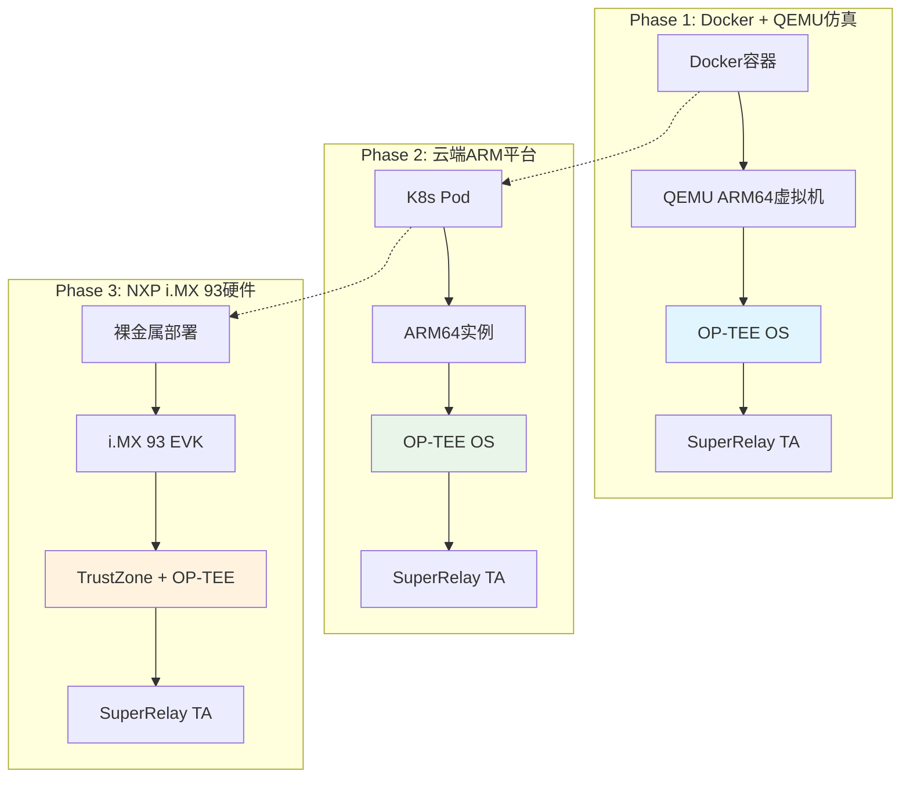

# SuperRelay TEE安全部署方案
## Docker + QEMU + OP-TEE 三阶段部署计划

> **版本**: v1.0
> **创建日期**: 2025-01-25
> **目标**: 将SuperRelay部署到基于OP-TEE的可信执行环境，实现硬件级私钥保护

## 🔒 安全目标

SuperRelay作为ERC-4337 Paymaster服务，需要安全地管理私钥进行UserOperation签名。本方案将私钥管理迁移到OP-TEE可信执行环境(TEE)，实现：

- **🔑 硬件级密钥保护**: 私钥永不离开安全世界
- **⚡ 高性能签名**: TEE中直接执行签名操作
- **🛡️ 抗攻击能力**: 抵御侧信道攻击和内存转储
- **🔄 无缝迁移**: 从仿真环境到真实硬件的渐进部署

## 📋 架构概览



## 🏗️ Phase 1: Docker + QEMU + OP-TEE 仿真环境

### 1.1 环境架构设计

```
┌─────────────────────────────────────────────────────────┐
│                    Host Machine                         │
├─────────────────────────────────────────────────────────┤
│                   Docker Engine                         │
│  ┌─────────────────────────────────────────────────────┐│
│  │              SuperRelay Container              │     ││
│  │  ┌─────────────────────────────────────────────┐    ││
│  │  │            QEMU ARM64 VM           │        │    ││
│  │  │  ┌─────────────────────────────────┐       │    ││
│  │  │  │         Normal World    │       │       │    ││
│  │  │  │  ┌─────────────────────┐│       │       │    ││
│  │  │  │  │   Linux Kernel     ││       │       │    ││
│  │  │  │  │  ┌───────────────┐ ││       │       │    ││
│  │  │  │  │  │ SuperRelay    │ ││       │       │    ││
│  │  │  │  │  │ (Normal World)│ ││       │       │    ││
│  │  │  │  │  └───────────────┘ ││       │       │    ││
│  │  │  │  └─────────────────────┘│       │       │    ││
│  │  │  │                         │       │       │    ││
│  │  │  │          OP-TEE         │       │       │    ││
│  │  │  │  ┌─────────────────────┐│       │       │    ││
│  │  │  │  │    Secure World     ││       │       │    ││
│  │  │  │  │  ┌───────────────┐ ││       │       │    ││
│  │  │  │  │  │SuperRelay TA  │ ││       │       │    ││
│  │  │  │  │  │ (TEE Client)  │ ││       │       │    ││
│  │  │  │  │  └───────────────┘ ││       │       │    ││
│  │  │  │  └─────────────────────┘│       │       │    ││
│  │  │  └─────────────────────────────────┘       │    ││
│  │  └─────────────────────────────────────────────┘    ││
│  └─────────────────────────────────────────────────────┘│
└─────────────────────────────────────────────────────────┘
```

### 1.2 关键技术组件

#### Docker镜像设计
```dockerfile
# 多阶段构建镜像
FROM ubuntu:22.04 AS optee-builder
LABEL stage=optee-build

# 安装OP-TEE构建依赖
RUN apt-get update && apt-get install -y \
    git build-essential python3 python3-pycryptodome \
    python3-pyelftools python3-serial \
    device-tree-compiler flex bison \
    libssl-dev

# 下载和编译OP-TEE
WORKDIR /optee
RUN git clone https://github.com/OP-TEE/build.git optee_build
RUN git clone https://github.com/OP-TEE/optee_os.git
RUN git clone https://github.com/OP-TEE/optee_client.git

# 构建OP-TEE for QEMU virt platform
RUN cd optee_build && make -j$(nproc) toolchains
RUN cd optee_build && make -j$(nproc) qemu

FROM rust:1.70-slim AS relay-builder
LABEL stage=relay-build

# 安装交叉编译工具链
RUN apt-get update && apt-get install -y \
    gcc-aarch64-linux-gnu \
    libc6-dev-arm64-cross

# 添加ARM64目标
RUN rustup target add aarch64-unknown-linux-gnu

# 复制源码并构建SuperRelay
COPY . /superrelay
WORKDIR /superrelay

# 编译ARM64版本的SuperRelay
RUN cargo build --target=aarch64-unknown-linux-gnu --release

FROM ubuntu:22.04 AS runtime
LABEL version="1.0" description="SuperRelay with OP-TEE on QEMU"

# 安装QEMU和必要的运行时依赖
RUN apt-get update && apt-get install -y \
    qemu-system-arm qemu-utils \
    socat telnet expect \
    && rm -rf /var/lib/apt/lists/*

# 复制OP-TEE镜像文件
COPY --from=optee-builder /optee/optee_build/out-br/images/ /opt/optee/images/
COPY --from=optee-builder /optee/optee_build/qemu_v8.mk /opt/optee/

# 复制SuperRelay二进制
COPY --from=relay-builder /superrelay/target/aarch64-unknown-linux-gnu/release/super-relay /opt/superrelay/

# 复制启动脚本和配置
COPY docker/optee-startup.sh /opt/optee/
COPY config/optee-config.toml /opt/superrelay/

# 暴露端口
EXPOSE 3000 9000 8545

# 启动命令
CMD ["/opt/optee/optee-startup.sh"]
```

#### SuperRelay TA (Trusted Application)

创建目录结构：
```
ta/super_relay_ta/
├── CMakeLists.txt              # TA构建配置
├── Makefile                    # 构建文件
├── super_relay_ta.c           # TA主程序
├── include/
│   └── super_relay_ta.h       # TA头文件
├── sub.mk                      # 子Makefile
└── user_ta_header_defines.h   # TA元数据
```

#### TA功能设计

```c
// super_relay_ta.h
#ifndef SUPER_RELAY_TA_H
#define SUPER_RELAY_TA_H

// TA UUID: {12345678-5b69-11d4-9fee-00c04f4c3456}
#define SUPER_RELAY_TA_UUID \
    { 0x12345678, 0x5b69, 0x11d4, \
      { 0x9f, 0xee, 0x00, 0xc0, 0x4f, 0x4c, 0x34, 0x56 } }

// TA命令
#define TA_SUPER_RELAY_CMD_GENERATE_KEY     0
#define TA_SUPER_RELAY_CMD_IMPORT_KEY       1
#define TA_SUPER_RELAY_CMD_SIGN_MESSAGE     2
#define TA_SUPER_RELAY_CMD_GET_PUBLIC_KEY   3
#define TA_SUPER_RELAY_CMD_DELETE_KEY       4

// 密钥类型
typedef enum {
    KEY_TYPE_ECDSA_SECP256K1 = 0,
    KEY_TYPE_ED25519 = 1,
} key_type_t;

// 签名结果结构
typedef struct {
    uint8_t signature[64];      // 签名数据
    uint32_t signature_len;     // 签名长度
    uint8_t recovery_id;        // 恢复ID (用于ECDSA)
} signature_result_t;

#endif /* SUPER_RELAY_TA_H */
```

### 1.3 Rust-TEE集成接口

#### OpteKmsProvider实现

```rust
// crates/paymaster-relay/src/optee_kms.rs
use std::ffi::CString;
use std::os::raw::{c_char, c_int, c_void};

use ethers::types::{Address, Signature, H256};
use eyre::{Result, eyre};
use secrecy::{ExposeSecret, SecretString};
use tracing::{debug, info, warn, error};

use crate::kms::{KmsError, KmsProvider, KmsSigningRequest, SigningContext};

// OP-TEE Client API绑定
#[link(name = "teec")]
extern "C" {
    fn TEEC_InitializeContext(
        name: *const c_char,
        context: *mut TEECContext,
    ) -> c_int;

    fn TEEC_OpenSession(
        context: *mut TEECContext,
        session: *mut TEECSession,
        destination: *const TEECUUID,
        connection_method: u32,
        connection_data: *const c_void,
        operation: *mut TEECOperation,
        return_origin: *mut u32,
    ) -> c_int;

    fn TEEC_InvokeCommand(
        session: *mut TEECSession,
        command_id: u32,
        operation: *mut TEECOperation,
        return_origin: *mut u32,
    ) -> c_int;
}

// OP-TEE数据结构
#[repr(C)]
pub struct TEECContext {
    _unused: [u8; 16],
}

#[repr(C)]
pub struct TEECSession {
    _unused: [u8; 16],
}

#[repr(C)]
pub struct TEECUUID {
    time_low: u32,
    time_mid: u16,
    time_hi_and_version: u16,
    clock_seq_and_node: [u8; 8],
}

#[repr(C)]
pub struct TEECOperation {
    started: u32,
    param_types: u32,
    params: [TEECParameter; 4],
}

#[repr(C)]
pub union TEECParameter {
    memref: TEECRegisteredMemoryReference,
    value: TEECValue,
    tmpref: TEECTempMemoryReference,
}

/// OP-TEE KMS Provider
pub struct OpteKmsProvider {
    context: TEECContext,
    session: TEECSession,
    ta_uuid: TEECUUID,
}

impl OpteKmsProvider {
    pub fn new() -> Result<Self> {
        let ta_uuid = TEECUUID {
            time_low: 0x12345678,
            time_mid: 0x5b69,
            time_hi_and_version: 0x11d4,
            clock_seq_and_node: [0x9f, 0xee, 0x00, 0xc0, 0x4f, 0x4c, 0x34, 0x56],
        };

        let mut provider = OpteKmsProvider {
            context: unsafe { std::mem::zeroed() },
            session: unsafe { std::mem::zeroed() },
            ta_uuid,
        };

        // 初始化TEE上下文
        let ret = unsafe {
            TEEC_InitializeContext(
                std::ptr::null(),
                &mut provider.context,
            )
        };

        if ret != 0 {
            return Err(eyre!("Failed to initialize TEE context: {}", ret));
        }

        // 打开TA会话
        let ret = unsafe {
            TEEC_OpenSession(
                &mut provider.context,
                &mut provider.session,
                &provider.ta_uuid,
                0, // TEEC_LOGIN_PUBLIC
                std::ptr::null(),
                std::ptr::null_mut(),
                std::ptr::null_mut(),
            )
        };

        if ret != 0 {
            return Err(eyre!("Failed to open TA session: {}", ret));
        }

        info!("OP-TEE KMS Provider initialized successfully");
        Ok(provider)
    }

    /// 在TEE中生成新的私钥
    pub fn generate_key(&mut self, key_id: &str) -> Result<Address> {
        debug!("Generating new key in TEE: {}", key_id);

        // 准备操作参数
        let mut operation: TEECOperation = unsafe { std::mem::zeroed() };
        // TODO: 设置参数传递key_id

        let ret = unsafe {
            TEEC_InvokeCommand(
                &mut self.session,
                0, // TA_SUPER_RELAY_CMD_GENERATE_KEY
                &mut operation,
                std::ptr::null_mut(),
            )
        };

        if ret != 0 {
            return Err(eyre!("TEE key generation failed: {}", ret));
        }

        // TODO: 从operation中获取生成的公钥地址
        let address = Address::zero(); // 临时实现

        info!("Successfully generated key {} in TEE", key_id);
        Ok(address)
    }

    /// 在TEE中执行签名操作
    pub fn sign_message(&mut self, key_id: &str, message_hash: H256) -> Result<Signature> {
        debug!("Signing message in TEE with key: {}", key_id);

        // 准备操作参数
        let mut operation: TEECOperation = unsafe { std::mem::zeroed() };
        // TODO: 设置参数传递key_id和message_hash

        let ret = unsafe {
            TEEC_InvokeCommand(
                &mut self.session,
                2, // TA_SUPER_RELAY_CMD_SIGN_MESSAGE
                &mut operation,
                std::ptr::null_mut(),
            )
        };

        if ret != 0 {
            return Err(eyre!("TEE signing operation failed: {}", ret));
        }

        // TODO: 从operation中获取签名结果
        let signature = Signature::default(); // 临时实现

        info!("Successfully signed message in TEE");
        Ok(signature)
    }
}

#[async_trait::async_trait]
impl KmsProvider for OpteKmsProvider {
    async fn sign(&self, request: KmsSigningRequest) -> Result<Signature, KmsError> {
        let mut provider = self.clone(); // TODO: 移除clone，改为内部可变性

        provider
            .sign_message(&request.key_id, request.message_hash)
            .map_err(|e| KmsError::SignatureFailed {
                reason: e.to_string(),
            })
    }

    async fn get_address(&self, key_id: &str) -> Result<Address, KmsError> {
        // TODO: 实现从TEE获取公钥地址
        Ok(Address::zero())
    }
}
```

### 1.4 配置文件设计

#### OP-TEE配置 (config/optee-config.toml)

```toml
# SuperRelay OP-TEE Configuration
[node]
http_api = "0.0.0.0:3000"
network = "dev"
node_http = "http://localhost:8545"

[paymaster_relay]
enabled = true
# 使用OP-TEE KMS后端
kms_backend = "optee"

[optee_kms]
# OP-TEE设备路径
device_path = "/dev/teepriv0"

# TA配置
ta_uuid = "12345678-5b69-11d4-9fee-00c04f4c3456"

# 密钥配置
[optee_kms.keys]
primary_paymaster = "paymaster-key-001"

# 安全策略
[optee_kms.security]
# 会话超时时间 (秒)
session_timeout = 300
# 失败重试次数
max_retries = 3
# 是否启用审计日志
audit_logging = true
```

### 1.5 启动脚本设计

#### Docker启动脚本 (docker/optee-startup.sh)

```bash
#!/bin/bash
set -e

OPTEE_DIR="/opt/optee"
SUPERRELAY_DIR="/opt/superrelay"

echo "🚀 Starting SuperRelay with OP-TEE on QEMU..."

# 检查必要文件
if [ ! -f "$OPTEE_DIR/images/bl1.bin" ]; then
    echo "❌ OP-TEE images not found!"
    exit 1
fi

if [ ! -f "$SUPERRELAY_DIR/super-relay" ]; then
    echo "❌ SuperRelay binary not found!"
    exit 1
fi

# 启动QEMU with OP-TEE
echo "🔧 Starting QEMU ARM64 with OP-TEE..."
cd "$OPTEE_DIR"

# QEMU启动参数
QEMU_ARGS=(
    -nographic
    -serial tcp::54320 -serial tcp::54321
    -smp 2
    -machine virt,secure=on
    -cpu cortex-a57
    -d unimp -semihosting-config enable=on,target=native
    -m 1057
    -bios bl1.bin
    -initrd rootfs.cpio.gz
    -kernel Image
    -no-acpi
    -append 'console=ttyAMA0,38400 keep_bootcon root=/dev/vda2'
)

# 后台启动QEMU
qemu-system-aarch64 "${QEMU_ARGS[@]}" &
QEMU_PID=$!

# 等待OP-TEE启动完成
echo "⏳ Waiting for OP-TEE to start..."
sleep 30

# 通过telnet连接到QEMU并启动SuperRelay
expect << 'EOF'
spawn telnet localhost 54320
expect "# "
send "cd /opt/superrelay\r"
expect "# "
send "./super-relay node --config optee-config.toml --paymaster-relay &\r"
expect "# "
send "echo 'SuperRelay started with OP-TEE backend'\r"
expect "# "
EOF

echo "✅ SuperRelay with OP-TEE is running!"
echo "📊 API endpoint: http://localhost:3000"
echo "🔒 TEE-secured signing is active"

# 保持容器运行
wait $QEMU_PID
```

### 1.6 开发和测试工具

#### 构建脚本 (scripts/build_optee_env.sh)

```bash
#!/bin/bash
set -e

echo "🏗️ Building SuperRelay OP-TEE Environment..."

# 检查依赖
command -v docker >/dev/null 2>&1 || { echo "❌ Docker not found!"; exit 1; }

# 构建Docker镜像
echo "📦 Building Docker image with OP-TEE..."
docker build -f docker/Dockerfile.optee-qemu -t superrelay-optee:latest .

# 创建开发容器
echo "🔧 Creating development container..."
docker run -d \
    --name superrelay-optee-dev \
    --privileged \
    -p 3000:3000 -p 9000:9000 -p 8545:8545 \
    -v "$(pwd)/config:/opt/superrelay/config" \
    -v "$(pwd)/logs:/opt/superrelay/logs" \
    superrelay-optee:latest

echo "✅ SuperRelay OP-TEE environment is ready!"
echo "🌐 Access API at: http://localhost:3000"
echo "📋 Container name: superrelay-optee-dev"
```

## 🏗️ Phase 2: 云端ARM仿真平台部署

### 2.1 Kubernetes部署配置

#### K8s部署清单 (k8s/superrelay-optee.yaml)

```yaml
apiVersion: apps/v1
kind: Deployment
metadata:
  name: superrelay-optee
  labels:
    app: superrelay-optee
spec:
  replicas: 2
  selector:
    matchLabels:
      app: superrelay-optee
  template:
    metadata:
      labels:
        app: superrelay-optee
    spec:
      # 使用ARM64节点
      nodeSelector:
        kubernetes.io/arch: arm64

      # 特权模式运行OP-TEE
      securityContext:
        privileged: true

      containers:
      - name: superrelay-optee
        image: superrelay-optee:cloud
        ports:
        - containerPort: 3000
          name: json-rpc
        - containerPort: 9000
          name: http-api

        resources:
          requests:
            cpu: "1000m"
            memory: "2Gi"
          limits:
            cpu: "2000m"
            memory: "4Gi"

        # 环境变量
        env:
        - name: OPTEE_DEVICE
          value: "/dev/teepriv0"
        - name: LOG_LEVEL
          value: "info"

        # 健康检查
        livenessProbe:
          httpGet:
            path: /health
            port: 3000
          initialDelaySeconds: 60
          periodSeconds: 30

        readinessProbe:
          httpGet:
            path: /health
            port: 3000
          initialDelaySeconds: 30
          periodSeconds: 10

        # 挂载配置和设备
        volumeMounts:
        - name: optee-config
          mountPath: /opt/superrelay/config
        - name: dev-tee
          mountPath: /dev/teepriv0

      volumes:
      - name: optee-config
        configMap:
          name: superrelay-optee-config
      - name: dev-tee
        hostPath:
          path: /dev/teepriv0
          type: CharDevice

---
apiVersion: v1
kind: Service
metadata:
  name: superrelay-optee-service
spec:
  selector:
    app: superrelay-optee
  ports:
  - name: json-rpc
    port: 3000
    targetPort: 3000
  - name: http-api
    port: 9000
    targetPort: 9000
  type: LoadBalancer

---
apiVersion: v1
kind: ConfigMap
metadata:
  name: superrelay-optee-config
data:
  optee-config.toml: |
    [node]
    http_api = "0.0.0.0:3000"
    network = "mainnet"
    node_http = "${ETH_NODE_URL}"

    [paymaster_relay]
    enabled = true
    kms_backend = "optee"

    [optee_kms]
    device_path = "/dev/teepriv0"
    ta_uuid = "12345678-5b69-11d4-9fee-00c04f4c3456"

    [optee_kms.keys]
    primary_paymaster = "paymaster-key-prod"

    [optee_kms.security]
    session_timeout = 300
    max_retries = 3
    audit_logging = true
```

### 2.2 性能优化策略

#### 签名批处理实现

```rust
// crates/paymaster-relay/src/batch_signer.rs
use std::collections::VecDeque;
use std::sync::{Arc, Mutex};
use std::time::{Duration, Instant};

use tokio::time::interval;
use ethers::types::{Signature, H256};
use tracing::{debug, info, warn};

use crate::optee_kms::OpteKmsProvider;

/// 批量签名请求
#[derive(Debug, Clone)]
pub struct BatchSignRequest {
    pub request_id: u64,
    pub key_id: String,
    pub message_hash: H256,
    pub response_sender: tokio::sync::oneshot::Sender<Result<Signature, String>>,
}

/// TEE批量签名器
pub struct TeeBatchSigner {
    optee_provider: Arc<Mutex<OpteKmsProvider>>,
    request_queue: Arc<Mutex<VecDeque<BatchSignRequest>>>,
    batch_size: usize,
    batch_timeout: Duration,
}

impl TeeBatchSigner {
    pub fn new(
        optee_provider: OpteKmsProvider,
        batch_size: usize,
        batch_timeout: Duration,
    ) -> Self {
        Self {
            optee_provider: Arc::new(Mutex::new(optee_provider)),
            request_queue: Arc::new(Mutex::new(VecDeque::new())),
            batch_size,
            batch_timeout,
        }
    }

    /// 启动批处理器
    pub fn start(&self) {
        let queue = Arc::clone(&self.request_queue);
        let provider = Arc::clone(&self.optee_provider);
        let batch_size = self.batch_size;
        let batch_timeout = self.batch_timeout;

        tokio::spawn(async move {
            let mut interval = interval(batch_timeout);

            loop {
                interval.tick().await;

                let batch = {
                    let mut queue_guard = queue.lock().unwrap();
                    let batch_len = std::cmp::min(batch_size, queue_guard.len());

                    if batch_len == 0 {
                        continue;
                    }

                    queue_guard.drain(0..batch_len).collect::<Vec<_>>()
                };

                // 批量处理签名
                Self::process_batch(Arc::clone(&provider), batch).await;
            }
        });
    }

    /// 处理批量签名
    async fn process_batch(
        provider: Arc<Mutex<OpteKmsProvider>>,
        batch: Vec<BatchSignRequest>,
    ) {
        debug!("Processing batch of {} signing requests", batch.len());

        let start_time = Instant::now();

        for request in batch {
            let result = {
                let mut provider_guard = provider.lock().unwrap();
                provider_guard.sign_message(&request.key_id, request.message_hash)
            };

            // 发送结果
            let _ = request.response_sender.send(
                result.map_err(|e| e.to_string())
            );
        }

        info!(
            "Processed batch in {:?} ms",
            start_time.elapsed().as_millis()
        );
    }

    /// 添加签名请求
    pub async fn sign_async(
        &self,
        key_id: String,
        message_hash: H256,
    ) -> Result<Signature, String> {
        let (tx, rx) = tokio::sync::oneshot::channel();

        let request = BatchSignRequest {
            request_id: rand::random(),
            key_id,
            message_hash,
            response_sender: tx,
        };

        // 添加到队列
        {
            let mut queue = self.request_queue.lock().unwrap();
            queue.push_back(request);
        }

        // 等待结果
        rx.await.map_err(|e| format!("Request cancelled: {}", e))?
    }
}
```

## 🏗️ Phase 3: NXP i.MX 93硬件部署

### 3.1 硬件平台特性

#### NXP i.MX 93 EVK规格
- **CPU**: 2x ARM Cortex-A55 @ 1.7GHz + 1x ARM Cortex-M33 @ 250MHz
- **安全特性**: ARM TrustZone, ELE (EdgeLock Enclave)
- **内存**: 2GB LPDDR4X, 16GB eMMC
- **连接**: 2x Gigabit Ethernet, WiFi 6, Bluetooth 5.2
- **OP-TEE支持**: 原生TrustZone支持，硬件加密加速器

#### 硬件BSP集成

```bash
# Yocto构建配置 (meta-superrelay/recipes-core/superrelay/superrelay.bb)
DESCRIPTION = "SuperRelay with OP-TEE for i.MX 93"
LICENSE = "MIT"

DEPENDS = "optee-os optee-client rust-native"
RDEPENDS_${PN} = "optee-client"

SRC_URI = "git://github.com/AAStarCommunity/SuperRelay.git;branch=optee-imx93"

# 使用硬件优化构建
EXTRA_CARGO_FLAGS = "--features imx93-hardware --target aarch64-unknown-linux-gnu"

do_compile() {
    export CROSS_COMPILE="aarch64-none-linux-gnu-"
    export CC="${CROSS_COMPILE}gcc"

    # 构建TA
    oe_runmake -C ${S}/ta/super_relay_ta PLATFORM=imx-mx8mqevk

    # 构建SuperRelay
    cargo build ${EXTRA_CARGO_FLAGS}
}

do_install() {
    install -d ${D}${bindir}
    install -m 755 ${S}/target/aarch64-unknown-linux-gnu/release/super-relay ${D}${bindir}/

    install -d ${D}${nonarch_base_libdir}/optee_armtz/
    install -m 444 ${S}/ta/super_relay_ta/out/12345678-5b69-11d4-9fee-00c04f4c3456.ta ${D}${nonarch_base_libdir}/optee_armtz/

    install -d ${D}${sysconfdir}/superrelay/
    install -m 644 ${S}/config/imx93-config.toml ${D}${sysconfdir}/superrelay/config.toml
}

FILES_${PN} += "${nonarch_base_libdir}/optee_armtz/"
```

### 3.2 生产级配置

#### 硬件配置 (config/imx93-config.toml)

```toml
# SuperRelay i.MX 93 Production Configuration
[node]
http_api = "0.0.0.0:3000"
network = "mainnet"
node_http = "${ETH_NODE_URL}"

[paymaster_relay]
enabled = true
kms_backend = "optee"

[optee_kms]
device_path = "/dev/teepriv0"
ta_uuid = "12345678-5b69-11d4-9fee-00c04f4c3456"

# 硬件特定配置
[optee_kms.hardware]
# 启用ELE硬件加密器
use_ele_crypto = true
# 启用硬件随机数生成器
use_hardware_rng = true
# 启用安全存储
use_secure_storage = true

[optee_kms.keys]
primary_paymaster = "paymaster-key-prod-001"

# 生产级安全策略
[optee_kms.security]
session_timeout = 1800
max_retries = 1
audit_logging = true
tamper_detection = true

# 性能优化
[optee_kms.performance]
batch_size = 10
batch_timeout = "50ms"
connection_pool_size = 4
```

### 3.3 安全启动和OTA

#### 安全启动脚本 (scripts/secure-boot-imx93.sh)

```bash
#!/bin/bash
set -e

IMX93_BOARD="/dev/mmcblk0"
OPTEE_IMAGE="optee-os-imx93.bin"
SUPERRELAY_TA="12345678-5b69-11d4-9fee-00c04f4c3456.ta"

echo "🔐 Configuring secure boot for SuperRelay on i.MX 93..."

# 1. 验证硬件支持
if [ ! -c "/dev/teepriv0" ]; then
    echo "❌ OP-TEE device not found! Check TrustZone configuration."
    exit 1
fi

# 2. 安装OP-TEE OS镜像
echo "📦 Installing OP-TEE OS..."
dd if="$OPTEE_IMAGE" of="$IMX93_BOARD" bs=1k seek=2048

# 3. 部署Trusted Application
echo "🔒 Installing SuperRelay TA..."
cp "$SUPERRELAY_TA" /lib/optee_armtz/

# 4. 设置安全存储权限
chmod 600 /lib/optee_armtz/"$SUPERRELAY_TA"
chown optee:optee /lib/optee_armtz/"$SUPERRELAY_TA"

# 5. 配置系统服务
systemctl enable superrelay-optee.service
systemctl enable optee.service

echo "✅ Secure boot configuration completed!"
echo "🚀 Reboot system to activate secure SuperRelay"
```

## 📊 监控和运维

### 监控指标定义

```rust
// crates/paymaster-relay/src/optee_metrics.rs
use prometheus::{Counter, Histogram, Gauge, register_counter, register_histogram, register_gauge};
use std::sync::Arc;

/// OP-TEE KMS性能指标
pub struct OpteeMetrics {
    pub tee_operations_total: Counter,
    pub tee_operation_duration: Histogram,
    pub tee_sessions_active: Gauge,
    pub tee_errors_total: Counter,
    pub key_operations_total: Counter,
}

impl OpteeMetrics {
    pub fn new() -> Arc<Self> {
        Arc::new(Self {
            tee_operations_total: register_counter!(
                "superrelay_optee_operations_total",
                "Total number of OP-TEE operations"
            ).unwrap(),

            tee_operation_duration: register_histogram!(
                "superrelay_optee_operation_duration_seconds",
                "Duration of OP-TEE operations in seconds"
            ).unwrap(),

            tee_sessions_active: register_gauge!(
                "superrelay_optee_sessions_active",
                "Number of active OP-TEE sessions"
            ).unwrap(),

            tee_errors_total: register_counter!(
                "superrelay_optee_errors_total",
                "Total number of OP-TEE errors"
            ).unwrap(),

            key_operations_total: register_counter!(
                "superrelay_optee_key_operations_total",
                "Total number of key operations"
            ).unwrap(),
        })
    }
}
```

## 🧪 测试策略

### 集成测试套件

```rust
// tests/optee_integration_test.rs
#[cfg(test)]
mod optee_tests {
    use super::*;
    use ethers::types::H256;

    #[tokio::test]
    async fn test_optee_key_generation() {
        let mut kms = OpteKmsProvider::new()
            .expect("Failed to initialize OP-TEE KMS");

        let key_id = "test-key-001";
        let address = kms.generate_key(key_id)
            .expect("Failed to generate key in TEE");

        assert_ne!(address, Address::zero());
    }

    #[tokio::test]
    async fn test_optee_signing() {
        let mut kms = OpteKmsProvider::new()
            .expect("Failed to initialize OP-TEE KMS");

        let key_id = "test-key-002";
        let _ = kms.generate_key(key_id).expect("Key generation failed");

        let message_hash = H256::random();
        let signature = kms.sign_message(key_id, message_hash)
            .expect("Failed to sign in TEE");

        // 验证签名格式
        assert_eq!(signature.v, 27 || signature.v == 28);
        assert_ne!(signature.r, H256::zero());
        assert_ne!(signature.s, H256::zero());
    }

    #[tokio::test]
    async fn test_optee_performance() {
        let mut kms = OpteKmsProvider::new()
            .expect("Failed to initialize OP-TEE KMS");

        let key_id = "perf-test-key";
        let _ = kms.generate_key(key_id).expect("Key generation failed");

        let start = std::time::Instant::now();
        let iterations = 100;

        for _ in 0..iterations {
            let message_hash = H256::random();
            let _ = kms.sign_message(key_id, message_hash)
                .expect("Signing failed");
        }

        let duration = start.elapsed();
        let avg_time = duration / iterations;

        println!("Average TEE signing time: {:?}", avg_time);
        assert!(avg_time < std::time::Duration::from_millis(100));
    }
}
```

## 📈 部署时间表

| 阶段 | 周期 | 关键里程碑 | 交付物 |
|------|------|-----------|--------|
| **Phase 1** | 4-6周 | Docker + QEMU + OP-TEE环境 | 容器镜像, TA代码, 测试套件 |
| **Phase 2** | 3-4周 | 云端ARM平台部署 | K8s配置, 性能优化, 监控仪表板 |
| **Phase 3** | 4-5周 | i.MX 93硬件部署 | BSP集成, 安全启动, 生产配置 |

## 🔗 相关资源

- **OP-TEE官方文档**: https://optee.readthedocs.io/
- **NXP i.MX 93参考手册**: https://www.nxp.com/docs/en/reference-manual/IMX93RM.pdf
- **ARM TrustZone架构**: https://developer.arm.com/documentation/den0006/latest
- **QEMU ARM仿真**: https://www.qemu.org/docs/master/system/arm/virt.html

---

*本文档将随着项目进展持续更新。如有技术问题，请提交Issue或联系开发团队。*