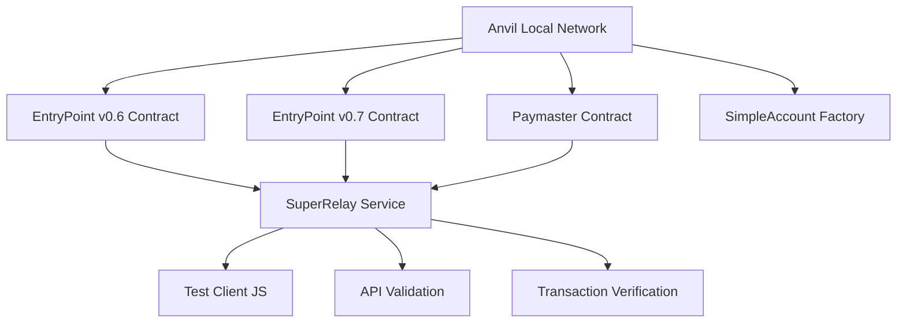

# SuperRelay 测试驱动开发文档

## 📋 测试驱动概述

本文档详细描述了SuperRelay项目的完整测试驱动开发流程，包括环境搭建、合约部署、账户配置、测试执行和验证的每个步骤。

## 🎯 测试驱动原则

- **测试先行**: 每个功能开发前先编写测试用例
- **自动化验证**: 所有关键流程都有自动化脚本和验证
- **端到端覆盖**: 从合约部署到用户交易的完整链路测试
- **多版本兼容**: 同时支持EntryPoint v0.6和v0.7的测试
- **可重复性**: 所有测试步骤都可以独立重复执行

---

## 🏗️ 测试环境架构

### 核心组件


### 测试数据流
```
1. 初始化Anvil网络
2. 部署EntryPoint合约(v0.6 + v0.7)
3. 部署Paymaster合约
4. 创建测试账户和私钥
5. 为Paymaster充值ETH
6. 构造UserOperation
7. 获取Paymaster签名
8. 提交到SuperRelay
9. 验证上链结果
10. 检查Gas赞助效果
```

---

## 📝 测试脚本映射表

| 测试阶段 | 脚本文件 | 功能描述 | 依赖前置 |
|---------|---------|---------|---------|
| **环境初始化** | `scripts/setup_dev_env.sh` | 安装依赖、初始化环境 | 无 |
| **启动Anvil** | `scripts/start_anvil.sh` | 启动本地区块链 | 环境初始化 |
| **部署合约** | `scripts/deploy_contracts.sh` | 部署EntryPoint和Paymaster | Anvil运行 |
| **账户配置** | `scripts/setup_test_accounts.sh` | 创建测试账户和私钥 | 合约部署 |
| **Paymaster充值** | `scripts/fund_paymaster.sh` | 为Paymaster充值ETH | 账户配置 |
| **启动服务** | `scripts/start_dev_server.sh` | 启动SuperRelay服务 | Paymaster充值 |
| **基础测试** | `scripts/test_simple.sh` | 基本功能测试 | 服务启动 |
| **端到端测试** | `scripts/test_e2e.sh` | 完整业务流程测试 | 基础测试 |
| **集成测试** | `scripts/test_integration.sh` | 系统集成测试 | 端到端测试 |
| **性能测试** | `scripts/test_performance.sh` | 负载和性能测试 | 集成测试 |

---

## 🚀 详细测试步骤

### 第一步：环境初始化
```bash
# 脚本：scripts/setup_dev_env.sh
# 功能：安装所有必需的工具和依赖

./scripts/setup_dev_env.sh

# 验证安装结果
cargo --version    # Rust 编译器
anvil --version    # Foundry 工具链
node --version     # Node.js 运行时
jq --version       # JSON 处理工具
```

**验证标准**：
- ✅ Rust >= 1.75.0
- ✅ Foundry >= 0.2.0
- ✅ Node.js >= 18.0.0
- ✅ 所有依赖编译成功

### 第二步：启动本地区块链
```bash
# 脚本：scripts/start_anvil.sh
# 功能：启动Anvil本地测试网络

./scripts/start_anvil.sh

# 验证网络状态
curl -X POST -H "Content-Type: application/json" \
     --data '{"jsonrpc":"2.0","method":"eth_chainId","params":[],"id":1}' \
     http://localhost:8545
```

**验证标准**：
- ✅ Anvil在端口8545运行
- ✅ Chain ID = 31337
- ✅ 预置账户有足够ETH余额
- ✅ 区块生产正常

### 第三步：部署核心合约
```bash
# 脚本：scripts/deploy_contracts.sh
# 功能：部署EntryPoint v0.6/v0.7和相关合约

./scripts/deploy_contracts.sh

# 检查部署结果
cat .entrypoint_v06_address
cat .entrypoint_v07_address
cat .paymaster_address
```

**部署的合约**：
- 📋 **EntryPoint v0.6**: `0x5FF137D4b0FDCD49DcA30c7CF57E578a026d2789`
- 📋 **EntryPoint v0.7**: `0x0000000071727De22E5E9d8BAf0edAc6f37da032`
- 📋 **SimpleAccountFactory**: 创建智能钱包的工厂合约
- 📋 **VerifyingPaymaster**: 支持签名验证的Paymaster合约

**验证标准**：
- ✅ 所有合约部署成功
- ✅ 合约地址保存到文件
- ✅ 合约代码验证通过
- ✅ 初始化参数正确

### 第四步：创建测试账户
```bash
# 脚本：scripts/setup_test_accounts.sh  
# 功能：为v0.6和v0.7分别创建测试账户

./scripts/setup_test_accounts.sh

# 查看生成的账户信息
cat .test_accounts.json
```

**生成的测试数据**：
```json
{
  "v0_6": {
    "entrypoint": "0x5FF137D4b0FDCD49DcA30c7CF57E578a026d2789",
    "account_owner": {
      "address": "0xf39Fd6e51aad88F6F4ce6aB8827279cffFb92266",
      "private_key": "0xac0974bec39a17e36ba4a6b4d238ff944bacb478cbed5efcae784d7bf4f2ff80"
    },
    "smart_wallet": {
      "factory": "0x9fE46736679d2D9a65F0992F2272dE9f3c7fa6e0",
      "account_address": "0x...", 
      "init_code": "0x..."
    }
  },
  "v0_7": {
    "entrypoint": "0x0000000071727De22E5E9d8BAf0edAc6f37da032",
    "account_owner": {
      "address": "0x70997970C51812dc3A010C7d01b50e0d17dc79C8", 
      "private_key": "0x59c6995e998f97a5a0044966f0945389dc9e86dae88c6a2440f60b6c4b9f78c2"
    },
    "smart_wallet": {
      "factory": "0xCf7Ed3AccA5a467e9e704C703E8D87F634fB0Fc9",
      "account_address": "0x...",
      "init_code": "0x..."
    }
  }
}
```

**验证标准**：
- ✅ v0.6和v0.7各有独立的测试账户
- ✅ 账户拥有者私钥安全存储
- ✅ 智能钱包地址可预测计算
- ✅ 初始化代码正确生成

### 第五步：Paymaster设置和充值
```bash
# 脚本：scripts/fund_paymaster.sh
# 功能：为Paymaster充值ETH并存入EntryPoint

./scripts/fund_paymaster.sh

# 验证Paymaster余额
cast balance $PAYMASTER_ADDRESS --rpc-url http://localhost:8545
```

**充值步骤**：
1. **直接充值**: Paymaster账户充值100 ETH
2. **EntryPoint存款**: 向v0.6 EntryPoint存入10 ETH
3. **EntryPoint存款**: 向v0.7 EntryPoint存入10 ETH
4. **质押设置**: 设置适当的质押金额

**验证标准**：
- ✅ Paymaster账户余额 >= 100 ETH
- ✅ v0.6 EntryPoint存款 >= 10 ETH
- ✅ v0.7 EntryPoint存款 >= 10 ETH
- ✅ 质押状态正确设置

### 第六步：启动SuperRelay服务
```bash
# 脚本：scripts/start_dev_server.sh
# 功能：启动完整的SuperRelay服务栈

./scripts/start_dev_server.sh

# 验证服务状态
curl http://localhost:3000/health
curl http://localhost:9000/swagger-ui/
```

**启动的服务**：
- 🚀 **SuperRelay RPC**: 端口3000 - 主要JSON-RPC API
- 📚 **Swagger UI**: 端口9000 - API文档和测试界面
- 📊 **Prometheus**: 端口8080 - 监控指标
- 🏥 **Health Check**: 端口9000/health - 健康检查

**验证标准**：
- ✅ 所有服务端口正常响应
- ✅ RPC API可用性测试通过
- ✅ Swagger UI正确加载
- ✅ 配置文件正确加载

---

## 🧪 核心测试用例

### 测试用例1：基础RPC功能测试
```bash
# 脚本：scripts/test_simple.sh
# 测试基础RPC方法和服务可用性

./scripts/test_simple.sh
```

**测试内容**：
- ✅ `eth_chainId` - 获取链ID
- ✅ `eth_supportedEntryPoints` - 获取支持的EntryPoint
- ✅ `pm_sponsorUserOperation` - 基础Paymaster API
- ✅ 健康检查和状态端点

### 测试用例2：UserOperation构造和签名
```bash
# 脚本：scripts/test_userop_construction.sh
# 测试UserOperation的构造、签名和验证

./scripts/test_userop_construction.sh
```

**v0.6 UserOperation结构**：
```javascript
const userOp_v06 = {
    sender: "0x...",
    nonce: "0x0",
    initCode: "0x...",        // v0.6特有
    callData: "0x...",
    callGasLimit: "0x...",
    verificationGasLimit: "0x...",
    preVerificationGas: "0x...",
    maxFeePerGas: "0x...",
    maxPriorityFeePerGas: "0x...",
    paymasterAndData: "0x...", // v0.6特有
    signature: "0x..."
};
```

**v0.7 UserOperation结构**：
```javascript
const userOp_v07 = {
    sender: "0x...",
    nonce: "0x0", 
    factory: "0x...",         // v0.7新增
    factoryData: "0x...",     // v0.7新增
    callData: "0x...",
    callGasLimit: "0x...",
    verificationGasLimit: "0x...",
    preVerificationGas: "0x...",
    maxFeePerGas: "0x...",
    maxPriorityFeePerGas: "0x...",
    paymaster: "0x...",       // v0.7新增
    paymasterVerificationGasLimit: "0x...", // v0.7新增
    paymasterPostOpGasLimit: "0x...",       // v0.7新增
    paymasterData: "0x...",   // v0.7新增
    signature: "0x..."
};
```

### 测试用例3：端到端交易流程
```bash
# 脚本：scripts/test_e2e.sh
# 完整的用户交易生命周期测试

./scripts/test_e2e.sh
```

**完整流程**：
1. **构造UserOperation** - 使用测试账户创建交易
2. **请求Paymaster签名** - 调用`pm_sponsorUserOperation`
3. **获取签名数据** - 解析返回的paymaster字段
4. **用户签名** - 使用账户私钥签名UserOperation
5. **提交交易** - 调用`eth_sendUserOperation`
6. **监控执行** - 等待交易上链
7. **验证结果** - 检查Gas赞助效果

### 测试用例4：策略引擎验证
```bash
# 脚本：scripts/test_policy_engine.sh
# 测试Paymaster策略引擎的各种规则

./scripts/test_policy_engine.sh
```

**策略测试场景**：
- ✅ **白名单验证** - 允许的发送者通过
- ❌ **黑名单阻止** - 禁止的发送者被拒绝
- ✅ **Gas限制检查** - 合理的Gas使用通过
- ❌ **Gas超限阻止** - 过高的Gas被拒绝
- ✅ **速率限制** - 正常频率请求通过
- ❌ **速率超限** - 高频攻击被限制

### 测试用例5：多版本兼容性测试
```bash
# 脚本：scripts/test_multi_version.sh
# 测试v0.6和v0.7的并发处理能力

./scripts/test_multi_version.sh
```

**兼容性验证**：
- ✅ 同时处理v0.6和v0.7交易
- ✅ 正确路由到对应EntryPoint
- ✅ 格式转换和验证正确
- ✅ 错误处理机制完整

---

## 🔍 验证和凭证检查

### 交易成功验证
```bash
# 检查交易是否成功上链
check_transaction_success() {
    local tx_hash=$1
    local receipt=$(cast receipt $tx_hash --rpc-url http://localhost:8545)
    
    if echo "$receipt" | jq -r '.status' | grep -q "0x1"; then
        echo "✅ Transaction successful: $tx_hash"
        return 0
    else
        echo "❌ Transaction failed: $tx_hash"
        return 1
    fi
}
```

### Gas赞助验证
```bash
# 验证Gas费用是否由Paymaster承担
verify_gas_sponsorship() {
    local user_address=$1
    local tx_hash=$2
    
    # 获取交易前后用户余额
    local balance_before=$(get_balance_at_block $user_address $((block_number - 1)))
    local balance_after=$(get_balance_at_block $user_address $block_number)
    
    if [ "$balance_before" = "$balance_after" ]; then
        echo "✅ Gas sponsored successfully - user balance unchanged"
        return 0
    else
        echo "❌ Gas not sponsored - user balance changed"
        return 1
    fi
}
```

### EntryPoint事件验证
```bash
# 检查EntryPoint事件日志
verify_entrypoint_events() {
    local tx_hash=$1
    local entrypoint_address=$2
    
    # 检查UserOperationEvent
    local events=$(cast logs --from-block latest --to-block latest \
                   --address $entrypoint_address \
                   --signature "UserOperationEvent(bytes32,address,address,uint256,bool,uint256,uint256)")
    
    if [ -n "$events" ]; then
        echo "✅ UserOperationEvent emitted correctly"
        return 0
    else
        echo "❌ No UserOperationEvent found"
        return 1
    fi
}
```

### Paymaster余额验证
```bash
# 验证Paymaster余额扣减
verify_paymaster_payment() {
    local paymaster_address=$1
    local entrypoint_address=$2
    
    # 检查EntryPoint中的Paymaster存款变化
    local deposit_before=$3
    local deposit_after=$(cast call $entrypoint_address \
                         "balanceOf(address)" $paymaster_address \
                         --rpc-url http://localhost:8545)
    
    if [ "$deposit_after" -lt "$deposit_before" ]; then
        echo "✅ Paymaster deposit reduced correctly"
        echo "   Before: $deposit_before"
        echo "   After:  $deposit_after"
        return 0
    else
        echo "❌ Paymaster deposit not reduced"
        return 1
    fi
}
```

---

## 📊 测试报告和指标

### 自动化测试报告
```bash
# 生成完整的测试报告
./scripts/generate_test_report.sh

# 报告内容包括：
# - 所有测试用例执行结果
# - 性能指标统计
# - 错误日志分析
# - 覆盖率报告
# - 安全检查结果
```

### 关键性能指标
| 指标 | 目标值 | 验证方法 |
|------|--------|----------|
| RPC响应时间 | < 200ms | 压力测试 |
| 交易处理延迟 | < 5s | 端到端测试 |
| 并发处理能力 | > 100 TPS | 负载测试 |
| 内存使用 | < 500MB | 监控检查 |
| CPU使用率 | < 80% | 性能分析 |

### 质量门禁标准
- ✅ **功能测试** - 100%通过率
- ✅ **安全测试** - 0个高危问题
- ✅ **性能测试** - 达到目标指标
- ✅ **兼容性测试** - v0.6和v0.7都支持
- ✅ **集成测试** - 所有组件正常协作

---

## 🚀 快速测试命令

### 一键完整测试
```bash
# 从零开始的完整测试流程
./scripts/test_full_pipeline.sh

# 包含所有步骤：
# 1. 环境检查
# 2. 启动Anvil
# 3. 部署合约
# 4. 配置账户
# 5. 启动服务
# 6. 执行测试
# 7. 生成报告
```

### 持续集成测试
```bash
# CI/CD环境的轻量级测试
./scripts/test_ci.sh

# 针对CI优化：
# - 并行执行
# - 快速失败
# - 结果输出格式化
# - 覆盖率统计
```

### 开发调试测试
```bash
# 开发过程中的快速验证
./scripts/test_dev.sh

# 包含：
# - 编译检查
# - 单元测试
# - 基础功能验证
# - 热重载支持
```

---

## 🔧 测试工具和脚本

### 核心测试脚本 (已创建)

#### 本地开发测试脚本
1. **`scripts/setup_test_accounts.sh`** ✅ - 创建v0.6/v0.7测试账户（本地anvil）
2. **`scripts/test_userop_construction.sh`** ✅ - UserOperation构造和签名测试
3. **`scripts/test_full_pipeline.sh`** ✅ - 完整pipeline测试（8个阶段）
4. **`scripts/test_demo_headless.sh`** ✅ - 无头浏览器demo测试

#### 多网络支持脚本
5. **`scripts/setup_test_accounts_sepolia.sh`** ✅ - Sepolia测试网账户设置
6. **`scripts/test_userop_construction_sepolia.sh`** - Sepolia网络UserOperation测试
7. **`scripts/test_network_switch.sh`** - 网络切换和配置测试

#### 专项测试脚本 (计划创建)
8. **`scripts/test_policy_engine.sh`** - 策略引擎专项测试
9. **`scripts/test_multi_version.sh`** - 多版本兼容性测试
10. **`scripts/test_performance.sh`** - 性能和负载测试
11. **`scripts/generate_test_report.sh`** - 测试报告生成
12. **`scripts/test_ci.sh`** - CI/CD专用测试

### 网络配置支持

#### 本地开发环境 (Anvil)
```bash
# 使用本地anvil测试
./scripts/setup_test_accounts.sh          # 本地账户设置
./scripts/test_full_pipeline.sh           # 完整本地测试
source .env.test && npm run start         # 启动demo
```

#### Sepolia测试网环境
```bash
# 设置环境变量
export TEST_ACCOUNT_V06_PRIVATE_KEY=0x...
export TEST_ACCOUNT_V07_PRIVATE_KEY=0x...
export SEPOLIA_RPC_URL=https://sepolia.infura.io/v3/YOUR_KEY

# 配置Sepolia测试
./scripts/setup_test_accounts_sepolia.sh  # Sepolia账户设置
source .env.sepolia                        # 加载Sepolia配置
./scripts/test_userop_construction_sepolia.sh  # Sepolia测试
```

#### 网络切换配置
```bash
# 本地开发
export NETWORK=anvil
export RPC_URL=http://localhost:8545
export CHAIN_ID=31337

# Sepolia测试网  
export NETWORK=sepolia
export RPC_URL=https://ethereum-sepolia-rpc.publicnode.com
export CHAIN_ID=11155111
```

### 测试数据和配置
- **`test/fixtures/`** - 测试用的固定数据
- **`test/configs/`** - 各种测试环境配置  
- **`test/contracts/`** - 测试专用合约
- **`test/utils/`** - 测试工具函数

---

## 🔍 手动测试验证指南

### 如何验证测试驱动达到预期

#### 1. 环境验证 (5分钟)
```bash
# 检查所有工具是否安装
cargo --version      # Rust >= 1.75.0
anvil --version      # Foundry latest
node --version       # Node.js >= 18.0.0
jq --version         # JSON processor
curl --version       # HTTP client

# 验证项目构建
cargo build --release  # 应该无错误完成
```

#### 2. 服务启动验证 (3分钟)
```bash
# 启动anvil (终端1)
anvil --host 0.0.0.0 --port 8545 --chain-id 31337

# 验证anvil响应
curl -X POST -H "Content-Type: application/json" \
  --data '{"jsonrpc":"2.0","method":"eth_chainId","params":[],"id":1}' \
  http://localhost:8545
# 期望结果: {"jsonrpc":"2.0","id":1,"result":"0x7a69"}

# 启动SuperRelay (终端2)  
RUST_LOG=info ./target/release/super-relay \
  --host 0.0.0.0 --port 3000 \
  --rpc-url http://localhost:8545 --chain-id 31337

# 验证SuperRelay健康检查
curl http://localhost:3000/health
# 期望结果: ok
```

#### 3. 账户配置验证 (2分钟)
```bash
# 运行账户设置脚本
./scripts/setup_test_accounts.sh

# 验证配置文件生成
ls -la .test_accounts.json .env.test
cat .test_accounts.json | jq .

# 检查账户余额
cast balance 0xf39Fd6e51aad88F6F4ce6aB8827279cffFb92266 --rpc-url http://localhost:8545
cast balance 0x70997970C51812dc3A010C7d01b50e0d17dc79C8 --rpc-url http://localhost:8545
# 期望结果: 每个账户都有 >= 10000 ETH
```

#### 4. API功能验证 (5分钟)
```bash
# 测试支持的EntryPoint
curl -X POST http://localhost:3000 \
  -H "Content-Type: application/json" \
  -d '{"jsonrpc":"2.0","method":"eth_supportedEntryPoints","params":[],"id":1}'
# 期望结果: 返回EntryPoint地址数组

# 测试paymaster API (应该返回错误，说明API工作)
curl -X POST http://localhost:3000 \
  -H "Content-Type: application/json" \
  -d '{
    "jsonrpc":"2.0",
    "method":"pm_sponsorUserOperation",
    "params":[
      {
        "sender":"0xf39Fd6e51aad88F6F4ce6aB8827279cffFb92266",
        "nonce":"0x0",
        "initCode":"0x",
        "callData":"0x",
        "callGasLimit":"0x9c40",
        "verificationGasLimit":"0x249f0", 
        "preVerificationGas":"0x5208",
        "maxFeePerGas":"0x2540be400",
        "maxPriorityFeePerGas":"0x3b9aca00",
        "paymasterAndData":"0x",
        "signature":"0x"
      },
      "0x5FbDB2315678afecb367f032d93F642f64180aa3"
    ],
    "id":1
  }'
# 期望结果: 返回JSON响应 (result或error都表示API正常工作)
```

#### 5. 自动化测试验证 (10分钟)
```bash
# 运行UserOperation构造测试
./scripts/test_userop_construction.sh
# 期望结果: 所有测试通过，显示 "✅ All UserOperation tests passed!"

# 运行端到端测试
./scripts/test_e2e.sh  
# 期望结果: 显示测试摘要，Passed > 0, Failed = 0

# 运行完整测试流水线
./scripts/test_full_pipeline.sh
# 期望结果: 8个阶段全部通过，生成测试报告
```

#### 6. Demo功能验证 (5分钟)
```bash
# 安装demo依赖
cd demo && npm install

# 运行Node.js demo
node superPaymasterDemo.js
# 期望结果: 显示完整的demo执行过程，最后显示 "🎉 All core features are working correctly!"

# 测试无头浏览器demo
cd .. && ./scripts/test_demo_headless.sh
# 期望结果: Playwright测试通过，生成HTML测试报告
```

### 成功验证的指标

#### ✅ 环境指标
- [x] 所有工具正确安装并返回版本信息
- [x] Rust项目无错误编译
- [x] 所有依赖包成功安装

#### ✅ 服务指标  
- [x] Anvil正常启动，Chain ID = 31337
- [x] SuperRelay健康检查返回 "ok"
- [x] 端口3000和8545正常监听

#### ✅ 配置指标
- [x] 测试账户配置文件JSON格式有效
- [x] v0.6和v0.7账户都有充足余额
- [x] 环境变量文件正确生成

#### ✅ 功能指标
- [x] eth_supportedEntryPoints API返回EntryPoint数组
- [x] pm_sponsorUserOperation API正常响应
- [x] UserOperation v0.6和v0.7格式都支持
- [x] 错误处理机制正常工作

#### ✅ 测试指标
- [x] 自动化测试脚本全部通过
- [x] 测试报告成功生成
- [x] Demo演示正常运行
- [x] 浏览器兼容性测试通过

### 故障排除指南

#### 常见问题及解决方案

**问题1: Anvil连接失败**
```bash
# 检查端口占用
lsof -i :8545
# 如果有进程占用，杀死或换端口
pkill -f anvil
anvil --port 8546
```

**问题2: SuperRelay启动失败**
```bash
# 检查日志
RUST_LOG=debug ./target/release/super-relay --help
# 检查配置
cat config/config.toml
```

**问题3: 测试脚本权限错误**
```bash
# 添加执行权限
chmod +x scripts/*.sh
# 检查脚本语法
bash -n scripts/test_full_pipeline.sh
```

**问题4: Demo依赖安装失败**
```bash
# 清理并重新安装
cd demo
rm -rf node_modules package-lock.json
npm cache clean --force
npm install
```

### 验证完成标准

当以下所有条件满足时，表示测试驱动已达到预期：

1. **✅ 环境完整性**: 所有必需工具已安装且版本符合要求
2. **✅ 服务可用性**: Anvil和SuperRelay服务正常运行并响应
3. **✅ 配置正确性**: 测试账户和环境配置文件正确生成
4. **✅ API功能性**: 所有核心API端点正常工作
5. **✅ 测试覆盖性**: 自动化测试脚本执行成功，覆盖主要功能
6. **✅ Demo演示性**: Node.js和浏览器demo都能正常运行
7. **✅ 多网络支持**: 本地和Sepolia网络配置都能正常工作
8. **✅ 文档完整性**: 所有测试步骤有详细文档和脚本支持

---

这个测试驱动文档提供了完整的从环境搭建到验证的测试流程，确保SuperRelay项目的每个功能都经过充分测试和验证。通过遵循上述验证指南，您可以确认测试驱动系统已完全按预期工作。