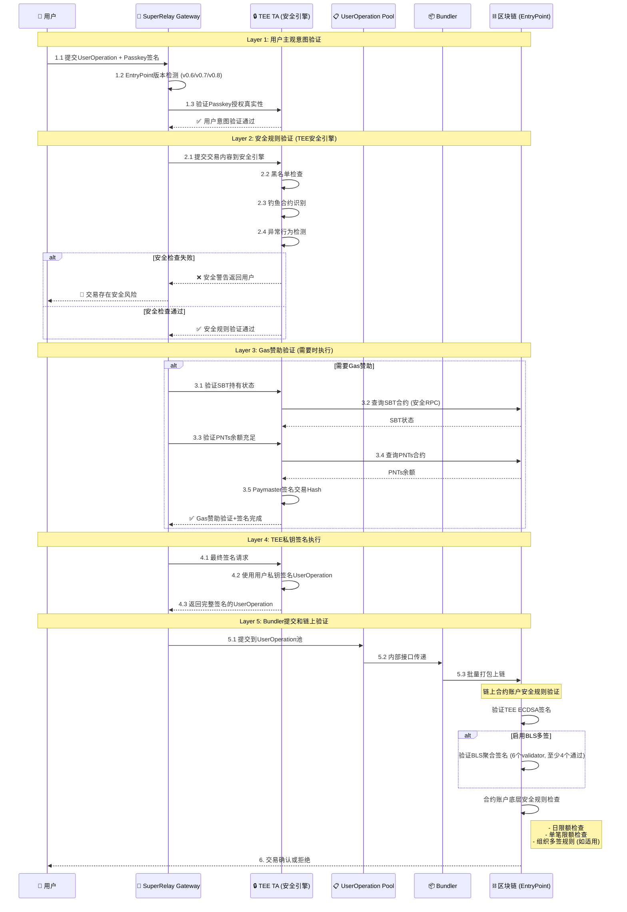
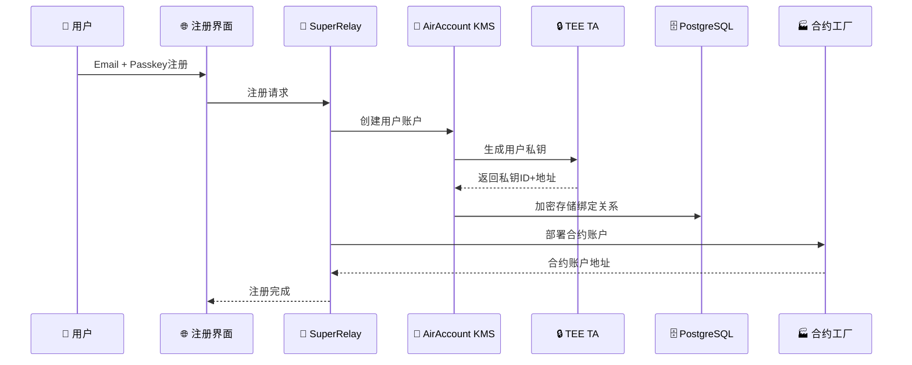

# SuperRelay + AirAccount 集成架构流程

**版本**: v1.2
**更新日期**: 2025-09-06
**状态**: 统一架构配置驱动的多重验证实施方案

## 🎯 项目总体目标

将SuperRelay（ERC-4337 Paymaster + Bundler）与AirAccount（基于ARM TEE的硬件KMS）深度集成，实现**意图与安全分离的多重验证**机制，提供企业级安全的Account Abstraction解决方案。

## 🔐 多重验证核心概念

### 概念升级：从"双重签名"到"多重验证"

**传统概念问题**：
- ❌ "双重签名"容易误解为技术实现细节
- ❌ 边界不清：用户签名、业务验证、安全检查混合

**新架构："意图与安全分离的多重验证"**：
- ✅ **第一层**: 用户主观意图验证 (Passkey授权)
- ✅ **第二层**: 安全规则验证 (TEE安全引擎)
- ✅ **第三层**: Gas赞助验证 (SBT+PNTs+Paymaster)
- ✅ **第四层**: TEE私钥签名执行
- ✅ **第五层**: 链上合约账户安全规则

## 🏗️ 系统架构概览

### 🔧 统一架构：配置驱动的KMS切换方案 (主要实施方案)

#### 核心设计理念
**一个统一代码分支 + 配置文件驱动 = 两种部署模式**

> **重要**: 这是经过充分讨论确认的最终实施方案，替代之前考虑的双分支维护方案

#### 🚀 SuperRelay 统一版本架构
- **核心组件**: Gateway + Paymaster + Bundler (统一)
- **KMS配置驱动**: 通过配置文件选择KMS提供者
- **部署模式**:
  - **模式1 (Standalone)**: Paymaster用AWS KMS + 用户私钥用远程AirAccount服务
  - **模式2 (Integrated)**: Paymaster用TEE KMS + 用户私钥用集成TEE
- **配置切换**: 零代码修改，只需要修改配置文件
- **维护优势**: 单一代码分支，统一测试，简化维护

#### 📋 KMS提供者抽象层设计
```rust
// 统一的KMS提供者接口
pub trait KmsProvider {
    async fn sign(&mut self, request: KmsSigningRequest, context: SigningContext) -> Result<KmsSigningResponse>;
    async fn check_status(&self) -> Result<KmsStatusResponse>;
}

// 配置驱动的KMS选择
pub enum KmsConfig {
    AwsKms { region: String, key_id: String },
    AirAccountRemote { service_url: String, api_key: String },
    AirAccountIntegrated { tee_config: TeeConfig },
}

// 统一的KMS工厂
impl KmsProviderFactory {
    pub fn create(config: KmsConfig) -> Box<dyn KmsProvider> {
        match config {
            KmsConfig::AwsKms { .. } => Box::new(AwsKmsProvider::new(config)),
            KmsConfig::AirAccountRemote { .. } => Box::new(RemoteAirAccountKmsProvider::new(config)),
            KmsConfig::AirAccountIntegrated { .. } => Box::new(IntegratedAirAccountKmsProvider::new(config)),
        }
    }
}
```

#### 🔄 AirAccount 双版本部署策略
**AirAccount独立版本 (服务模式)**:
- ✅ **功能**: Web注册界面 + 账户生命周期管理 + KMS HTTP服务
- ✅ **部署**: 独立服务器，通过HTTP API提供KMS服务
- ✅ **适用**: 多个SuperRelay实例共享KMS服务

**AirAccount集成版本 (嵌入模式)**:
- ✅ **功能**: 相同功能 + 直接嵌入SuperRelay进程
- ✅ **部署**: 编译时集成，减少网络调用开销
- ✅ **适用**: 单体部署，最高性能要求

**版本一致性保证**:
- 🔄 **核心代码共享**: 90%代码复用，只有接口适配层不同
- 🔄 **构建配置**: 通过feature flags控制编译输出
- 🔄 **API兼容**: HTTP API和直接调用API保持一致

## 🔄 意图与安全分离的多重验证完整流程

### 核心流程：5层验证 + 链上最终验证

```
Layer 1: 用户意图 → Layer 2: 安全规则 → Layer 3: Gas赞助 → Layer 4: TEE签名 → Layer 5: 链上验证
```

#### 详细多重验证流程



#### 关键技术实现点

**步骤3 - SBT+PNTs验证（SuperRelay Gateway模块）**:
```rust
// 在SuperRelay/crates/gateway/src/sbt_validator.rs
pub struct SBTValidator {
    rpc_client: Arc<Provider<Http>>,
    sbt_contract: Address,
    pnts_contract: Address,
}

impl SBTValidator {
    pub async fn verify_user_eligibility(&self, user_address: Address, required_gas: U256) -> Result<bool> {
        // 1. 验证SBT持有
        let sbt_balance = self.check_sbt_ownership(user_address).await?;

        // 2. 验证PNTs余额
        let pnts_balance = self.check_pnts_balance(user_address).await?;
        let required_pnts = required_gas * PNTS_TO_ETH_RATE;

        Ok(sbt_balance > 0 && pnts_balance >= required_pnts)
    }
}
```

**步骤4-5 - 双重签名验证**:
```rust
// SuperRelay调用AirAccount KMS
pub struct DualSignatureRequest {
    pub user_operation: UserOperationV06, // 或 PackedUserOperation
    pub entry_point_version: String,
    pub user_passkey_signature: Vec<u8>,
    pub paymaster_mode: PaymasterMode, // AirAccount或AWS
}
```

## 📋 用户注册预置流程

### Phase 1: 用户注册阶段（集成版本需要）



**数据存储改进方案**:
- **TEE存储**: 用户私钥（硬件级安全）
- **数据库存储**: 用户特定密钥派生加密的绑定关系
- **加密方案**: `PBKDF2(user_email + master_key, user_specific_salt)`

## 🔧 技术决策确认

### ✅ 决策1: SBT+PNTs验证位置
**确认方案**: SuperRelay Gateway模块内，使用Rust ethers-rs实现

### ✅ 决策2: Paymaster私钥存储 (更新)
**确认方案**: 统一分支配置驱动实现
- **Phase 1 (Standalone模式)**: AWS KMS for Paymaster + Remote AirAccount for Users
- **Phase 2 (Integrated模式)**: TEE KMS for Paymaster + Integrated AirAccount TEE

### ✅ 决策3: EntryPoint版本支持
**确认方案**: 优先v0.6，架构支持v0.7/v0.8扩展

### ✅ 决策4: 用户数据加密安全
**安全改进**: 从节点私钥加密改为用户特定密钥派生

## 🎯 SuperRelay统一架构 (最终确认方案)

```
SuperRelay统一项目 (feature/super-relay)
├── 统一Gateway模块 (SBT+PNTs验证)
├── 统一Paymaster模块
│   ├── KMS抽象层 (KmsProvider trait)
│   ├── AWS KMS实现 (AwsKmsProvider)
│   ├── Remote AirAccount实现 (RemoteAirAccountKmsProvider)
│   └── Integrated AirAccount实现 (IntegratedAirAccountKmsProvider)
├── 统一Bundler模块 (交易打包)
└── 配置驱动系统
    ├── config.toml (部署模式配置)
    ├── Phase 1配置: Standalone模式
    └── Phase 2配置: Integrated模式
```

### 配置文件驱动示例
```toml
# config/standalone.toml (Phase 1)
[kms]
mode = "hybrid"  # AWS KMS + Remote AirAccount
aws_region = "us-west-2"
aws_key_id = "paymaster-key-id"
airaccount_service_url = "https://airaccount.example.com"
airaccount_api_key = "your-api-key"

# config/integrated.toml (Phase 2)
[kms]
mode = "integrated"  # Full TEE Integration
tee_config_path = "/etc/tee/config.json"
tee_paymaster_key_id = "tee-paymaster-key"
```

### Phase 3: 技术实现细节分析

#### 🤔 决策点1: SBT+PNTs余额验证位置
**方案A: TA内验证（推荐）**
```rust
// 在TEE TA中实现
impl DualSignatureVerifier {
    fn verify_sbt_ownership(&self, user_address: Address) -> Result<bool> {
        // 通过安全RPC调用链上合约
        self.rpc_client.call_contract(SBT_CONTRACT, "balanceOf", user_address)
    }

    fn verify_pnts_balance(&self, user_address: Address, required: u256) -> Result<bool> {
        // 验证PNTs余额是否足够支付Gas
        self.rpc_client.call_contract(PNTS_CONTRACT, "balanceOf", user_address)
    }
}
```

**优势**:
- ✅ 硬件级安全
- ✅ 防止CA层被攻击时的数据泄露
- ✅ 统一在TEE内处理所有敏感逻辑

**方案B: CA内验证**
```typescript
// 在Node.js CA中实现
class PaymasterVerifier {
    async verifySBTAndPNTs(userAddress: string): Promise<boolean> {
        // 通过ethers.js查询链上状态
    }
}
```

**优势**:
- ✅ 实现简单
- ✅ RPC调用更灵活

#### 🤔 决策点2: Paymaster私钥存储方案

**方案A: AirAccount ARM KMS（推荐）**
```rust
impl PaymasterSigner {
    fn sign_sponsorship(&self, user_op_hash: [u8; 32]) -> Result<Signature> {
        // 使用预注册的Paymaster私钥在TEE内签名
        self.tee_keystore.sign(PAYMASTER_KEY_ID, user_op_hash)
    }
}
```

**优势**:
- ✅ 统一的硬件安全架构
- ✅ 降低云端依赖
- ✅ 更强的安全保障

**方案B: AWS KMS**
```typescript
class AWSPaymasterSigner {
    async signSponsorship(userOpHash: string): Promise<string> {
        // 调用AWS KMS进行签名
        return await this.awsKms.sign(userOpHash);
    }
}
```

**优势**:
- ✅ 云端高可用
- ✅ 企业级密钥管理

#### 🤔 决策点3: 用户数据加密存储方案

**当前方案: 节点私钥加密**
```typescript
interface UserRecord {
    email: string;
    passkey_credential_id: string;
    passkey_public_key: Buffer;
    user_address: string;
    tee_key_id: string;        // TEE中的私钥标识符
    contract_account: string;   // 部署的合约账户地址
    created_at: timestamp;
}

// 加密存储
const encryptedRecord = encrypt(userRecord, NODE_PRIVATE_KEY);
```

**安全评估**:
- ✅ 基础防护：防止数据库直接泄露
- ⚠️ 风险点：节点私钥泄露导致全部用户数据泄露
- 🔄 **改进建议**: 使用用户特定的密钥派生（PBKDF2/Scrypt）

## 📊 UserOperation版本支持矩阵

| EntryPoint版本 | UserOperation结构 | 支持状态 | Hash计算 |
|---------------|------------------|---------|----------|
| v0.6 | UserOperation | ✅ 已实现 | 标准ABI编码 |
| v0.7 | PackedUserOperation | 🔄 开发中 | 优化的packed编码 |
| v0.8 | PackedUserOperation + EIP-7702 | ⏳ 计划中 | ERC-712兼容 |

### UserOperation结构对比

#### v0.6 UserOperation
```solidity
struct UserOperation {
    address sender;
    uint256 nonce;
    bytes initCode;
    bytes callData;
    uint256 callGasLimit;
    uint256 verificationGasLimit;
    uint256 preVerificationGas;
    uint256 maxFeePerGas;
    uint256 maxPriorityFeePerGas;
    bytes paymasterAndData;
    bytes signature;
}
```

#### v0.7/v0.8 PackedUserOperation
```solidity
struct PackedUserOperation {
    address sender;
    uint256 nonce;
    bytes initCode;
    bytes callData;
    bytes32 accountGasLimits;    // packed: callGasLimit + verificationGasLimit
    uint256 preVerificationGas;
    bytes32 gasFees;             // packed: maxFeePerGas + maxPriorityFeePerGas
    bytes paymasterAndData;
    bytes signature;
}
```

## 🔐 安全架构设计

### TEE TA安全边界
```
┌─────────────────────────────────────────────┐
│            TEE Secure World (TA)            │
├─────────────────────────────────────────────┤
│  • 用户私钥生成和存储                          │
│  • UserOperation签名                       │
│  • Paymaster赞助签名                        │
│  • SBT/PNTs余额验证 (推荐)                   │
│  • 反重放攻击检测                             │
│  • 配置完整性验证                             │
└─────────────────────────────────────────────┘

┌─────────────────────────────────────────────┐
│         Normal World (CA + SuperRelay)      │
├─────────────────────────────────────────────┤
│  • 用户注册管理                              │
│  • 加密数据存储                              │
│  • HTTP API接口                            │
│  • Bundler交易打包                          │
│  • 监控和日志                               │
└─────────────────────────────────────────────┘
```

### 数据流安全设计
1. **用户私钥**: 永不离开TEE TA
2. **签名过程**: 全部在TEE内完成
3. **配置验证**: 通过链上合约哈希验证
4. **通信加密**: CA↔TA之间使用安全通道

## 🚀 实施优先级排序

### 🔥 高优先级（立即实施）
1. ✅ 统一配置文档（已完成）
2. 🔄 多版本UserOperation结构支持
3. 🔄 EntryPoint版本选择机制
4. 🔄 TA配置管理系统

### 🟡 中优先级（短期实施）
5. ⏳ SBT+PNTs链上验证集成
6. ⏳ Paymaster签名架构选择
7. ⏳ 用户数据加密存储优化
8. ⏳ 完整的端到端测试

### 🔵 低优先级（中长期规划）
9. ⏳ AWS KMS集成选项
10. ⏳ 链上配置验证合约
11. ⏳ 监控和告警系统
12. ⏳ 性能优化和扩展

## ✅ 关键决策已确认

1. **SBT+PNTs验证位置**: ✅ TA内实现（TEE安全引擎组件）
2. **Paymaster私钥存储**: ✅ 配置驱动切换（Phase 1用AWS，Phase 2用TEE）
3. **用户数据加密方案**: ✅ PBKDF2用户特定密钥派生（在Phase 2实施）
4. **EntryPoint版本支持**: ✅ 从v0.6开始，同时支持v0.7/v0.8
5. **架构模式**: ✅ 统一分支配置驱动（替代双分支维护）

## 🎯 完整开发计划 - 按层级组织

### 📊 当前实现状态分析

**✅ 已完成 (v0.1.8)**:
1. SuperRelay双分支架构 (relay-standalone, relay-airaccount)
2. Gateway模块 SBT+PNTs验证器 (ethers-rs集成)
3. UserOperation v0.6结构体支持和EntryPoint版本选择
4. AWS KMS和AirAccount KMS双轨实现
5. 多重验证协调器 (DualSignatureFlow重构)

**📋 现有技术资产**:
- RPC配置: Sepolia + 本地测试网 (.env完整配置)
- 合约地址: SBT, PNTs, EntryPoint (v0.6/v0.7/v0.8)
- SuperRelay Bundler: LocalBuilderHandle + RemoteBuilderClient (已实现)
- UserOperation Pool: 内部接口机制 (已存在)

## 📊 实施策略：先Standalone模式，后集成模式 (分阶段实施)

### 🎯 Phase 1: Standalone模式 (高优先级)
**目标**: 实现配置驱动的AWS KMS + Remote AirAccount混合模式
- ✅ **Paymaster签名**: 使用AWS KMS（云端高可用）
- ✅ **用户密钥管理**: 使用Remote AirAccount服务（TEE硬件安全）
- ✅ **部署模式**: 分离式架构，便于测试和验证
- ✅ **配置文件**: `config/standalone.toml`

#### Phase 1核心任务 (立即执行)
1. **H1.1**: 实现TEE安全引擎核心功能
2. **H2.1**: 优化Gateway-Pool-Bundler完整链路
3. **H2.2**: 修复硬编码RPC URL问题
4. **H2.3**: 标准化ECDSA签名格式
5. **H3.1**: 扩展PackedUserOperation v0.7/v0.8支持

### 🎯 Phase 2: Integrated模式 (中优先级)
**目标**: 基于Phase 1稳定基础，实现完全TEE集成模式
- ✅ **Paymaster签名**: 使用TEE内部KMS（最高安全）
- ✅ **用户密钥管理**: 使用集成TEE（单体高性能）
- ✅ **部署模式**: 一体化架构，减少网络开销
- ✅ **配置文件**: `config/integrated.toml`

#### Phase 2核心任务 (短期规划)
1. **M1**: 用户数据安全加密改进（PBKDF2）
2. **M2**: 端到端测试和验证
3. **M3**: 企业级特性实现
4. **M4**: 真实TEE环境部署

### 🔄 Future Roadmap (预留功能，暂不实施)
- **F1**: BLS聚合签名防护机制（6验证器，4最小阈值）
- **F2**: 合约账户安全规则（限额控制，多签治理）

### 实施优势分析
#### 统一架构优势
- ✅ **维护简化**: 单一代码库，统一测试和部署
- ✅ **配置灵活**: 零代码修改切换部署模式
- ✅ **渐进升级**: Phase 1 → Phase 2 平滑迁移
- ✅ **风险控制**: 先验证Standalone模式稳定性

#### 阶段式实施优势
- ✅ **快速验证**: Phase 1快速建立端到端流程
- ✅ **技术分离**: AWS云端服务 + TEE硬件安全各自优势
- ✅ **风险隔离**: 分阶段验证，降低集成风险
- ✅ **用户体验**: Phase 1即可提供完整功能

## 📋 详细开发计划

> **详细的分层todo计划已转移到 [todo.md](./todo.md)**
>
> 包含：
> - Phase 1: 核心功能实现 (立即执行)
> - Phase 2: 增强功能实现 (短期规划)
> - 预留扩展点规划
> - 优先级矩阵和依赖关系

---

**文档维护者**: SuperRelay + AirAccount 集成团队
**最后更新**: 2025-09-06 v1.1
**架构状态**: 多重验证核心实现完成，进入TEE安全引擎开发阶段