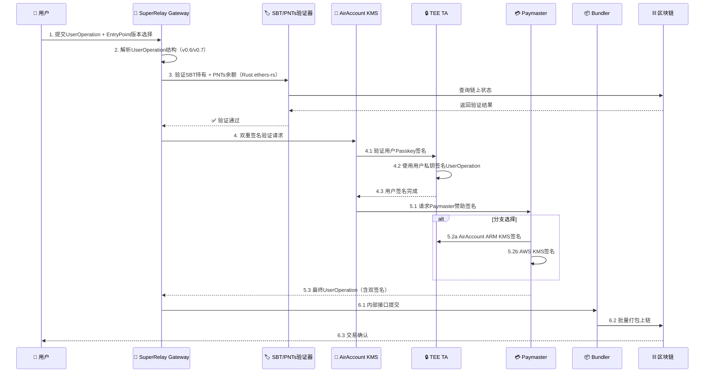
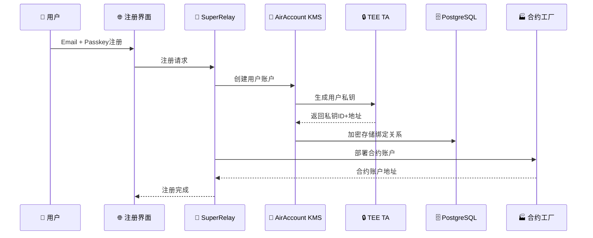

# SuperRelay + AirAccount 集成架构流程

**版本**: v1.0  
**更新日期**: 2025-09-06  
**状态**: Architecture Design

## 🎯 项目总体目标

将SuperRelay（ERC-4337 Paymaster + Bundler）与AirAccount（基于ARM TEE的硬件KMS）深度集成，提供完整的Account Abstraction解决方案。

## 🏗️ 系统架构概览

### SuperRelay 两个版本定位

#### 当前版本（SuperRelay Standalone）
- **组件**: Paymaster + Bundler
- **假设**: 用户签名已完成
- **功能**: 交易验证 → Gas赞助签名 → 打包上链
- **私钥管理**: 云端KMS（无ARM芯片支持）
- **适用场景**: 传统Web3应用集成

#### 集成版（SuperRelay + AirAccount）
- **组件**: Paymaster + Bundler + AirAccount KMS
- **新增功能**: 
  - 用户注册管理（Email + Passkey）
  - TEE硬件私钥生成和存储
  - 合约账户工厂部署
  - 双重签名验证（用户意图 + Paymaster赞助）
- **适用场景**: 企业级安全要求的Web3应用

## 🔄 用户交易提交完整流程

### 精炼版：用户发起交易到上链的全过程

```
1. 用户提交 → 2. 版本选择 → 3. SBT+PNTs验证 → 4. 双重签名 → 5. Paymaster签名 → 6. 打包上链
```

#### 详细步骤流程



#### 关键技术实现点

**步骤3 - SBT+PNTs验证（SuperRelay Gateway模块）**:
```rust
// 在SuperRelay/crates/gateway/src/sbt_validator.rs
pub struct SBTValidator {
    rpc_client: Arc<Provider<Http>>,
    sbt_contract: Address,
    pnts_contract: Address,
}

impl SBTValidator {
    pub async fn verify_user_eligibility(&self, user_address: Address, required_gas: U256) -> Result<bool> {
        // 1. 验证SBT持有
        let sbt_balance = self.check_sbt_ownership(user_address).await?;
        
        // 2. 验证PNTs余额
        let pnts_balance = self.check_pnts_balance(user_address).await?;
        let required_pnts = required_gas * PNTS_TO_ETH_RATE;
        
        Ok(sbt_balance > 0 && pnts_balance >= required_pnts)
    }
}
```

**步骤4-5 - 双重签名验证**:
```rust
// SuperRelay调用AirAccount KMS
pub struct DualSignatureRequest {
    pub user_operation: UserOperationV06, // 或 PackedUserOperation
    pub entry_point_version: String,
    pub user_passkey_signature: Vec<u8>,
    pub paymaster_mode: PaymasterMode, // AirAccount或AWS
}
```

## 📋 用户注册预置流程

### Phase 1: 用户注册阶段（集成版本需要）



**数据存储改进方案**:
- **TEE存储**: 用户私钥（硬件级安全）
- **数据库存储**: 用户特定密钥派生加密的绑定关系
- **加密方案**: `PBKDF2(user_email + master_key, user_specific_salt)`

## 🔧 技术决策确认

### ✅ 决策1: SBT+PNTs验证位置
**确认方案**: SuperRelay Gateway模块内，使用Rust ethers-rs实现

### ✅ 决策2: Paymaster私钥存储
**确认方案**: 两个分支并行开发
- **relay-standalone分支**: AWS KMS
- **relay-airaccount分支**: AirAccount ARM KMS

### ✅ 决策3: EntryPoint版本支持
**确认方案**: 优先v0.6，架构支持v0.7/v0.8扩展

### ✅ 决策4: 用户数据加密安全
**安全改进**: 从节点私钥加密改为用户特定密钥派生

## 🎯 SuperRelay分支架构

```
SuperRelay项目
├── main分支 (基础架构)
├── relay-standalone分支 (AWS KMS版本)
│   ├── Gateway模块 (SBT+PNTs验证)
│   ├── Paymaster模块 (AWS KMS签名)  
│   └── Bundler模块 (交易打包)
└── relay-airaccount分支 (AirAccount集成版本)
    ├── Gateway模块 (SBT+PNTs验证)
    ├── AirAccount集成模块
    ├── Paymaster模块 (TEE KMS签名)
    └── Bundler模块 (交易打包)
```

### Phase 3: 技术实现细节分析

#### 🤔 决策点1: SBT+PNTs余额验证位置
**方案A: TA内验证（推荐）**
```rust
// 在TEE TA中实现
impl DualSignatureVerifier {
    fn verify_sbt_ownership(&self, user_address: Address) -> Result<bool> {
        // 通过安全RPC调用链上合约
        self.rpc_client.call_contract(SBT_CONTRACT, "balanceOf", user_address)
    }
    
    fn verify_pnts_balance(&self, user_address: Address, required: u256) -> Result<bool> {
        // 验证PNTs余额是否足够支付Gas
        self.rpc_client.call_contract(PNTS_CONTRACT, "balanceOf", user_address)
    }
}
```

**优势**: 
- ✅ 硬件级安全
- ✅ 防止CA层被攻击时的数据泄露
- ✅ 统一在TEE内处理所有敏感逻辑

**方案B: CA内验证**
```typescript
// 在Node.js CA中实现
class PaymasterVerifier {
    async verifySBTAndPNTs(userAddress: string): Promise<boolean> {
        // 通过ethers.js查询链上状态
    }
}
```

**优势**:
- ✅ 实现简单
- ✅ RPC调用更灵活

#### 🤔 决策点2: Paymaster私钥存储方案

**方案A: AirAccount ARM KMS（推荐）**
```rust
impl PaymasterSigner {
    fn sign_sponsorship(&self, user_op_hash: [u8; 32]) -> Result<Signature> {
        // 使用预注册的Paymaster私钥在TEE内签名
        self.tee_keystore.sign(PAYMASTER_KEY_ID, user_op_hash)
    }
}
```

**优势**:
- ✅ 统一的硬件安全架构
- ✅ 降低云端依赖
- ✅ 更强的安全保障

**方案B: AWS KMS**
```typescript
class AWSPaymasterSigner {
    async signSponsorship(userOpHash: string): Promise<string> {
        // 调用AWS KMS进行签名
        return await this.awsKms.sign(userOpHash);
    }
}
```

**优势**:
- ✅ 云端高可用
- ✅ 企业级密钥管理

#### 🤔 决策点3: 用户数据加密存储方案

**当前方案: 节点私钥加密**
```typescript
interface UserRecord {
    email: string;
    passkey_credential_id: string;
    passkey_public_key: Buffer;
    user_address: string;
    tee_key_id: string;        // TEE中的私钥标识符
    contract_account: string;   // 部署的合约账户地址
    created_at: timestamp;
}

// 加密存储
const encryptedRecord = encrypt(userRecord, NODE_PRIVATE_KEY);
```

**安全评估**:
- ✅ 基础防护：防止数据库直接泄露
- ⚠️ 风险点：节点私钥泄露导致全部用户数据泄露
- 🔄 **改进建议**: 使用用户特定的密钥派生（PBKDF2/Scrypt）

## 📊 UserOperation版本支持矩阵

| EntryPoint版本 | UserOperation结构 | 支持状态 | Hash计算 |
|---------------|------------------|---------|----------|
| v0.6 | UserOperation | ✅ 已实现 | 标准ABI编码 |
| v0.7 | PackedUserOperation | 🔄 开发中 | 优化的packed编码 |
| v0.8 | PackedUserOperation + EIP-7702 | ⏳ 计划中 | ERC-712兼容 |

### UserOperation结构对比

#### v0.6 UserOperation
```solidity
struct UserOperation {
    address sender;
    uint256 nonce;
    bytes initCode;
    bytes callData;
    uint256 callGasLimit;
    uint256 verificationGasLimit;
    uint256 preVerificationGas;
    uint256 maxFeePerGas;
    uint256 maxPriorityFeePerGas;
    bytes paymasterAndData;
    bytes signature;
}
```

#### v0.7/v0.8 PackedUserOperation
```solidity
struct PackedUserOperation {
    address sender;
    uint256 nonce;
    bytes initCode;
    bytes callData;
    bytes32 accountGasLimits;    // packed: callGasLimit + verificationGasLimit
    uint256 preVerificationGas;
    bytes32 gasFees;             // packed: maxFeePerGas + maxPriorityFeePerGas
    bytes paymasterAndData;
    bytes signature;
}
```

## 🔐 安全架构设计

### TEE TA安全边界
```
┌─────────────────────────────────────────────┐
│            TEE Secure World (TA)            │
├─────────────────────────────────────────────┤
│  • 用户私钥生成和存储                          │
│  • UserOperation签名                       │
│  • Paymaster赞助签名                        │
│  • SBT/PNTs余额验证 (推荐)                   │
│  • 反重放攻击检测                             │
│  • 配置完整性验证                             │
└─────────────────────────────────────────────┘

┌─────────────────────────────────────────────┐
│         Normal World (CA + SuperRelay)      │
├─────────────────────────────────────────────┤
│  • 用户注册管理                              │
│  • 加密数据存储                              │
│  • HTTP API接口                            │
│  • Bundler交易打包                          │
│  • 监控和日志                               │
└─────────────────────────────────────────────┘
```

### 数据流安全设计
1. **用户私钥**: 永不离开TEE TA
2. **签名过程**: 全部在TEE内完成
3. **配置验证**: 通过链上合约哈希验证
4. **通信加密**: CA↔TA之间使用安全通道

## 🚀 实施优先级排序

### 🔥 高优先级（立即实施）
1. ✅ 统一配置文档（已完成）
2. 🔄 多版本UserOperation结构支持
3. 🔄 EntryPoint版本选择机制
4. 🔄 TA配置管理系统

### 🟡 中优先级（短期实施）
5. ⏳ SBT+PNTs链上验证集成
6. ⏳ Paymaster签名架构选择
7. ⏳ 用户数据加密存储优化
8. ⏳ 完整的端到端测试

### 🔵 低优先级（中长期规划）
9. ⏳ AWS KMS集成选项
10. ⏳ 链上配置验证合约
11. ⏳ 监控和告警系统
12. ⏳ 性能优化和扩展

## 🤝 关键决策需要确认

1. **SBT+PNTs验证位置**: TA内 vs CA内？
2. **Paymaster私钥存储**: AirAccount KMS vs AWS KMS？
3. **用户数据加密方案**: 当前方案是否足够安全？
4. **优先支持的EntryPoint版本**: 从v0.6开始还是直接v0.7？

## 📝 下一步行动计划

1. **确认技术决策点**
2. **实现EntryPoint版本选择机制**
3. **开发TA配置管理系统**
4. **集成SBT+PNTs验证逻辑**
5. **完善双重签名验证流程**

---

**文档维护者**: SuperRelay + AirAccount 集成团队  
**最后更新**: 2025-09-06  
**状态**: 需要技术决策确认